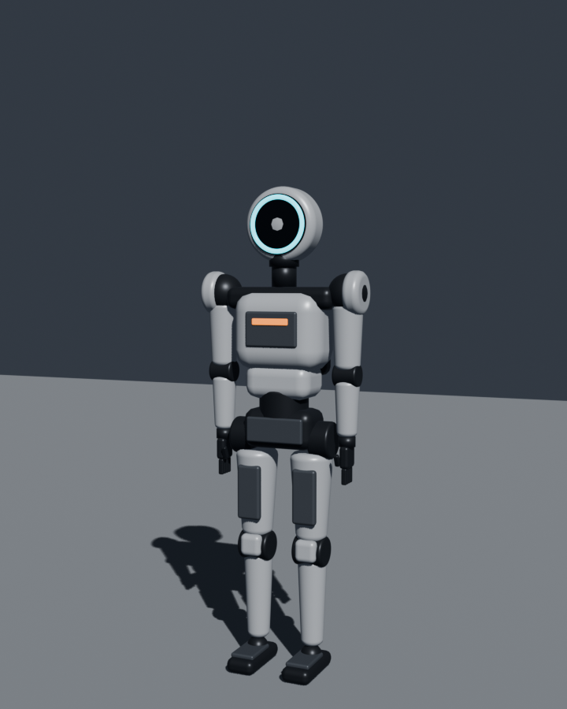
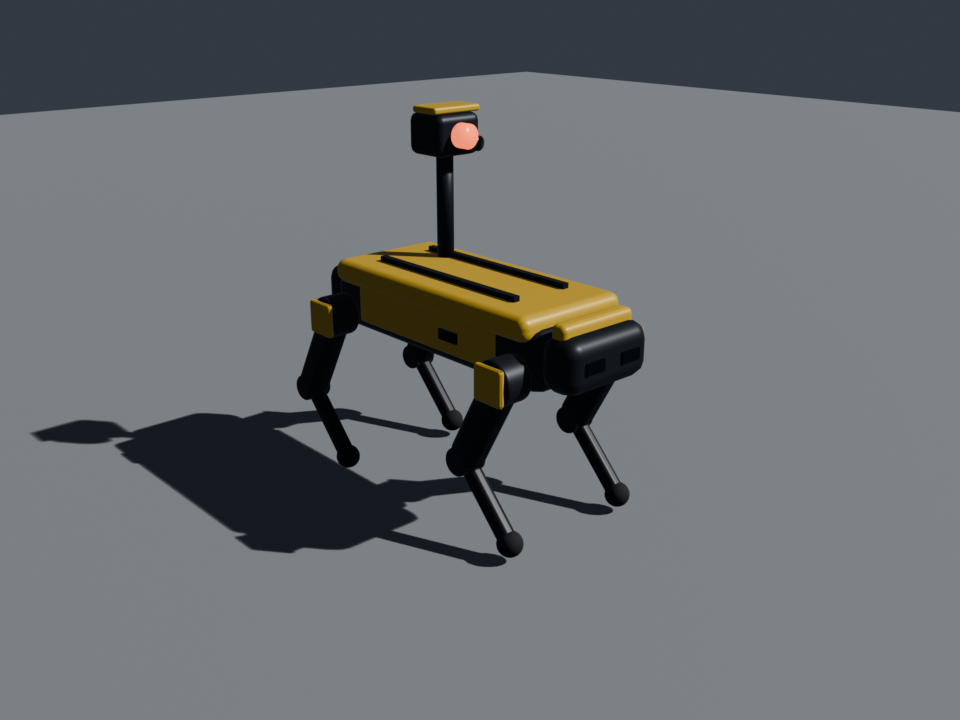
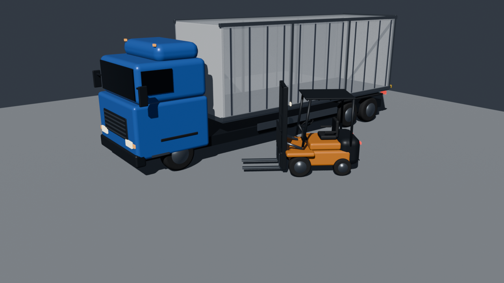
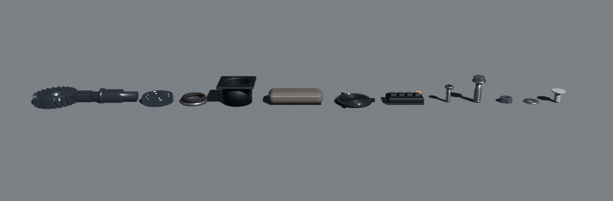
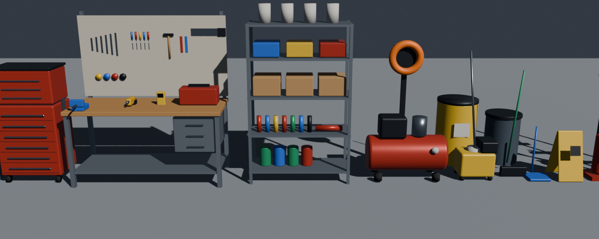
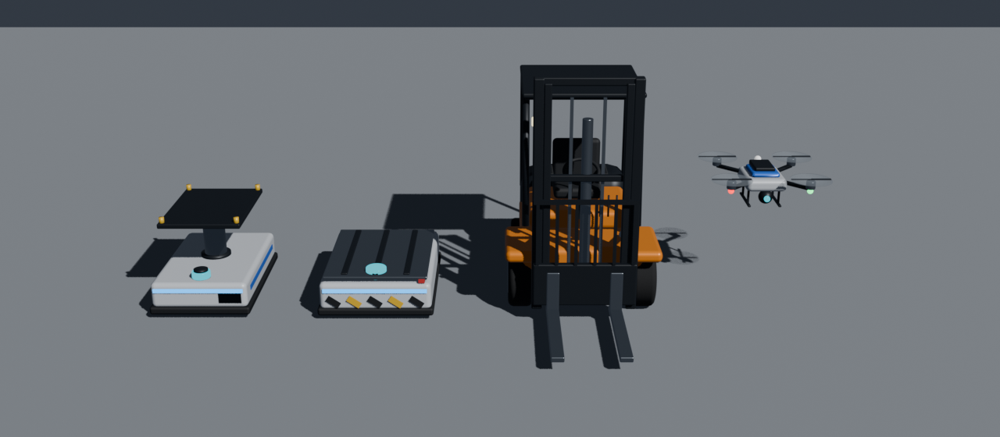

# Jin-flexible — 피지컬AI 실증 메타팩토리 A-1 유연생산 Zone 운영 시뮬레이션

삼진산업 **LT2 후드 Ass'y**(+ 상용트럭 도어 혼류 확장)를 대상으로, 메타팩토리 **A-1 유연생산 Zone**의 셀·로봇·AMR·셀 운영통제(Cell OCS)·피지컬AI 운영을 3D로 시뮬레이션합니다. 유연생산 Zone 시뮬레이터 [Jin-3D](https://github.com/theuniversepark/jin-3d)(최종 커밋 `50dccc0`)를 그대로 기반으로 삼아, 공장 단위 기능 — 레거시 → 자동화 → 피지컬AI 3단계, 로봇·AMR 카메라 영상과 녹화·MP4·AAS 영상 링크, CCTV(사각지대 0 배치·NVR·AI 감지), Private 5G(기지국 배치·DAPS 핸드오버·지연 모델), VLA 에피소드·학습·배포, AIOS, FACOS, 오케스트레이터·상위 명령, 혼합형 다중 에이전트, KPI 영향 분석, 정비 휴머노이드·사족보행·순찰 드론, 입고·창고·출하 트럭 야드, Odoo ERP, AAS·OPC UA PubSub over MQTT·패킷 덤프 — 을 모두 유지하고, Zone만 유연생산으로 바꿨습니다.

- **유연생산 Zone 설계서**: [docs/ZONE_DESIGN.md](docs/ZONE_DESIGN.md) — 근거 자료(WP6 셀 운영통제 협의자료 R3 · 유연제조 공정시나리오 도출서 · 협약용 부록 A-1 Cell 로스터 · 임시 테스트베드 구축계획), 셀 구성·동선·운영 단계·Cell OCS·KPI·로드맵·미정 사항
- 사용한 오픈소스와 출처: [OPEN_SOURCE.md](OPEN_SOURCE.md)

## 맥 앱 (Jin-flexible.app)
```bash
npm run package     # → dist/Jin-flexible-darwin-arm64/Jin-flexible.app (Apple Silicon)
npm run app         # 패키징 없이 개발용으로 바로 실행
```
- `Jin-flexible.app`을 응용 프로그램 폴더로 옮겨 쓰면 됩니다. 앱 안에 서버·Three.js·Blender 모델·MQTT 브로커가 모두 들어 있습니다.
- 내장 서버는 127.0.0.1의 고정 포트 **47620**(쓰이고 있으면 빈 포트), MQTT 브로커는 **1884** — 유연생산 Zone(Jin-3D: 47615 · 1883)과 동시에 켤 수 있습니다.
- Claude API 키는 **⚙ 버튼 또는 ⌘,** 에서 입력합니다(macOS 키체인 암호화, `~/Library/Application Support/Jin-flexible/`).
- 개발자 서명이 없는 ad-hoc 서명 앱입니다. 다른 Mac에서는 처음 한 번 Finder에서 우클릭 → 열기가 필요합니다.

## 브라우저로 실행
```bash
cd /Users/jin/Projects/flexible-manufacturing
cp .env.example .env            # ANTHROPIC_API_KEY=sk-ant-... 입력 (Claude 에이전트용, 선택)
npm start                       # = node server.mjs → http://localhost:8770 (MQTT 1884)
npm test                        # 자동 시험 26개 파일 (유연생산 Zone tests/flexible.mjs 포함)
```
API 키가 없어도 실행되며, 그때는 추론 기반 에이전트만 쓸 수 있습니다. ES 모듈을 쓰기 때문에 `index.html`을 파일로 바로 열면 동작하지 않습니다.

## 유연생산 Zone 고유 기능 (Jin-3D 대비 추가·변경)
- **셀 8개** (WP6 라인 개념도): 윗줄 C01 공급·키팅 → C02 안착·보정 → C03 가접·본용접(6축 2대) → C04 실링 → C05 헤밍 → 오른쪽 **통제 이송(인터록)** → (도어만) 가운데 C10 정밀 장착(A-1-2 확장) → 아랫줄 C06 치수·외관검사 → C08 양품·출하(구분 적재장). C06 **NG는 폐기하지 않고 C07 NG·재작업**(재검 포함)으로 분기하고, 고친 판넬은 양품 흐름으로 돌아갑니다.
- **작업물**: Blender로 모델링한 LT2 후드 판넬(1606 × 555mm, 외판 곡면·내판 보강·힌지·스트라이커)과 도어 판넬(창틀 개구부). 셀을 지날 때마다 **용접점 → 실러 비드 → 헤밍 테두리 → (도어) 힌지 장착 → 검사 태그(합격 초록 · NG 빨강 · 재작업 후 합격 주황)** 가 붙습니다.
- **제품 전환 · LOT (혼류 대응력)**: 제품이 바뀌면 셀마다 그리퍼·레시피·지그 프로그램을 전환합니다 — 레거시 수작업 240초(LOT 10개 묶음) · 자동화 툴체인저·레시피 호출 25초(LOT 3) · 피지컬AI 범용 그리퍼 + 레시피 선행 로딩 2초(1개 단위 혼류, 셀이 기다리는 동안 미리 전환하면 손실 0). 후드만 대비 1:1 혼류 생산량은 레거시 약 73% · 자동화 약 86% · 피지컬AI 약 99%입니다(4시간 × 시드 3 평균, `tests/flexible.mjs`).
- **로봇**: C01 키팅 — 피지컬AI는 AMMR 2대(옆 부품 선반에서 INR·OTR·SUB 부품을 가져와 키팅), C02~C05·C10 — 6축 로봇(R01~R08, 피지컬AI는 손목 카메라 VLA), C07 재작업 — 피지컬AI는 휴머노이드.
- **AMR**: 고하중 AMR 12대·지그 12세트(A-1-3, KMP 1500P급). C08에서 내린 빈 AMR은 AGV 충전기 사이(x −12.4)로 앞 통로를 건너 대기·충전 열(C09)로 돌아갑니다.
- **지표**: 왼쪽 Zone 카드에 **통합 연계 성공률**(도출서 KPI 95%: 고장·사람 조치·미복구 없이 끝난 셀 작업 ÷ 전체 셀 작업) · NG → 재작업 성공 · 제품 전환 횟수·손실·LOT.
- **물동량**: 대형 판넬 기준으로 창고 팔레트(판넬 키트 10세트/팔레트) · 출하 팔레트(레거시 8 · 자동화·피지컬AI 6개)를 다시 잡았고, 작업 1회 마모를 사이클 길이에 맞췄습니다(스폿 팁·헤밍 금형).
- 작업 시간·이상 확률은 시뮬레이션용 가정값입니다(도출서 C/T는 "실측 후 산정"). `js/line.js`의 `ZONE_RECIPES`·`STATION_TYPES`에서 바꿉니다.

## 휴머노이드 충전 도크
정비 휴머노이드(정비실 양쪽 끝에 하나씩, 서로 마주 봄)와 물류 휴머노이드(물류 대기존) 대기 자리마다 **휴머노이드 충전 도크**가 있습니다 — 바닥 판과 발 접점, 뒤쪽 충전 기둥(등 배터리 팩 높이의 접점 암), 세로 LED와 상태 화면. 할 일이 없으면 도크에 등을 대고 통로 쪽을 보고 서서 충전하며 기다리고(무선·접점 충전, 30% 아래면 팩 교체), 도크 LED는 충전 중 초록으로 숨쉬고 비어 있으면 파랑 대기입니다. **도크와 부딪히지 않게**: 휴머노이드는 도크에서 나갈 때 앞으로 1.1m 걸어 나온 뒤 움직이고, 돌아올 때는 (진입 지점 →) 도크 앞에 선 뒤 곧게 들어갑니다. 물류 휴머노이드 도크 두 개는 물류 대기존(x −39.55 · −37.85, z 0.8)에 나란히 공장 아래쪽(+z, 앞쪽 통로 방향)을 보게 두었습니다. 부품을 가지러 갈 때는 도크 앞에서 서쪽 진출 줄로, 아래쪽(F) 통로 셀은 도크 앞에서 곧장 통로로, 위쪽(B) 통로 셀은 아래쪽 통로까지 올라갔다 내려오지 않고 도크 앞에서 바로 옆 왼쪽 세로 통로(x −35.5)로 오갑니다 — 예: 도어 조립셀 복귀 약 69m → 46m, 후드 조립셀 복귀 약 51m → 45m. 비켜서기·돌아가기 점이 충전 도크 위면 반대쪽으로 비켜서고, 양쪽 다 막히면 그 자리에서 기다립니다(도크 뒤로 밀려 들어가 갇히지 않음). 정비실에서는 가운데 통로(x 14.1)로 드나들고 도구 보관대는 안쪽 줄(z 15.15)을 따라 옆으로 가서, 양쪽 끝 충전 스테이션 앞을 지나지 않습니다(보관대에서 현장으로 나갈 때도 가운데 통로 → 정비실 앞). 도크는 충돌 감지의 정지 장애물이라 다른 로봇은 서 있는 로봇처럼 돌아가고(도크 주인은 들어가고 나올 때만 무시), 직선 이동이 도크를 가로지르면(하던 일을 다른 자리에서 이어 갈 때) 정비실 앞으로 돌아가는 길로 다시 잡습니다. 같은 도구 보관대를 동료가 쓰는 중이거나 그 통로에 있으면 정비실 앞에서 차례를 기다립니다. 검증: `npm test`(tests/paths.mjs) — 3단계 × 시드 2 × 2시간 동안 이동 로봇이 충전 도크(바닥 판·기둥)와 겹친 경우 0건. 검증: `npm test`(tests/tools.mjs) — 대기 중인 휴머노이드는 늘 충전 중이며 도크 방향으로 섬, 구분 적재장은 AMR이 가운데 정지 구간에 들어간 뒤에만 집기 시작.

## 이동 로봇 경로·막힘 점검
모든 이동 로봇(운반 AMR · AGV · 지게차 · 정비원/정비 휴머노이드 · 물류 휴머노이드 · 사족보행 · 작업자)의 경로를 3단계 공장 × 여러 시드 × 2~4시간, 설비 고장·현장 이벤트를 주입해 돌리며 "할 일이 있는데 제자리에 갇힌" 경우를 모아 고쳤습니다.
- **정비실 대기 자리**: 정비원·정비 휴머노이드가 정비실 앞줄 x 12·13.6에 서 있어 도구 보관대로 드나드는 길을 막았고, 출동하는 동료가 대기 중인 동료를 돌아가지 못해 12~15초씩 맴돌았습니다. 대기 자리(충전 스테이션)를 정비실 양쪽 끝(x 10.95 · 17.25, z 14.0, 서로 마주 봄)으로 옮기고, 정비실에는 가운데 통로(x 14.1)로 드나들며 보관대는 안쪽 줄(z 15.15)로 다닙니다. 바닥의 "🔧 정비실" 문구는 정비실 구역 정중앙에 있습니다. 쓰는 작업이 없는 A형 사다리는 없앴습니다.
- **제자리에서 일하는 로봇 돌아가기**: 점검·청소·대기처럼 제자리에서 일하는 로봇(이동 단계가 아님)이 내 목적지가 아닌 길을 막으면, 할 일 없는 로봇과 같이 1.5초 뒤 옆으로 돌아갑니다(이전에는 우선순위가 높은 쪽이 15초 교착 해제까지 기다림). 같은 현장에 다른 로봇이 먼저 와 일하고 있으면 그 바로 옆에서 멈춥니다.
- **비켜선 자리에서 기다리기**: 정면으로 마주쳐 우선순위가 낮은 쪽이 비켜서면, 상대가 지나갈 때까지(최대 2.5초) 비켜선 자리에서 기다립니다 — 비켜섰다가 곧바로 다시 막는 반복(라이브락, 피지컬AI에서 사족보행이 휴머노이드 앞을 23번 오감)을 막습니다.
- **순환 대기**: A→B→C→A처럼 서로를 기다리는 고리(4대까지)를 찾으면 고리 안에서 우선순위가 가장 낮은 로봇이 2초 뒤 비켜섭니다(이전에는 12초 뒤).
- **충전 도크 주위 맴돎 해소**: 교착을 푸는 우선 통행권이 경로를 목적지 하나로 잘라(대각선 직진) 휴머노이드가 통로·도크 앞을 건너뛰고 공장을 가로질러 오다 옆 도크에 막혀 도크 뒤를 맴돌았습니다. 이제 우선 통행 때는 비켜서기로 넣은 우회점만 버리고 원래 길(통로·옆 세로 통로·도크 앞)은 그대로 갑니다. 또 비켜서는 점이 도크 뒤(1.6m까지)면 고르지 않고, 나란한 도크 앞 줄을 따라 옆 도크 앞을 지나는 것은 장애물로 보지 않습니다. 부품 선반 진출입은 일방통행 두 줄(들어갈 때 x −41.6 · 나올 때 x −40.8), 정비실 가운데 통로도 일방통행 두 줄(들어갈 때 x 13.6 · 나올 때 x 14.6)이고, 도구 보관대 차례는 들어가기 전 자리에서 기다립니다. 결과: 도크 3.5m 안 복귀 최장 4.3초(곧게 들어감), 피지컬AI 4시간 × 시드 3에서 6초 넘는 막힘은 출하 도크 앞 교차의 짧은 대기 2건(최장 10초)뿐.
- 결과: 레거시·자동화 6~8시간 분량에서 6초 넘는 막힘 0건, 피지컬AI는 혼잡한 교차 지점의 짧은 대기(최장 약 10초)만 남았습니다. 검증: `npm test`(tests/paths.mjs, 7개 항목) — 3단계 × 시드 2 × 2시간 동안 12초 넘게 갇힌 로봇 없음, 정비실 안에서 동료에게 3초 넘게 막히지 않음, 대기 자리와 도구 보관대 드나드는 길이 1m 넘게 떨어져 있음.

## 에이전트 구조 — 단일 자율 에이전트 / 혼합형 다중 에이전트 (옵션 · 트윈 비교)
오른쪽 자율운영 에이전트 패널의 **단일 에이전트 | 혼합형 다중** 버튼으로 구조를 바꿉니다(운전 중에도, 의사결정 기록은 이어짐). **피지컬AI 공장은 혼합형 다중 에이전트가 기본**입니다(`MODES.dark.agentArch = 'hybrid'`, 자동화는 단일 기본 — 바꾸면 그 단계 선택을 기억). **🔬 트윈 비교**는 같은 조건의 디지털트윈에서 두 구조를 실제로 돌려 비교합니다(`js/multiagent.js`).
- **단일 에이전트** (기본, `js/agent.js`): 에이전트 하나 안의 판단 모듈 6개(물류 · 예지정비 · 품질 · 흐름 제어 · 에너지 · 차량 충전)가 1초마다 정해진 순서로 판단하고 바로 실행합니다.
- **혼합형 다중 에이전트**: ① **반사 계층**(매 1초, 바로 실행) — 자재 배차 · 셀 절전 · AGV 충전 · 정지 설비 앞 투입 보류. ② **도메인 에이전트**(제안만) — 정비 에이전트(5초) · 품질 에이전트(2초) · 흐름 에이전트(3초)가 공장 상태를 보고 제안과 근거를 올립니다. ③ **메인 조정자**(매 1초) — **현장 보고도 제안으로 받습니다: 피지컬AI의 사족보행 순찰이 찾은 이상 징후(열화상·진동 → 예지정비, 미세 편차 → 재보정)는 바로 실행하지 않고 정비·품질 에이전트 제안으로 메인에 올라갑니다(`sim.agentHub`).** 판정 순서: 안전 우선순위(오케스트레이터 P1 화재·인명 대응 중이면 예지정비·재보정 보류) → 이미 처리된 제안 정리 → **충돌 판정**(병목 셀이 가동 중이면 위급하지 않은 예지정비는 대기 구간까지 미룸 · 병목에 가까운 셀도 조금 더 기다림 · 정비 인력 수만큼만 예지정비 · 정비가 필요한 셀의 고속 운전 거절 · 투입 간격은 20초 안에 반대로 되돌리지 않음) → 승인한 제안 실행. 제안 → 실행 지연 · 충돌 · 보류 · 되돌림을 셉니다. 에이전트 패널에 제안·승인·보류·충돌·평균 지연이 나옵니다.
- **트윈 비교 결과** (유연생산Zone, 시드 3~5개 평균, 피지컬AI는 10분마다 현장 이벤트 · 20분마다 설비 고장 주입):

| 단계 · 시간 | 지표 | 단일 | 혼합형 다중 | 차이 |
|---|---|---:|---:|---:|
| 자동화 · 1시간 × 3 | UPH · OEE | 387.3 · 58.10% | 392.0 · 58.80% | **+1.2% · +0.70%p** |
| | 정지(고장·정비) · kWh/개 | 16.1분 · 0.1803 | 15.4분 · 0.1785 | −0.7분 · −1% |
| | 제안 → 실행 지연 | 0초 | 평균 0.94초 · 최대 10초 | 느려짐 |
| 자동화 · 2시간 × 5 | UPH · OEE | 391.2 · 58.65% | 400.5 · 60.04% | **+2.4% · +1.39%p** |
| | 설비 고장 · 정지 | 8.4회 · 33.5분 | 8.0회 · 32.1분 | 줄어듦 |
| | 충돌 판정 · 보류 | — | 32.6회 · 67회 | |
| 피지컬AI · 2시간 × 5 (순찰 보고 직접 처리) | UPH · OEE | 381.1 · 57.12% | 381.1 · 57.12% | 같음 |
| 피지컬AI · 2시간 × 5 (순찰 보고 → 메인 조정) | UPH · OEE | 381.1 · 57.12% | 383.1 · 57.40% | **+0.5% · +0.28%p** |
| | 정지 · kWh/개 · 판단 지연 | 22.8분 · 0.1239 · 0초 | 22.6분 · 0.1235 · 평균 0.75초 | |

  - **해석**: 자동화 공장에서는 메인 조정자가 병목 셀 가동 중 예지정비를 대기 구간으로 미루고 정비 인력 수만큼만 정비를 걸어 처리량이 늘고 고장·정지가 줄었습니다(대가: 제안 → 실행 평균 약 1초 지연). 피지컬AI 공장은 처음에는 예지정비·보정을 사족보행 순찰이 에이전트를 거치지 않고 바로 걸어 두 구조 결과가 같았습니다. 순찰 보고를 정비·품질 에이전트 제안으로 받아 메인 조정자가 판정(병목 가동 중 미룸 · 인력 한도 · P1 보류)하도록 바꾼 뒤 혼합형이 UPH +0.5% · OEE +0.28%p로 약간 나아져 기본 구조로 적용했습니다(효과는 자동화보다 작음). 레거시는 에이전트가 수동 운영(작업반장)이라 비교하지 않습니다.
- **에이전트 구성 화면**: FACOS 🤖 자율 에이전트 팝업 맨 위 **🧩 에이전트 구성 · 역할 · 관계 · 판정 순서** 버튼을 누르면 펼쳐집니다(`js/agentinfo.js`) — ① 상관 관계 도식(오케스트레이터 · 도메인 에이전트 3개 → 제안 큐 → 메인 조정자 → 공장 실행, 사족보행 순찰 보고, 반사 계층 바로 실행 · 상자마다 이번 운전 제안·승인·보고 수), ② 에이전트 목록(계층 · 주기 · 기능 · 역할 · 권한 · 이번 운전 수치 — 반사 계층 · 정비 · 품질 · 흐름 · 메인 조정자 · 공장 오케스트레이터 · 사족보행 순찰), ③ 메인 조정자 판정 순서(정렬 → 정리 → 안전 → 충돌 ①병목 ②병목 근접 ③인력 한도 ④정비↔고속 운전 ⑤진동 방지 → 실행, 단계마다 이번 운전 건수), ④ 지금 대기 중인 제안, ⑤ 두 구조 트윈 비교. 단일 구조일 때는 모듈 6개와 판단 순서를 보여 줍니다.
- 검증: `npm test`(tests/multiagent.mjs, 10개 항목) — 피지컬AI 기본 혼합형, 순찰 보고 → 제안 → 메인 승인·실행, 도메인 에이전트 3개 제안 → 메인 승인, 충돌 판정·보류·지연 기록, 반사 계층 즉시 실행, 정비 인력 수 이하 예지정비, P1 대응 중 예지정비 보류, 트윈 비교에서 혼합형 UPH가 단일보다 나빠지지 않음(자동화·피지컬AI), 비교 지표.

## 문제 해결 우선순위 — 화재·사람·시설 안전 먼저, 그다음 생산·효율
여러 문제·이벤트가 겹치면 오케스트레이터가 **안전을 먼저, 생산량·공정 운영·효율을 나중에** 처리합니다(`js/orchestrator.js` `PRIORITY` · `js/sim.js` `pickResponder` · `preemptJob`).

| 우선순위 | 대상 | 처리 |
|---|---|---|
| **P1 화재·인명 안전** | 연기 의심(화재 징후) · 안전구역 사람 진입 · 비상정지·보호정지 등 긴급 명령 | 판단 지연 25%(피지컬AI 0.4초)로 바로 명령, 대응 자원 선점, 예지정비·재보정 보류 |
| **P2 시설·작업 안전** | 바닥 누유 · 이물질(미끄럼·충돌) | 판단 지연 50%, 생산 작업보다 먼저 출동 |
| **P3 생산 정지** | 설비 고장 (긴급수리) | 정비 요청 중 가장 먼저 배정 |
| **P4 생산 차질** | 자재 공급 차질 · 부품 결품 · 운영 명령 | — |
| **P5 효율·품질** | 예지정비 · 재보정 · 공정 편차 | P1 대응 중에는 배정 보류, 해소 뒤 배정 |

- **대응 로봇 선택과 선점**: 현장 이벤트(청소·소화기 대기)는 ① 대기 중인 정비 휴머노이드(가까운 순) → ② 더 낮은 우선순위 일을 하던 휴머노이드(덜 급한 일부터 — 대기 · 부품 보충(P4) → 예지정비(P5) → 긴급수리(P3))를 돌립니다. 같거나 더 급한 안전 대응 중인 로봇은 건드리지 않고, 대응 로봇이 없으면 3초마다 다시 배정합니다. 이전에는 연기 의심 때 대기 중인 정비 휴머노이드가 없으면 소화기 대기 로봇을 보내지 못했습니다.
- **하던 일 이어 하기**: 선점된 로봇은 하던 일을 기억했다가 안전 대응을 마치면 이어 합니다. 셀 현장에서 수리 중이었으면 수리를 잠시 멈추고(진행률 유지) 돌아와 이어서 끝냅니다(타임라인 "P1 우선 — ○○ 중단 → 안전 대응 후 재개", "안전 대응 후 복귀 · 수리 재개").
- **드론 · 화면**: 순찰 드론은 P1 → P2 → 생산 순으로 출동하고 더 낮은 우선순위 임무에서 돌려 옵니다. 오케스트레이터 인시던트 목록·흐름도와 관제 디스플레이에 P1~P5 배지가 붙고, 진행 중 인시던트는 우선순위 순으로 보입니다.
- 검증: `npm test`(tests/priority.mjs, 15개 항목) — 정비 휴머노이드 2대가 모두 긴급수리 중일 때 연기(P1)·이물질(P2)이 동시에 나면 연기 판단·명령 0.4초 · 이물질 0.8초, 덜 급한 일을 하던 휴머노이드부터 선택, 없으면 수리 중인 휴머노이드를 선점해 소화기 대응 → 해소 뒤 수리 재개·완료, P1 중 예지정비 보류 → 해소 뒤 배정, 드론 P1 현장 출동, 2시간 운전(10분마다 이벤트·고장) 이벤트 전부 해결 · 감지→명령 P1 0.35초 < P2 0.62초.

## KPI 영향 분석 · 개선 제안 · 의사결정 지원
상단 **📊 KPI 영향·개선** 버튼(제안 수 배지)으로 여는 창에서, 이벤트·문제가 **UPH · OEE · WIP · POWER**에 미친 영향을 원인별로 나눠 보고 개선 제안을 적용할지 결정합니다(`js/impact.js` · `js/impactview.js`). 단계별 분석 결과와 트윈 검증 리포트: [docs/KPI_IMPACT_REPORT.md](docs/KPI_IMPACT_REPORT.md).
- **손실 분해 (KPI 계산에 반영)**: 매 틱 셀마다 가동하지 못한 시간을 원인으로 나눕니다 — 설비 고장 · 예지정비 · 재보정 · 부품 결품 · 자재 공급 차질 · 진로 현장 이벤트 · 정지·감속 명령 · 흐름·밸런스 대기 · 사이클 속도 · 품질 불량. 자재대기·막힘은 그 원인(상류·하류 셀 정지, 진로 이벤트로 멈춘 운반 AMR, 공급 차질)에 매기고, 셀마다 병목 대비 가중치를 곱합니다. 이론 생산 − 양품 = 손실 대수를 품질 불량 + 가중 손실시간 비례로 나눠 원인별 **UPH 손실 · OEE 손실(%p, 합 + OEE = 100%) · WIP 증가 · 전력 낭비(kWh) · kWh/개 영향**을 냅니다. `sim.kpi().impact`에 들어가고, KPI 패널의 OEE(손실 1위) · WIP(이벤트 +) · 전력(낭비 kWh)에 표시됩니다. 이벤트별 영향(지속 · 손실 대수 · 영향 로봇)도 보여 줍니다. 구간: 최근 10분 · 30분 · 전체.
- **개선 제안**: 1분마다 최근 30분을 분석해 원인별 손실이 기준을 넘으면 실제 운영값을 바꾸는 제안을 만듭니다 — 예지정비 시작 건강도 · 설비 알람 자동 호출(안돈) · 인시던트 판단 지연 · 자재 재주문점 · 투입 간격(배율) · AMR 선행 배차 · 셀 절전 진입 · 재보정 시작 Cpk. 근거 수치 · 변경 값 · 기대 효과(추정) · 부작용을 함께 냅니다.
- **의사결정 지원**: 새 제안은 디지털트윈(현재 vs 제안, 30분 × 시드 3, 실제 현장 이벤트 재연)으로 미리 검증해 UPH · OEE · WIP · kWh/개 변화와 판정(적용 권장 · 효과 미미 · 보류 권장)을 붙이고 **"이 제안을 적용하시겠습니까?"**를 묻습니다(KPI 패널 💡 알림 · 효과 큰 순). ✅ 적용 → 운영값 변경 · 오케스트레이터 로그, 10분 실측(적용 전 10분 대비) → ↩ 되돌리기, ⏸ 보류 → 30분 동안 다시 묻지 않음. 이력과 함께 📄 리포트(.md)로 저장합니다.
- 분석 예 (2시간): 손실 1위는 세 단계 모두 혼류 흐름·밸런스 대기(23~32%p), 레거시는 설비 고장 −11.3%p, 진로 현장 이벤트는 우회·대기·빠른 처리로 0.05%p 미만. 자동화 공장의 **AMR 선행 배차 2대**는 트윈에서 UPH 362 → 423(+17%) · kWh/개 −10%로 가장 큰 개선, 피지컬AI의 예지정비 임계 상향은 UPH 465 → 445라 보류 권장. → **자동화 공장 기본값으로 AMR 선행 배차 2대 적용** (`MODES.smart.amrStage = 2`): 실제 2시간 × 시드 3 운전에서 UPH 381 → 414(+8.7%) · OEE 57.1 → 62.1% · kWh/개 0.180 → 0.171(−5%) · 출하 752 → 813, 대신 평균 WIP 7.7 → 10.2(진입로 대기 AMR 1대분 + 투입 증가). **피지컬AI 공장은 투입 간격 단축 적용** (`MODES.dark.releaseMargin = 0.94`, 병목 사이클 × 0.98 → 0.94): 2시간 × 시드 3(10분마다 현장 이벤트)에서 UPH 473 → 475 · OEE 70.9 → 71.2% · kWh/개 0.1075 → 0.1072 · WIP 8.7 그대로 — 효과는 작지만 나빠지는 KPI가 없습니다. **레거시 공장은 설비 알람 자동 호출(안돈) 적용** (`MODES.traditional.alarmDelay` 35 → 10초, `andon: true`): 고장 시 경광등·호출 버저로 반장을 바로 불러, 2시간 × 시드 3에서 고장 정지 2,668 → 2,350초(−12%) · UPH 321 → 325 · OEE 47.9 → 48.4% · WIP 14.7 → 13.6(−7%) · kWh/개 0.2632 → 0.2606 · 출하 608 → 619.
- 검증: `npm test`(tests/impact.mjs, 16개 항목) — OEE + 원인별 손실 = 100%, kpi()와 일치, 정비·품질·진로 이벤트 귀속, 전력 낭비 ≤ 전체, 구간 분석, 리포트, 제안 생성 · 트윈 검증 · 적용(운영값 변경) · 10분 실측 · 되돌리기 · 보류.

## 진로 위 현장 이벤트 — 우회 · 정지 대기 · 상위 보고
운반 AMR · AGV · 지게차 · 휴머노이드 · 사족보행 · 작업자의 이동 경로에 해결되지 않은 현장 이벤트(누유 · 이물질 · 연기 · 무단 진입)가 있으면 그 반경(누유 1.3m · 이물질 1.0m · 연기 1.8m · 무단 진입 2.2m + 로봇 크기)에 들어가지 않습니다(`js/sim.js` `moverHazard` · `hazardOut` · `reportHazard`).
- **우회**: 앞 3m 경로가 반경에 걸리면 반경 밖 양옆 두 점(앞 · 뒤)으로 돌아 원래 길에 다시 오릅니다. 돌아가는 점이 건물 밖 · 설비 셀 · 충전 도크 위면 반대쪽으로, 양쪽 다 안 되면 정지 대기.
- **정지 대기**: 우회할 길이 없거나 목적지가 반경 안이면(그 셀로 가는 운반 · 부품 보충 등) 반경 앞에서 멈춰 해결될 때까지 기다리고, 해결되면 이동을 다시 시작합니다. 컨베이어처럼 정해진 길을 가는 대상물 운반 AMR은 앞 2.5m에 이벤트가 있으면 그 자리에서 멈춥니다. 멈춰 기다리는 로봇은 다른 로봇에게 정지 장애물이라 뒤 로봇은 돌아갑니다.
- **반경 안에서 발생**: 서서 일하던 자리(부품 보충 · 대기)나 지나가던 길 바로 옆에서 이벤트가 나면 그 자리에서 기다리지 않고 먼저 반경 밖으로 비켜서고, 해결된 뒤 원래 자리로 돌아와 하던 일을 이어 합니다.
- **상위 오케스트레이터 보고**: 이벤트를 처음 마주친 로봇은 (아직 감지 전이면 자기 센서 · 카메라로 감지해 인시던트를 열고) 인시던트 타임라인에 "○○ 진로에 바닥 누유 — 우회 경로로 돌아감 / 해결될 때까지 정지 대기 (상위 보고 · 영향 N대)"를 남기고, 이벤트 로그에 위치와 조치를 기록합니다. 오케스트레이터는 이를 바탕으로 도구를 챙긴 정비 휴머노이드 · 점검 사족보행을 보냅니다 — 대응 로봇만 반경 안으로 들어갑니다.
- 검증: `npm test`(tests/hazard.mjs, 7개 항목) — 피지컬AI 2시간 × 시드 2, 10분마다 통로 위 이벤트를 넣어 정지 대기 6대 · 우회 12대, 마주친 이벤트 13건 모두 인시던트에 보고, 대응하지 않는 로봇이 반경 안에 들어간 경우 0회(발생 직후 3초 탈출 시간 제외), 모든 이벤트 150초 안 해결, 출하 계속.

## 정비 도구 챙겨 출동
정비원·정비 휴머노이드는 **상황에 맞는 도구를 정비실에서 챙겨 현장으로 출동**하고, 일을 마치면 정비실 보관대에 반납한 뒤 대기 자리로 돌아갑니다(`js/sim.js` `TOOL_KITS`). 들고 있는 도구는 3D 모델에 보이고(손에 든 공구함·진단 케이스·대걸레·빗자루·쓰레받기·소화기, 대걸레 버킷은 몸 앞에서 밀고 감 — 자루는 팔 각도와 상관없이 수직), 작업 이름과 오케스트레이터 타임라인에 "정비실에서 ○○ 챙김 (구성품)"으로 남습니다.

| 상황 | 챙기는 도구 | 정비실 보관 위치 |
|---|---|---|
| 설비 고장 (긴급수리) | 수리 공구 세트 — 공구함 · 토크렌치 · 멀티미터 | 공구 카트 |
| 예지정비 | 예지정비 키트 — 진동 분석기 · 그리스 건 · 교체 부품 | 작업대 |
| 재보정 | 보정 키트 — 다이얼 게이지 · 보정 지그 | 작업대 |
| 바닥 누유 | 누유 처리 키트 — 흡착재 키트 · 대걸레 · 버킷 | 청소 코너 |
| 바닥 이물질 | 이물질 수거 도구 — 빗자루 · 쓰레받기 · 수거함 | 청소 코너 |
| 연기 의심 | 소화기 — 사족보행이 열화상·가스 점검하는 동안 대기 중인 정비 휴머노이드가 소화기를 들고 현장 옆에서 대기 | 소화기 받침대 |

- 바닥 청소(누유·이물질)는 **정비실 휴머노이드**가 먼저 맡습니다(대기 중인 쪽 우선 → 가장 가까운 쪽, 없으면 다른 휴머노이드). 하던 일이 있으면 처리 후 이어서 합니다.
- 도구를 챙기러 정비실에 들르므로 바닥 이벤트 처리 시간이 늘었습니다(정비실에서 출동해 정비실 가까운 통로 이벤트 기준 약 75초).
- 검증: `npm test`(tests/tools.mjs, 11개 항목) — 누유·이물질은 정비실 보관대에서 해당 키트를 챙긴 휴머노이드가 현장 도착 · 처리 후 반납 · 타임라인 기록, 설비 고장은 수리 공구 세트로 수리 후 반납, 연기 의심은 소화기 대기 후 반납, 자동화 단계 정비원도 도구를 챙김.

## 지게차 포크 간섭 방지
지게차는 차체 중심에서 포크 끝까지 앞으로 1.9m 나와 있어, 반지름 1m 원으로만 보던 충돌 감지로는 포크가 로봇·AMR·사람 위로 지나갈 수 있었습니다(1시간 시뮬레이션에서 자동화·피지컬AI 출하 지게차가 사족보행·AMR·정비원과 수십 차례 겹침). 이제 지게차를 **차체 + 포크**로 봅니다(`js/sim.js` `FORK`).
- **지게차가 감지할 때**: 포크 끝보다 0.5m 앞까지, 포크 폭(±0.55m) 안을 봅니다. 길을 꺾을 때도 새 방향으로 다시 감지한 뒤 돌아 포크가 옆으로 휩쓸지 않습니다.
- **다른 이동체가 감지할 때**: 지게차 차체·포크(뒤 0.8m ~ 앞 1.45m 선분, 반폭 0.55m)에 다가가는 쪽으로는 들어가지 않고, 이미 가까이 있으면 멀어지는 쪽(비켜서기·물러나기)은 허용합니다. 교착을 푸는 우선 통행 중에도 포크 자리에는 들어가지 않습니다.
- **주차 방향**: 할 일 없이 선 지게차는 통로 반대쪽(벽 쪽)을 보고, 충전소에서는 옆(+x)을 보고 서서 포크가 순찰로·충전 기둥으로 나오지 않습니다.
- 검증: `npm test`(tests/forklift.mjs, 10개 항목) — 3단계 공장을 각각 30분 돌리며 0.5초마다 포크 위 점들이 다른 이동체 · 셀 바닥(로봇·설비) · 충전 기둥 · 정비실 비품과 겹치는지 검사(모두 0건), 출하가 계속 진행되는지(교착 없음). 1시간 처리량은 변경 전과 같거나 늘었습니다(레거시 출하 272 · 자동화 368 · 피지컬AI 424 → 432).

## 트럭 적재·하역 포크 승강
- 지게차의 포크·캐리지·짐받이는 마스트를 따라 오르내립니다(Blender 모델 빈 객체 `ForkCarriage`, 적재물도 포크 위에 얹혀 같이 움직임).
- **출하 도크(트럭에 싣기)·입고 도크(트럭에서 내리기)**: 도크 앞(벽에서 2.6~2.7m)에서 트럭 쪽을 보고 서서, 포크 끝이 도크에 선 트럭 뒤쪽에 다가가는 만큼 **포크를 적재함 바닥(1.27m) 위까지 올린 뒤**(팔레트 바닥 1.32m) 적재함 안으로 들어가 싣거나 들고, **포크를 올린 채 반듯이 후진해**(차체 방향 유지, `rev`) 트럭에서 떨어진 뒤 돌아섭니다 — 포크·적재물이 트럭 뒤 범퍼·적재함 끝과 겹치지 않습니다. 그 밖에서는 포크를 주행 높이(적재 시 0.12m)로 내립니다.
- 검증: `npm test`(tests/forklift.mjs) — 3단계 공장 모두 트럭 앞 2.2m 안(포크 끝이 적재함에 닿는 거리)에서는 지게차가 늘 트럭 쪽을 본 채 들어가고 후진으로 나오며 적재함 안에서 돌지 않음(돌아섬 0건), tests/blender.mjs — `ForkCarriage` 아래 포크 2개·캐리지·짐받이.

## 구분 적재장 처리 순서
AMR이 구분 적재장 입구(경로 끝)에서 **가운데 정지 구간까지 들어가 선 뒤에(1.3초, `SINK_PICK.enter`)** 그 제품 쪽 적재 로봇이 사이클을 시작하고, 박스는 로봇 그리퍼가 내려와 집는 순간(사이클 시작 후 1.05초)에 AMR에서 그리퍼로 옮겨집니다**. 시뮬레이션도 그때 입고를 세고 AMR을 내보내며, 적재 팔레트에는 로봇이 내려놓을 때 쌓입니다(`js/sim.js` `SINK_PICK`). 같은 제품의 다음 AMR은 로봇이 앞 박스를 다 놓을 때까지(사이클 3.2초) 기다립니다. 이전에는 AMR이 도착하자마자 박스가 사라진 뒤 로봇이 빈 AMR 위에서 집는 동작을 했습니다. 박스를 집은 뒤 AMR은 가운데 정지 구간에서 진행 방향 그대로 곧장 복귀합니다(이전에는 입구로 되돌아갔다가 다시 들어와 2초 선 뒤 떠남 — 빈 AMR도 같은 방식). 대기 시간이 생겨 자동화 단계 1시간 출하가 368 → 352개로 약 4% 줄었습니다(레거시 272 · 피지컬AI 424로 같음).

## 렌더: Blender 모델 (기본)
공장의 모든 로봇·시설·설비를 **Blender에서 모델링한 모델로 그립니다**. 앱을 열면 Blender 모델(glTF)을 먼저 불러온 뒤 공장을 한 번만 그리며(기본 도형 모델이 잠깐 보였다 바뀌지 않음), 모델 파일을 불러오지 못하면 운영 로그에 경고를 남기고 three.js 코드로 만든 기본 도형 모델로 계속 실행합니다. 이전의 Plain / Texture 선택 버튼은 없앴습니다(개발 확인용으로 `window.__twin.setRender('3d' | 'blender')`만 남김).
- **Blender 모델**: **Blender 5.2에서 실제로 모델링·재질 적용해 glTF(.glb)로 내보낸 모델**로 바꿔 그립니다 — **운반 AMR 16대 · AGV · 지게차(입고·출하) · 순찰 드론 3대 · 휴머노이드 · 사족보행 · 6축 로봇 팔 · AMMR · 화물트럭 · 갠트리 · 도어 제품 · 조립·체결 부품 · 후드 제품 · 정비실 비품**. 모서리 라운드(Bevel)·부드러운 셰이딩·PBR 재질(금속·거칠기·발광)로 만들었고(예: AMR 리프트 기둥·지그 상판·위치 고정 핀·라이다·카스터, AGV 롤러 데크·경고 띠, 지게차 마스트·체인·포크·운전석·오버헤드 가드·타이어, 드론 암·모터·로터 블레이드·짐벌), 실내 환경광(RoomEnvironment, PBR 반사)을 켭니다.
  - **휴머노이드(물류 휴머노이드 · 보조 휴머노이드 · 정비 휴머노이드 · 셀 작업 휴머노이드)**: Boston Dynamics 전동식 Atlas의 분위기(회색 외장 · 짙은 관절 액추에이터 · 앞을 보는 원형 얼굴판과 링 조명 · 등 배터리 팩)를 참고해 Blender로 새로 모델링한 독자 디자인입니다(실제 제품의 복제가 아니며 로고·상표 없음). 관절은 빈 객체(`Body · Waist · Head · Shoulder_L/R · Elbow_L/R · Hip_L/R · Knee_L/R`)로 만들어 기본 도형 모델과 같은 자리(어깨 1.52m · 고관절 0.92m)에 두었고, 기본 도형 모델에 없던 **팔꿈치·무릎**이 걸을 때 앞으로 내딛는 다리의 무릎이 굽고 작업·운반 자세에 맞춰 팔꿈치가 굽습니다. 얼굴 링 조명(재질 `VISOR`)은 상태색(작업 하늘색 · 대기 초록), 가슴 상태등(재질 `ACC`)은 역할색입니다. 셀 작업 휴머노이드는 이 몸체(다리·허리·머리)에 6축 양팔을 달아 씁니다. 미리보기: `assets/blender/preview_humanoid.png`.


  - **사족보행 순찰 로봇**: Boston Dynamics Spot의 분위기(노란 상판·측면 외장 · 짙은 몸체 · 앞·옆·뒤 스테레오 카메라 · 뒤로 꺾인 무릎 · 페이로드 레일)를 참고해 Blender로 새로 모델링한 독자 디자인입니다(복제가 아니며 로고·상표 없음). 등 위 센서 마스트(열화상 렌즈 — 재질 `THERMAL` · 음향 카메라)와 점검 스캔 빔은 기본 도형 모델과 같습니다. 관절 빈 객체(`Body · Hip_0~3 · Knee_0~3 · Cam`)를 기본 도형 모델과 같은 순서·자리(몸통 0.55m · 다리 ±0.21 × ±0.36m)에 두어 대각 보행(trot)·센서 머리 회전이 그대로 동작하고, 정강이는 기본 무릎 각에서 발이 바닥에 닿도록 놓았습니다. 미리보기: `assets/blender/preview_quadruped.png`.


  - **6축 로봇 팔 (모든 셀의 다관절·협동 로봇 · 팔레타이징 · AMMR·휴머노이드의 팔)**: Rainbow Robotics RB20-1900의 분위기(흰 원통 관절 하우징 · 짙은 관절 캡 · 가는 원통 링크 · 그리퍼)를 참고해 Blender로 새로 모델링한 독자 디자인입니다(복제가 아니며 로고·상표 없음). 관절마다 마디(`Seg_Base · Seg_Turret · Seg_Shoulder · Seg_Elbow · Seg_Wrist · Seg_Wrist2 · Seg_Flange`)를 따로 내보내 기본 도형 팔과 같은 관절 그룹·치수(베이스 0.4 · 어깨 0.42 · 상완 1.1 · 전완 0.9m × 배율)에 붙이므로 J1~J6 관절값 · 역기구학(팔레타이징) · 텔레메트리 · VLA가 그대로입니다. 관절 캡의 색 링(재질 `ArmAcc`)은 셀 색(산업용) 또는 파랑(협동)입니다.
  - **AMMR 양팔 로봇**: Rainbow Robotics RB-Y1의 분위기(둥근 바퀴형 이동 베이스 · 접히는 몸통 기둥 · 흰 가슴 · 카메라 머리)를 참고한 독자 디자인입니다. 몸통 승강(`Lift`) · 머리 회전(`Head`) · 상태등(`LED`)은 기본 도형 모델과 같은 자리이고, 양팔은 위 6축 팔 마디로 가슴 양옆에 답니다.
  - **지게차(입고·출하, 유인·자율)**: 하부 프레임 · 좌석 아래 배터리 덮개 · 앞 휀더 · 둥근 카운터웨이트와 후미등 · 팔걸이 좌석 · 조향 핸들·레버 · 마스트 바깥·안쪽 레일과 리프트·틸트 유압 실린더 · 짐받이(로드 백레스트) · 기울어진 원형 기둥의 오버헤드 가드 · 전조등 · 후방 블루 스팟 램프까지 모델링했습니다. 오버헤드 가드(`Guard`)·전조등(`Lamp`) 이름과 크기(1.5 × 2.4 × 3.2m)는 그대로라 운전자·자율 경광등·적재 팔레트가 같은 자리에 놓입니다.
  - **화물트럭(출하·입고)**: 특정 회사 모델이 아닌 일반형 캡오버 트럭(길이 10.5m · 폭 2.5m)으로, 운전석(전면 유리·측면 창·사이드 미러·그릴·범퍼·전조등·방향지시등·지붕 에어 디플렉터·승강 발판) · 섀시와 연료탱크 · 바퀴와 휀더 · 측면 보호대 · 커튼 사이더 적재함(반투명 커튼 `Tarp` · 커튼 스트랩 · 기둥 · 지붕 레일 · 뒤 범퍼)을 만들었습니다. 운전석 색은 트럭마다 다르고(재질 `CabPaint`), 뒷문은 경첩 빈 객체(`Door_L`·`Door_R`)라 도크에서 열리며, 후미등(`TAIL`)은 후진 시 흰색으로 깜빡이고, 실린 팔레트는 커튼 너머로 보입니다. 미리보기: `assets/blender/preview_truck.png`.


  - **갠트리 로봇(직교 3축)**: 산업 현장의 일반형 직교 갠트리로, 앵커 볼트로 고정한 철골 기둥(베이스 판·보강판) · T슬롯 알루미늄 프로파일 빔 · 리니어 가이드 레일과 랙 · 축마다 서보모터와 감속기(X축은 양쪽 동기 구동) · 케이블 체인 · 공압 그리퍼까지 모델링했습니다. 셀마다 X축 길이가 달라 부품(`Post · XBeam · Bridge · Carriage · ZAxis`)으로 내보내 기둥은 복제하고 X축 빔은 셀 길이에 맞춰 늘리며, 브리지(X 주행) · 캐리지(Y 이송) · 승강축(Z)은 기본 도형 모델과 같은 그룹에 붙여 키프레임 동작과 관절값(mm)이 그대로입니다. 캐리지 도장색(재질 `GantryAcc`)은 셀 색입니다.
  - **도어 제품**: 원통형 전기차 동축 구동축(모터 + 감속기 + 인버터)을 입체로 모델링했습니다. 하우징 앞 위쪽은 Blender 불리언 연산으로 잘라낸 단면(cutaway)이라 고정자 철심 · 구리 권선 · 회전자 · 헬리컬 기어가 보입니다. 미리보기: `assets/blender/preview_eaxle.png`.


  - **조립·체결 부품**: 실제 부품 형상을 Blender로 모델링해(화면에서 보이도록 실제의 약 2배 크기) 셀의 부품 빈 · 부품 랙 · 볼/스크류 피더 · 체결 트레이 위에 담고, VLA 협동로봇은 녹색 상자 대신 **실제 부품을 집어** 대상물로 옮깁니다(작업 사이클마다 빈 순서대로 다른 부품).
    - **후드 조립셀**: 컵홀더 · 암레스트 패드(스티치) · 스피커 그릴 · 윈도 스위치, 볼 피더에는 트림 클립
    - **도어 조립셀**: 헬리컬 기어(키 홈) · 계단 샤프트(스플라인) · 볼베어링(볼·케이지) · 오일씰, 볼 피더에는 오일씰
    - **후드 체결셀**: 십자 나사 · 트림 클립 패스너 · 와셔 · 너트 (스크류 피더에 나사·클립)
    - **도어 체결셀**: 플랜지 육각 볼트 · 육각 너트 · 와셔 · 나사, 다축 너트러너 옆 체결 트레이에 볼트·너트·와셔
    - 미리보기: `assets/blender/preview_parts.png`


  - **자재투입존 (유연생산Zone)**: 박스 더미 대신 **한쪽(+z)은 후드 빗살 거치대**(2열 × 10장, 패널을 세워 나란히 꽂고 앞면이 바깥을 봄), **반대쪽(−z)은 도어을 바닥 팔레트 위에 받침대째 3열 × 3줄로 놓고 층 사이에 받침목을 깔아 3단으로 쌓아**(선반 없음 — 갠트리가 위에서 집으므로 충돌 없음, 맨 위 약 1.9m · 들고 지나가는 높이보다 낮음, 위층이 있을 때만 받침목 표시) 실물 모델이 정렬되어 있습니다. 투입 갠트리 프레임은 양쪽 구역을 덮도록 넓혔고(z −3.15 ~ +3.15), Z축 봉은 2.7m로 늘리고 캐리지에 가이드 슬리브를 달아 가장 낮게 내려가도 봉이 캐리지에 물려 있습니다. 재고 수량(최대 40)을 혼류 비율로 양쪽에 나눠 보여 주며, **다음에 투입할 제품 쪽 구역에서 집어** 그 제품 모델 그대로 AMR에 내려놓습니다(AMR도 투입 순간부터 실물 제품을 싣고 감). 후드은 Blender로 새로 모델링한 앞문 내장 패널(기재 패널 · 소프트 벨트라인 · 직물 인서트 · 암레스트 · 윈도 스위치 · 인사이드 핸들 · 스피커 그릴 · 맵 포켓 · 뒷면 클립, `doortrim.glb`)이고, 수십 개를 그려도 가볍도록 모델을 재질별로 합쳐 InstancedMesh로 그립니다. 미리보기: `assets/blender/preview_doortrim.png`.
  - **정비실**: 오른쪽(드론 패드 H1 쪽)으로 넓혀 H1 패드 왼쪽 가장자리에서 바닥 1.5칸(1.5m) 앞까지 확장했습니다(폭 5m → 7.6m). 실제 정비실처럼 뒤쪽에 2도어 캐비닛(구급함) · 서랍식 공구 카트 · 작업대(공구 타공판의 렌치·드라이버·망치·플라이어·톱, 바이스, 전동드릴, 멀티미터, 공구함) · 소모품 선반(오일 캔·스프레이·부품 상자·부품 빈·걸레 롤·그리스 건) · 에어 컴프레서와 호스 릴을 두고, 확장 구역에 청소도구(탈수기 달린 대걸레 버킷과 대걸레 · 빗자루와 쓰레받기 · 젖은 바닥 주의 표지 · 쓰레기통 · 흡착재 키트 드럼), 옆에 소화기, 앞에 A형 사다리를 배치했습니다. 가운데는 비워 정비 대기 자리와 바닥 표시가 보입니다. 미리보기: `assets/blender/preview_maint.png`.


  - 동작은 기본 도형 모델과 같습니다: 상태등 색(AMR 대기 초록 · 투입 주황 · 운반 파랑), 적재물, 드론 로터 회전·기울기·항법등·스트로브·하방 빔, 자율 지게차 경광등. 코드가 쓰는 부분은 Blender에서 정해진 이름(재질 `LED`·`NAV_R`·`NAV_G`·`STROBE`, 노드 `Rotor_0~3`·`Guard`)으로 만들어 그대로 연결합니다.
  - **나머지 로봇·시설·설비 전부(공정 설비·컨베이어·선반·디스플레이·서버·5G 기지국·CCTV·건물 등)**: 3단계 공장(레거시·자동화·피지컬AI)에 쓰이는 상자·원기둥·구 **284종**의 치수를 모두 모아 Blender가 같은 치수로 다시 만든 도형(모서리 라운드·곡면 세분화·부드러운 셰이딩) 라이브러리 `assets/blender/primitives.glb`로 바꿔 끼웁니다(피지컬AI 화면 기준 약 1,800개 메시). 메시의 위치·회전·부모(관절 그룹)와 재질은 그대로라 로봇 관절 동작·텔레메트리·VLA·클릭 선택이 영향을 받지 않고, 운영 중에 새로 생기는 모델(대상물·트럭 등)도 1.5초마다 바꿔 끼웁니다. 이미지 텍스처(후드·도어 사진, 글자판)와 다중 재질 메시는 UV·면 구분을 지키려고 그대로 둡니다.
- **도형 치수 수집**: `npm run blender:collect` (= `electron tools/collect-primitives.cjs`) — 앱을 화면 없이 띄워 기본 도형 모델(3d)로 3단계 공장을 차례로 돌리며 쓰인 도형 치수를 `blender/primitives.json`으로 모읍니다(모델을 바꾸면 다시 실행).
- **Blender 자산 만들기**: `npm run blender:assets` (= `blender -b --python blender/build_assets.py`) — Blender를 화면 없이 실행해 모델링 → `assets/blender/amr.glb · agv.glb · forklift.glb · drone.glb · humanoid.glb · quadruped.glb · arm6.glb · ammr.glb · truck.glb · gantry.glb · eaxle.glb · parts.glb · doortrim.glb · maint.glb` · 도형 라이브러리 `primitives.glb`와 Eevee 미리보기 렌더 `assets/blender/preview.png`를 만듭니다. 좌표는 1단위 = 1m, 바닥 중심 원점, 앞쪽 = three.js +z(Blender −Y)로 3D 모델과 같은 자리·크기입니다. Blender는 개발 도구로만 쓰고 앱에는 들어가지 않습니다(설치: `brew install --cask blender`).
- 검증: `npm test`(tests/blender.mjs, 55개 항목) — GLB 2.0 형식·Blender glTF exporter로 생성, 크기가 3D 모델과 같음(±0.25m, 바닥 원점), 코드가 쓰는 재질·노드 이름, 발광 재질, 미리보기 렌더, 도형 라이브러리(수집한 279종이 모두 이름으로 들어 있고 치수가 같음). 앱을 열면 AMR 16/16 · AGV·지게차 6/6 · 드론 3/3 · 보조 휴머노이드 2/2 · 사족보행 2/2 · 6축 팔 21대 · AMMR 8대 · 화물트럭 3대가 Blender 모델로 바뀌고 도형 1,776개가 라이브러리 도형으로 바뀌며 환경광이 켜지는 것, 콘솔 오류 0을 확인했습니다.



## 화면 이동 (방향키)
3D 화면에서 **방향키**를 누르면 화면 중앙 고정점(마우스 드래그 회전의 중심)이 화살표 방향으로 바닥 위를 이동합니다. 방향은 지금 보고 있는 화면 기준입니다 — **↑** 화면 안쪽(앞), **↓** 뒤, **←** 왼쪽, **→** 오른쪽. 누르고 있는 동안 계속 움직이고, 두 키를 함께 누르면 대각선으로, **Shift**를 함께 누르면 2.5배 빠르게 움직입니다. 속도는 시점 거리에 비례합니다(멀리서 볼수록 빠르게, 초당 시야 거리의 35%, 최소 6m/s). 카메라가 고정점과 함께 평행 이동하므로 보는 각도·확대는 그대로이고, 공장과 트럭 야드 밖으로 너무 멀리 나가지 않게 막습니다. 입력창에 글을 쓰는 중에는 동작하지 않습니다.

## 그림자
3D 화면은 비스듬한 주광(햇빛 방향 조명) 하나로 설비·로봇·드론의 그림자를 바닥에 드리워, 위에서 볼 때도 높이와 위치(바닥에 붙어 있는지·떠 있는지, 드론 고도)를 알아보기 쉽게 합니다. 정보가 없는 그림자는 뺐습니다 — **천장 CCTV 카메라·지지대**(바닥에 점·줄로 흩어지던 그림자)와 **왼쪽 벽**(벽·입고 도크 문틀·재고 현황판·외벽 크롤 글씨, 물류 확장동 바닥을 크게 덮던 그림자)은 그림자를 드리우지 않습니다. 나머지 설비·선반·로봇·드론 그림자는 그대로입니다.

## 팝업 창 닫기 (바깥 클릭)
로봇·설비를 눌러 뜨는 **정보 창**, **CCTV 영상 창**, **5G 기지국 정보 창**, 하단 버튼으로 연 **오케스트레이터 창**·**CCTV 카드(지도)**·**5G 카드(지도)** 는 창 바깥을 누르면 닫힙니다(✕ 버튼·같은 하단 버튼으로 닫는 것도 그대로). 하단 버튼으로 여는 가운데 창(🧭 진화 컨셉 · 📊 3단계 8시간 비교 · 📡 데이터 연동 · 🏢 Odoo, 그리고 VLA 학습 · AIOS 학습 · FACOS 상세 · 지시 게이트 · 설정)은 **창 바깥 어두운 바탕**을 누르면 닫힙니다 — 창 안에서 끌다가 바탕에서 놓은 경우는 닫지 않고, 각 창의 ✕와 같은 정리(갱신 중지)를 합니다. 3D 화면에서 CCTV 카메라·5G 기지국을 누를 때는 그 지도 카드가 유지됩니다. 3D 화면에서는 누른 자리에서 그대로 뗐을 때만 닫고, 끌어서 회전·이동할 때는 닫지 않습니다. 다른 로봇·설비·카메라·기지국을 누르면 그 창으로 바뀌고, 나머지 팝업은 닫힙니다. 왼쪽·오른쪽 패널, 하단 버튼 줄 등 3D 밖 화면을 눌러도 닫힙니다.

## 팝업 창 스크롤
모든 팝업 창(로봇·설비 정보 · CCTV 영상 · 5G 기지국 · 5G·CCTV 카드 · 오케스트레이터 흐름/명령 콘솔 · 진화 컨셉 · 3단계 비교 · 데이터 연동 · Odoo · VLA · AIOS · FACOS 상세)은 내용이 창보다 길면 마우스 휠·트랙패드로 끝까지 내려가고 다시 맨 위로 올라옵니다. 창마다 실시간 갱신(0.25~1.5초)으로 내용을 다시 그려도 **스크롤 위치와 펼친 항목(<details>)을 그대로 유지**하고, 바뀐 내용이 없으면 다시 그리지 않습니다(`setHTML` · 오케스트레이터 `put`).
- 검증: `npm run test:ui`(tests/ui-scroll.cjs, Electron) — 창 높이 620px에서 모든 팝업을 열고 스크롤이 필요한 영역마다 실제 휠로 아래·위로 굴려, 끝까지 내려감 → 1.5초 뒤(갱신 후)에도 위치 유지 → 맨 위로 복귀 → 펼친 항목 유지를 확인합니다. 결과: 18개 영역 모두 통과(5개 창은 내용이 짧아 스크롤 불필요), 콘솔 오류 0.

## 화면 패널 숨기기 · 보이기
왼쪽 **유연생산Zone** 패널과 오른쪽 **자율운영 에이전트** 패널은 패널 가장자리 가운데의 **◀ / ▶** 탭(또는 키보드 `[` · `]`)으로 숨기고 다시 보일 수 있습니다. 숨기면 패널이 옆으로 밀려 들어가고 탭만 화면 가장자리에 남으며, 3D 화면과 하단 버튼·설비 정보 창·오케스트레이터·FACOS 표시 줄이 빈 자리만큼 넓어집니다. 숨김 상태는 브라우저에 기억됩니다. 오른쪽 아래 공정 설계 도크는 그대로 남습니다.

## 추론 기반 / 대화 기반
오른쪽 패널의 **추론 기반 / 대화 기반** 토글로 전환합니다. 자동화·피지컬AI 단계에서 쓸 수 있습니다.
- **추론 기반**: 내장 운영 에이전트가 관찰 → 판단 → 실행 루프로 예지정비·품질 보정·병목·투입·공급 차질·AGV 배차·충전·절전을 판단합니다.
- **대화 기반**: 추론 기반 에이전트가 그대로 공장을 운영하고, 입력창에 쓴 운영자 지시를 해석해 공정에 반영합니다 (`js/dialog.js`). 한 번에 여러 지시를 쉼표·"그리고"로 이어 쓸 수 있습니다.
  - 셀 명령: "포장셀 속도 75%", "후드 체결셀 천천히", "전체 보호정지", "보호정지 해제", "비상정지", "비상정지 해제", "투입 정지/재개", "대피시켜/대피 해제", "도어 조립셀 예방정비", "이액슬 체결셀 재보정" → 상위 명령(명령 콘솔과 같은 경로, 흐름도·MQTT에 기록)
  - 혼류 비율: "후드 2:1로 생산", "도어만 생산", "반반" → 재시작 없이 다음 투입부터 적용, 왼쪽 Zone 카드도 바뀜
  - 투입 간격 "투입 간격 7.5초", 공급 차질 중 "긴급 조달", 상태 질의 "부품분류셀 상태 어때?", "공장 상태 알려줘"
  - 대상이 모호하면(예: "정비해줘") 셀을 지정하라고 답하고, 쓸 수 없는 상태면(예: 비상정지 중 속도 변경) 이유를 보여 줍니다.
  - 해석 순서: 내장 해석기(서버·API 키 없이 즉시)가 먼저 처리하고, 알아듣지 못한 문장은 Claude가 연결되어 있으면 Claude가 해석해 같은 조치(issue_command·set_mix 등)로 반영합니다. Claude를 주기적으로 부르지 않으므로 운영 판단은 언제나 추론 기반 에이전트가 합니다. (예전에 남아 있던, 정비·품질·흐름 판단을 Claude에 넘기는 경로 `agent.llm`은 한 번도 켜지지 않아 코드에서 정리했습니다 — 단일·혼합형 에이전트 모두 해당.)
- **지시 게이트** (`js/gate.js`): 조치마다 **해석 → 대상 확인 → 안전 규칙 → 실행 가능성 → 영향 평가**를 거쳐 판정합니다. 한 단계라도 막히면 거절하고 사유와 대안을 돌려줍니다(예: 대상 셀 미지정 → "포장셀 예방정비"처럼 셀을 함께, 비상정지 중 속도 변경 → 먼저 "비상정지 해제", 이미 같은 상태 → 변경 없음). 영향 평가에서 주의(⚠)가 나오면 수행하되 영향을 표시합니다(예: 속도 110% → 마모 +40%, 투입 정지 → 재공 소진 후 자재대기, 혼류 변경 → 다음 투입부터).
- 대화창에는 "운영자 지시"와 "지시 게이트 · 수행 n · 거절 n"(지시·게이트·판정)이 남고, **항목을 누르면 게이트 도식**이 열립니다. 조치마다 지시 → 5단계 게이트 → 판정 ◇ → 수행 갈래(명령 전송 → 셀 수신 확인 → 실행·완료, 또는 즉시 적용) / 거절 갈래(거절 → 운영자 통보)를 그리고, 지난 길은 색으로, 가지 않은 갈래와 도달하지 않은 단계는 흐리게 표시합니다. 명령 진행(ACK·완료 시각)은 도식이 열려 있는 동안 실시간으로 갱신되고, 아래 표에 단계별 판단 근거가 나옵니다 (`js/gateview.js`).
- Agent가 연결되어 있으면 내장 해석기로 알 수 없는 문장은 "Agent 해석" 갈래로 넘어가고, Agent가 돌려준 조치도 같은 게이트를 거칩니다.
- Claude 해석 경로: 브라우저가 공장 스냅샷(JSON)과 해석 못 한 문장을 서버로 보내고, 서버(`server/llm-agent.mjs`)가 strict 도구(issue_command·set_mix·투입·정비 등)로 Claude와 도구 루프를 돌리며 스냅샷 기준으로 조치를 검증합니다. 승인된 조치는 브라우저가 다시 검증한 뒤 적용합니다. effort `medium`, 거절 대비 서버측 폴백(`fallbacks: "default"`). 해석 횟수와 추정 비용이 패널에 표시되고, API 키는 서버에만 있습니다.
- "3단계 8시간 비교"는 속도 때문에 추론 기반 에이전트로 계산합니다.

## 메타팩토리 테스트베드 · A-1 유연생산Zone (기본 라인, 후드·도어 혼류)
삼진산업 LT2 후드와 상용트럭 도어를 한 Zone에서 혼류 생산합니다 (U자형: 윗줄 동쪽 흐름 → 오른쪽 통제 이송 → 아랫줄 서쪽 흐름).

```
자재 투입 → C01 공급·키팅(혼류 판별 게이트) → C02 안착·보정 → C03 가접·본용접 → C04 실링 → C05 헤밍
          ─(통제 이송·인터록)→ 후드: C06 치수·외관검사 / 도어: C10 정밀 장착 → C06
          C06 ─ 합격 → C08 양품·출하(구분 적재장: 후드·도어 팔레트)
              └ NG  → C07 NG·재작업(재검) → C08 (못 고치면 격리)
```

| 셀 | 유형 | 용도 | 로봇 (자동화 / 피지컬AI) | AS-IS |
|---|---|---|---|---|
| C01 공급·키팅 | 키팅 (게이트 판별) | 공동 — 부품 ID 인식·혼류 판별·키팅 | 협동로봇 2 / AMMR 2 | A10 |
| C02 안착·보정 | 지그 안착·비전 6DoF 보정 | 공동 | 6축 1 (R02) | A10·A40 |
| C03 가접·본용접 | 서보 스폿건 용접 | 공동 — 병목 | 6축 2 (R03·R04, HS220급) | A10·A20 |
| C04 실링 | 실러 도포·비드 검사 | 공동 | 6축 1 (R05) | A30·A40 |
| C05 헤밍 | 헤밍 프레스 | 공동 | 6축 1 (R06) | A40·A50 |
| C10 정밀 장착 | 힌지·스트라이커 장착·체결 | 도어 전용 (A-1-2 확장) | 6축 2 (R07·R08) | — |
| C06 치수·외관검사 | 비전 2·게이지 | 공동 — NG → C07 | — | A60~A80 |
| C07 NG·재작업 | 재용접·재도포·재검 | NG 분기 | 협동로봇 1 / 휴머노이드 1 | — |
| C08 양품·출하 | 구분 적재장 | 후드·도어 팔레트, 적재 로봇 2 | 팔레타이징 2 | A80 |

- **혼류 비율**: 후드만 / 2:1 / 1:1 / 1:2 / 도어만. 투입 순서는 비율대로 평준화하고, 레거시·자동화는 LOT로 묶습니다.
- **혼류 판별 게이트(C01)**: 대상물이 게이트를 지나면 후드/도어를 판별해 키트를 정하고, 표시판·스캔 링이 제품 색(후드 주황·도어 보라)으로 바뀝니다.
- **병목 계산**: 제품 전용 셀(C10)은 도어 비중만큼, C07은 NG 비율(가정 5%)만큼만 일하므로 "사이클 × 처리 비중"으로 병목을 잡습니다 — 세 단계 모두 C03.
- **구분 적재장(C08)**: AMR 하역 위치 서쪽에 적재 로봇 2대, 그 서쪽에 후드(앞쪽)·도어(뒤쪽) 팔레트가 나란히 있고, 출하 지게차는 서쪽 통로(x −20.5)에서 집습니다.
- 셀 배치·경로·혼류 비율은 `js/line.js`의 `ZONE_CELLS`·`ZONE_EDGES`·`ZONE_PATHS`·`ZONE_MIXES`·`ZONE_AMR`에 있습니다.

## 데이터 연동 (기준 시계 · AAS · OPC UA PubSub over MQTT · 파일 저장)
하단 **📡 데이터 연동**에서 확인·설정합니다 (`js/datahub.js`, `js/aas.js`, `server/mqtt-gateway.mjs`).
- **기준 시계**: 공장 전체가 하나의 시계를 씁니다. 시뮬레이션 0초 = 시작일 08:00(현지) 기준이고, 모든 운영 데이터·이벤트·OPC UA 메시지·저장 파일의 시각이 이 시계의 ISO 8601 UTC 값입니다. 상단 시계에 마우스를 올리면 UTC 기준 시각이 보입니다.
- **이동 로봇 전송 경로 (Private 5G)**: AMR·AGV·자율 지게차·휴머노이드·사족보행·드론·AMMR의 AAS·OPC UA 메시지는 그 로봇의 5G 모뎀 → Private 5G 업링크 → 5GC UPF → MQTT 브로커로 갑니다(DAPS 핸드오버로 끊김·유실 0, 아래 'Private 5G 특화망'). 설비·셀처럼 고정된 자산은 유선(공장 LAN)입니다.
- **수집**: 수집 주기(기본 10초, 시뮬레이션 시간)마다 모든 자산의 값을 한 시각으로 묶어 기록하고, 운영 로그는 발생 시각 그대로 이벤트로 기록합니다. 최근 6000회차를 보관합니다.
- **AAS 스키마 설계 기준**: 어떤 규격·기준으로 서브모델과 속성을 정했는지, 한계와 다음 단계는 [docs/AAS_SCHEMA.md](docs/AAS_SCHEMA.md)에 정리했습니다.
- **AAS 모델** (IDTA Part 1 메타모델 — 기본 **v3.1**, 저장 옵션 v3.0): 자산마다 AAS 하나 — 라인, 설비·셀, 셀 로봇(관절·TCP), 운반 AMR, AGV/지게차, 휴머노이드, 사족보행, 정비로봇. 서브모델은 Nameplate · TechnicalData · OperationalData(실시간 값) · TimeSeries(IDTA 02008). 제조사명은 "Jin-3D 가상 자산"입니다.
- **OPC UA PubSub over MQTT** (OPC UA Part 14, JSON 인코딩, MQTT 전송): 서버에 내장 MQTT 브로커(aedes)가 `mqtt://127.0.0.1:1884`에서 실행됩니다.
  - 데이터: `opcua/json/data/jin3d/MetaFactory/<자산 id>` — NetworkMessage(`ua-data`) 안의 DataSetMessage(`ua-keyframe`), 필드마다 `Value`·`SourceTimestamp`
  - 메타데이터: `opcua/json/metadata/jin3d/MetaFactory/<자산 id>` (retain) — DataSetMetaData(필드 이름·BuiltInType·단위)와 AAS id·서브모델 id·idShort·semanticId
  - 이벤트: `opcua/json/data/jin3d/MetaFactory/Events` (`ua-event`), AAS 구조: `aas/jin3d/environment` (retain)
  - 상위 명령: `opcua/json/data/jin3d/MetaFactory/Commands` — 명령 상태가 바뀔 때마다(전송·수신 확인·실행·완료/거부) CommandId·Code·Target·Argument·Issuer·Reason·State 필드
  - 외부 PC에서 받으려면 `MQTT_HOST=0.0.0.0 npm start`, 사내 브로커로도 보내려면 `MQTT_BRIDGE_URL=mqtt://브로커:1883`. 포트는 `MQTT_PORT`. MQTT Explorer 등에서 `opcua/json/#`를 구독해 확인합니다.
  - 서버 없이(정적 파일로) 열면 수집·저장만 합니다.
- **저장**: 현재까지 수집한 데이터를 파일로 내려받습니다.
  - JSON(`.aas.json`)·XML(`.aas.xml`)·RDF(`.aas.ttl`): AAS 환경(셸·서브모델·개념 설명). TimeSeries에는 자산별 최근 60개 기록(InternalSegment)을 넣고, 전체 시계열은 같은 이름의 CSV를 ExternalSegment로 참조합니다.
  - CSV(`.csv`): 전체 시계열과 이벤트(긴 형식: 기록 종류, UTC 시각, 시뮬레이션 초, 자산 id, 항목, 값, 단위). 머리말에 AAS id·semanticId 규칙.
  - AutomationML(`.aml`): CAEX 3.0 — 라인 → 셀 → 셀 로봇, 이동 로봇 계층, AAS id와 최신 값, CSV 시계열 ExternalDataReference.
  - JSON·XML 결과는 IDTA `aas-core3.0` 검증 라이브러리로 메타모델·제약 검증 오류 0건을 확인했습니다.

### 로봇 카메라 영상 자동 저장 · AAS 영상 링크
`js/robotrec.js` · `js/aas.js` `videoSubmodel` — 모든 로봇이 촬영하는 영상을 자동으로 로컬에 저장하고, AAS 데이터를 만들 때 그 영상 파일 링크를 함께 넣어 전달합니다.
- **모든 로봇 카메라 자동 녹화**: 셀 로봇 손목 카메라(VLA) · AMMR·휴머노이드 머리·양손·등(각 4대) · 운반 AMR·AGV·지게차·사족보행·정비로봇 전방 · 순찰 드론 짐벌 — 유연생산Zone 피지컬AI 기준 **로봇 카메라 70대**를 한 분할 화면(칸 256×144, 칸마다 로봇 ID·카메라 이름)으로 계속 녹화해 2fps **5분 구간 WebM**으로 저장합니다. 맥 앱·서버 실행은 `data/robotcam/<실행ID>_robotcam_<번호>.webm` + 칸 색인 `.json`(로봇 · 카메라 · AAS 자산 · 칸 좌표)에, 서버가 없는 웹 버전은 브라우저에 최근 2구간을 보관합니다. 576구간을 넘으면 오래된 것부터 지웁니다.
- **AAS 저장 때 영상 자동 저장**: 로봇 정보 창의 💾 AAS 저장(AASX · JSON · XML · RDF)이나 데이터 연동 창의 AAS 저장(JSON · XML · RDF)을 누르면, 진행 중인 녹화 구간을 바로 마감해 로컬 파일로 저장한 뒤 AAS를 만듭니다 — 링크가 방금 장면까지 가리킵니다. 서버가 없으면 영상 파일도 AAS와 함께 로컬로 내려받습니다.
- **AAS VideoRecordings 서브모델**: 자산마다(로봇 · 셀 로봇, 공장 자산에는 CCTV 전체 분할 영상) 영상 항목을 카메라·구간별로 넣습니다 — `Camera` · `CameraKey`(head · handL · handR · back · wrist · front) · `Segment` · `StartTime`/`EndTime`(기준 시계 UTC) · `FrameRate` · `CropRect`(분할 영상 안 이 카메라 칸 x,y,폭,높이) · **File `Video`**(video/webm, 값 = 영상 링크 `http://127.0.0.1:47620/videos/robotcam/<구간>.webm`) · `LocalPath`(로컬 저장 경로) · `IndexFile`(칸 색인).
- **AASX 영상 링크 파일**: AASX 패키지에는 카메라·구간마다 **영상 링크 파일** `/aasx/<자산>/files/videos/<구간>_<카메라>.url`(인터넷 바로가기 — 더블클릭하면 영상이 열림)과 목록 `video_links.json`을 보조 파일(aas-suppl)로 담고, File `LinkFile`이 그 파일을 가리킵니다 — AASX 하나만 전달해도 받는 쪽에서 영상을 찾아 열 수 있습니다.
- 맥 앱은 내장 서버를 고정 포트 **47620**에서 먼저 열어(쓰이고 있으면 빈 포트) 앱을 다시 켜도 AAS 영상 링크가 그대로 열립니다. 서버는 `GET /videos/robotcam/<파일>` · `GET /videos/cctv/<파일>`로 저장한 영상을 내려줍니다(파일 이름 검사로 경로 탈출 차단).
- 검증: `npm test`(tests/aasvideo.mjs, 10개 항목) — VideoRecordings 서브모델·셸 연결, 카메라별 영상 File, 칸·시각·경로·색인, LinkFile, .url 링크 파일 내용, AAS XML, AASX 보조 파일·관계, 서버 저장 → 링크 주소로 내려받기, 상태·목록, 경로 탈출 거부. 맥 앱 화면에서 로봇 카메라 70대 분할 영상이 서버에 쌓이고, 정비 휴머노이드 AASX에 카메라 4대 × 구간 링크 파일이, 셀 AMMR AAS JSON에 영상 링크 12개가 들어가며 링크 주소로 영상이 열리는 것을 확인했습니다.

### 영상 MP4 저장 (ffmpeg)
`server/video-convert.mjs` — 로봇 카메라·CCTV 영상을 ffmpeg로 **MP4(H.264 · yuv420p · faststart)**로 저장합니다. 이 컴퓨터에 설치된 ffmpeg를 씁니다(`FFMPEG_PATH` → Homebrew `/opt/homebrew/bin/ffmpeg` → `~/.local/bin` → PATH, 앱에 포함하지 않음). ffmpeg가 없으면 지금처럼 WebM으로만 저장합니다.
- **녹화 영상 보관 한도** (`server/app-server.mjs` `VIDEO_LIMITS`, 환경 변수로 변경): 원본 WebM 구간 수 — CCTV `JIN3D_CCTV_KEEP` · 로봇 카메라 `JIN3D_ROBOTCAM_KEEP`(기본 각 576구간 ≈ 48시간), MP4(전체 + 카메라별) 구간 수 `JIN3D_MP4_KEEP`(기본 144구간 ≈ 12시간), **전체 용량**(원본 + MP4 + 색인) — CCTV `JIN3D_CCTV_MAX_MB`(기본 4GB) · 로봇 카메라 `JIN3D_ROBOTCAM_MAX_MB`(기본 8GB). 용량을 넘으면 오래된 구간의 MP4부터 지우고, 그래도 넘으면 오래된 구간을 통째로 지웁니다(저장·변환할 때마다, 서버 시작 3초 뒤). 실제 5분 구간 크기(CCTV 약 20MB · 로봇 카메라 약 44MB)로 한도까지 쌓이면 CCTV 약 4.0GB · 로봇 카메라 약 8.2GB → 용량 한도가 그 안으로 묶습니다. 서버 시작 때 MP4가 없는 구간(변환 기능 이전 녹화 등)은 차례로 MP4로 변환합니다. `/api/cctv` · `/api/robotcam`은 **실제 용량**(원본 · MP4 · 카메라별 MP4)과 구간 수 · MP4 구간 수 · 한도를 돌려주고, CCTV 정보 창 아래 줄과 로봇 정보 창 영상 아래에 "서버 보관 N구간 · 용량 / 한도"로 표시됩니다. 검증: `tests/episodekeep.mjs`(녹화 영상 3개 항목).
- **자동 녹화 구간 → MP4**: 로봇 카메라(`data/robotcam/`)·CCTV(`data/cctv/`) 5분 구간이 서버에 저장되면 차례로(한 번에 하나씩) 변환합니다 — ① 전체 분할 영상 `<구간>.mp4`, ② 칸 색인대로 잘라 낸 **카메라별 MP4** `<구간>/<로봇>_<카메라>.mp4`(예: `HM-M1_handL.mp4` · `AM-01_front.mp4` · `CC-04_view.mp4`, 칸 크기 그대로 256×144·288×162), 변환 결과 `<구간>.mp4.json`. 한 번 디코드해 split → crop으로 카메라 여럿을 함께 만듭니다. 크기: 비트레이트 상한(전체 400kbps · 카메라 칸 40kbps, 2fps)으로 5분 구간 전체 약 9MB + 카메라별 합 약 37MB. MP4는 144구간(약 12시간, `JIN3D_MP4_KEEP`) 보관하고 원본 WebM은 576구간 보관합니다.
- **AAS 영상 링크 = MP4**: AAS 저장 때 진행 중 구간을 마감하고 MP4 변환이 끝나기를 기다린 뒤, VideoRecordings의 File `Video`를 **그 카메라만 잘라 낸 MP4**(video/mp4, `http://127.0.0.1:47620/videos/robotcam/<구간>/<로봇>_<카메라>.mp4`)로, 원본 분할 WebM은 File `SourceVideo`로 넣습니다. `LocalPath`는 MP4 로컬 경로, AASX 링크 파일(.url)도 MP4를 가리킵니다 — 받는 쪽은 칸을 자르지 않고 바로 재생합니다. 공장 자산(CCTV)에는 전체 분할 MP4와 카메라 44대 각각의 MP4 링크가 들어갑니다.
- **CCTV 정보 창**: **⏺ 이 카메라 녹화**는 정지하면 서버 ffmpeg로 `CCTV_<카메라>_<날짜시각>.mp4`(화질 우선 CRF 23)로 바꿔 로컬 파일로 저장하고, **⬇ 전체 CCTV 최근 녹화 (MP4)**는 최근 구간 MP4와 색인을 저장합니다. 창 아래 줄에 "MP4 저장 (ffmpeg 버전 — 전체 + 카메라별)"이 표시됩니다. 서버 API: `GET /api/convert?kind=robotcam|cctv&id=<구간>`(변환 완료까지 대기), `POST /api/clip-mp4`(WebM → MP4), `GET /videos/<종류>/<구간>/<파일>.mp4`, `/api/status`의 `ffmpeg`(사용 가능 · 버전).
- 검증: `npm test`(tests/mp4.mjs, 10개 항목 · ffmpeg 없으면 건너뜀) — ffmpeg 찾기, 카메라별 파일 이름 규칙(서버 = 화면), 상태 표시, 구간 변환(전체 + 카메라별), H.264·yuv420p, 카메라별 MP4 = 칸 크기, 링크 주소로 내려받기, 재변환 안 함, 개별 녹화 → MP4, 잘못된 경로 거부. 맥 앱 화면에서 로봇 카메라 70대 구간마다 카메라별 MP4 70개가 만들어지고 AAS JSON 영상 링크가 카메라별 MP4를 가리키는 것, CCTV 개별 녹화(640×360)·전체 최근 녹화(2592×844)가 H.264 MP4로 저장되는 것을 ffprobe로 확인했습니다.

## 공장 오케스트레이터 · 인시던트 흐름도
설비 고장·자재 공급 차질·현장 이벤트가 생기면 셀이 먼저 자체 조치하고, 공장 상위 오케스트레이터에 상황을 보고하며, 오케스트레이터의 판단·명령을 받아 실행 자원이 조치합니다. 하단 **🛰 오케스트레이터**(진행 중 건수 배지)에서 그 과정을 도표로 확인합니다 (`js/orchestrator.js`, `js/orchview.js`).
- **스윔레인 흐름도**: 현장 감지(로봇·센서·카메라) · 셀 컨트롤러(셀 자체 조치) · 공장 오케스트레이터(판단·명령) · 실행 자원(정비·AGV·휴머노이드·사족보행) 4개 레인에 단계 상자와 보고·명령·완료 보고 화살표를 시각(+경과 초)과 함께 실시간으로 그립니다. 위쪽 진행 표시: 감지 → 셀 자체 조치 → 상위 보고 → 판단 → 명령 → 조치 → 완료 확인.
- **인시던트**: 설비 고장(비상 정지·자가 진단 → 보고 → 긴급수리 명령 → 정비 출동·도착·수리 → 복구 확인), 자재 공급 차질(버퍼 재고로 투입 유지 → 보고 → 안전재고 긴급 투입·대체 발주·AGV 우선 배차 → 공급 재개), 현장 이벤트(AI 감지 → 감속·우회 → 보고 → 휴머노이드·사족보행 출동 명령 → 처리), AMMR 부품 선반 결품(새 대상물 받지 않고 선반 앞 대기 → 보고 → 선반 보충 명령).
- **셀 자체 해결**: 피지컬AI 단계의 자율 재보정(공정 편차)은 셀에서 해결하고 결과만 상위에 통보합니다(목록에 "셀 자체 해결", 필터로 숨길 수 있음).
- **오케스트레이터 판단 시간**: 피지컬AI 1.5초, 자동화(MES) 3초. 레거시 단계는 설비 알람 자동 호출(안돈)로 반장이 고장을 확인(약 10초, 이전 작업자 발견 약 35초)·판단 후 정비반을 부릅니다. 정비·대응 출동은 이 판단 뒤에 이루어집니다.
- ⚡ 설비 고장 주입, ⛔ 자재 공급 차질, ⚠ 현장 이벤트 버튼을 누르면 흐름도가 열리며 그 인시던트를 보여 줍니다.
- **자재 공급 차질 재현**: 차질이 나면 창고 출고가 실제로 멈춥니다. 창고 랙이 비고 '⛔ 출고 중단' 표지가 뜨며, 보충하러 간 AGV는 창고에서 '출고 대기' 상태로 기다립니다. 자동화·피지컬AI 단계에서는 오케스트레이터가 안전재고를 AGV로 긴급 운송하고 대체 발주로 차질 기간을 30% 줄이지만, 버퍼가 바닥나면 투입이 멈추고 셀들이 자재대기에 들어갑니다. 출고가 재개되고 자재가 투입구에 도착해야 인시던트가 닫히고 경보가 꺼집니다.
- **경보 표시**: 고장·공급 차질·현장 이벤트가 진행 중이면 하단의 해당 버튼이 깜빡이고(고장 빨강·공급 차질 주황·현장 이벤트 노랑) 건수 또는 남은 복구 시간을 보여 줍니다. 현장에서도 고장 설비(빨간 바닥 테두리·경광등·빛기둥·라벨), 공급 차질 시 자재창고 랙과 투입구(주황), 현장 이벤트 위치(빨강/노랑)는 4.4m 바닥 구역·경광등·빛기둥이 깜빡이고, 바깥으로 퍼지는 파문과 설비에 가려지지 않는 경고 표지(예: ⛔ 바닥 누유)로 멀리서도 위치를 알 수 있습니다. 문제가 해결되면 원래 상태로 돌아갑니다. 시스템의 '동작 줄이기' 설정이 켜져 있으면 깜빡이지 않고 고정 강조로 표시합니다.

- 흐름도·인시던트 목록·명령 상태·명령 이력은 스크롤할 수 있고, 0.25초마다 갱신돼도 스크롤 위치가 유지됩니다(바뀐 내용이 없으면 다시 그리지 않음).
## CCTV (사각지대 없는 배치)
하단 **📹 CCTV** 버튼을 누르면 CCTV 배치와 커버리지 지도가 나옵니다 (`js/cctv.js`, 모든 단계).
- **배치 방법**: 건물 안 바닥(왼쪽 물류 확장동 포함 x −50.6~37.6 · z −19.6~19.6)과 입고·출하 트럭 야드를 1m 간격 지점으로 나누고, 카메라에서 각 지점까지의 시야가 큰 설비(셀 높이 2.9m·자재 투입 갠트리·물류 선반 5m·관제 서버 랙)에 가리지 않는지 3D로 따져 "보이는 지점"을 구합니다. 아직 안 보이는 지점을 가장 많이 덮는 후보 자리부터 차례로 골라(탐욕적 집합 덮개) **모든 지점이 최소 한 대에 보일 때까지** 설치합니다. 설비가 서 있는 자리는 사람이 설 수 없어 제외하고, 지점 높이는 바닥 근처(0.3m)로 엄격하게 봅니다.
- **카메라**: 건물 안은 천장 돔 카메라(높이 7.5m, 어안 360° · 반경 9m, 천장 2m 격자 후보), 트럭 야드는 외벽·야드 가장자리 기둥(트럭 진출입 차로·회전 구역·대기 자리를 비켜)의 실외 PTZ 돔 카메라(높이 7.5m, 줌 반경 20m). 카메라마다 ID(CC-01~)와 녹화 표시등.
- **결과**(유연생산Zone): **CCTV 45대**(건물 안 35 — 물류 확장동 포함 · 입고 야드 6 · 출하 야드 4) — 바닥 5,943개 지점 **사각지대 0곳(100% 감시)**, 2대 이상이 함께 보는 이중 감시 77%. 기본 라인은 48대로 100%. 라인 배치가 바뀌면(공정 설계) 다시 계산합니다(약 60ms, 같은 배치는 캐시).
- **커버리지 지도**: 바닥 색 빨강 = 사각지대 · 연두 = 1대 · 초록 = 2대 이상, 카메라마다 감시 반경 원(건물 안 하늘색 · 야드 주황), 요약 카드(대수·사각지대·감시율·이중 감시율).
- **피지컬AI: CCTV 에이전트** (`js/cctv.js` `CCTVAgent`) — CCTV 영상 AI 분석 결과로 현장을 감시하다가 이벤트를 찾으면 **메인 오케스트레이터에 보고**하고, **이벤트 이력**을 관리합니다. 역할은 나눠져 있습니다: 대응 판단·지시·종료는 **메인 오케스트레이터**, CCTV 에이전트는 **감지·보고·이력 관리**까지.
  - **감지·보고**: 사각지대가 없어 현장 이벤트(바닥 누유·이물질·연기·침입)가 어디서 생겨도 **2초 안에 감지**합니다(로봇·드론 카메라가 먼저 보면 그쪽이 감지하고 CCTV는 "교차 확인" 이력만 남김). 감지 주체 "CCTV 에이전트 (CC-nn)"와 모델·신뢰도가 오케스트레이터 타임라인에 "CCTV 에이전트 보고" 단계로 들어가고, 이어서 드론이 우선 출동합니다.
  - **영상 기록 확보**: 설비 고장·결품 같은 다른 인시던트도 그 자리를 보는 CCTV가 있으면 "영상 확보" 이력을 남깁니다(증거 영상).
  - **이력**: 번호(EV-0001~) · 시각 · 구분(감지·보고 / 교차 확인 / 영상 확보) · 카메라(함께 본 카메라 포함) · 분류 · AI 모델 · 신뢰도 · 연결 인시던트 · 상태(진행 중 → 종료) · 소요 시간 · 처리 결과(오케스트레이터의 마지막 조치). 인시던트가 닫히면 이력도 자동으로 종료됩니다. CSV로 내려받을 수 있습니다(엑셀용 UTF-8).
  - 레거시·자동화 단계는 녹화·관제만 합니다(AI 감지·보고 없음). FACOS 현장 감지 칸·창에 CCTV 대수·감시율·CCTV 감지 건수가 나옵니다.
- **CCTV 영상 AI 파이프라인** (피지컬AI) — 현장 이벤트 감지에 쓰이는 대표 공개 알고리즘을 역할별로 적용했습니다:
  | 모델 | 역할 |
  |---|---|
  | **YOLO11** 객체 탐지 | 작업자·AMR·AGV·지게차·트럭·드론·로봇 박스 + 클래스 + 신뢰도 |
  | **ByteTrack** 다중 객체 추적 | 프레임 간 같은 대상에 추적 ID(#n) 유지 |
  | **YOLO11-seg** 인스턴스 분할 | 바닥 누유·이물질 영역 분할(마스크) |
  | **YOLO11 연기·화재** (D-Fire 데이터셋 학습) | 연기·불꽃 감지 |
  | **지오펜스 규칙** (탐지 + 구역 판정) | 금지 구역(지게차 전용·셀 안전 펜스) 사람 침입 |
  - 디지털트윈 안에서는 실제 신경망을 돌리지 않고, 장면의 실제 대상(사람·로봇·이벤트)을 카메라 화면으로 투영해 **모델 출력 형식 그대로(박스·마스크·클래스·추적 ID·신뢰도)** 만듭니다. 설비에 가려 안 보이는 대상은 탐지하지 않고, 거리가 멀수록 신뢰도가 낮아집니다. 실제 공장에서는 이 자리에 해당 모델의 추론 결과가 들어갑니다(모델 파일은 포함하지 않음).
- **CCTV 영상 보기** — 3D 화면의 **CCTV 카메라를 클릭**하거나, 전광판의 영상 칸을 클릭하거나, CCTV 카드의 **"📺 CCTV 영상·이벤트 이력 열기"**를 누르면 CCTV 영상 창이 열립니다: 그 카메라 시점의 실시간 영상 + AI 오버레이(박스·분할·추적 ID·이벤트 경보 띠), ◀ ▶ 카메라 전환, ⟲ ⟳ PTZ 회전, 적용 AI 모델 칩, 화면 안 탐지 수, 이벤트 이력 표(이 카메라만 보기 · 행의 카메라로 이동 · CSV).
- **CCTV 전광판** — 공장 뒷벽 중앙 관제 디스플레이 왼쪽(뒷벽 왼쪽 두 번째 벽 기둥부터)에 오른쪽 로봇 디스플레이와 같은 **12m × 4m CCTV 전광판**을 달았습니다. **설치된 CCTV 전체 영상을 한 화면에 분할 표시**합니다 — 대수에 맞춰 칸 비율이 16:9에 가깝게 나눕니다(유연생산Zone 45대 → 9 × 5, 48대 → 10 × 5, 남는 칸은 비움). 칸마다 카메라 ID·위치·시각이 나오고, 칸을 클릭하면 그 카메라 영상 창이 열립니다. 영상은 프레임마다 2칸씩 차례로 갱신하고, 진행 중인 이벤트·인시던트를 잡고 있는 카메라 칸은 더 자주(매 프레임 최대 2칸) 갱신합니다. 라인 배치가 바뀌어 CCTV 대수가 달라지면 분할을 다시 나눕니다. 피지컬AI에서는 AI 박스와 이벤트 경보(빨간 테두리·"바닥 누유 · YOLO11-seg 0.92 · 오케스트레이터 보고됨")가 함께 표시됩니다.
- 검증: `npm test`(tests/cctv.mjs, 10개 항목) — 세 라인 배치 모두 사각지대 0곳, 바닥 아무 곳 현장 이벤트 20건 모두 2.6초 안 감지, 감지한 CCTV가 그 위치를 실제로 보는지, 자동화 단계는 자동 감지 없음, CCTV 에이전트 보고 이력과 오케스트레이터 인시던트 연결, 타임라인의 보고 단계, 설비 고장 영상 확보 이력, 인시던트 종료 시 이력 종료(소요·결과).

### CCTV 영상 저장 — 전체 자동 녹화(NVR) · 개별 저장
`js/cctvrec.js` — 영상은 시뮬레이션 장면을 각 CCTV 시점으로 렌더한 것을 브라우저 MediaRecorder로 WebM(VP9) 파일로 만듭니다.
- **전체 자동 녹화 (NVR)**: 운전을 시작하면 설치된 CCTV **전체(유연생산Zone 44대)**의 분할 화면을 그대로 계속 녹화합니다. 전광판과 같은 배치이고, AI 검출 상자·카메라 ID·위치·시각이 영상에 함께 들어가며, 머리 띠에 REC · 카메라 수 · 공장 단계 · UTC 시각 · 구간 번호를 표시합니다. 2fps · 가로 2592px(칸 288×162) · **5분 구간 파일**로 끊어 저장합니다(구간 약 40MB).
  - 맥 앱·`node server.mjs`: 구간이 끝날 때마다 서버 `data/cctv/<실행ID>_cctv_<번호>.webm`에 저장합니다(맥 앱은 `~/Library/Application Support/Jin-3D/data/cctv/`, `JIN3D_DATA_DIR`로 변경). 보관 한도(원본 576구간 · MP4 144구간 · 전체 4GB — 아래 '녹화 영상 보관 한도')를 넘으면 오래된 것부터 지웁니다. `GET /api/cctv`로 구간 수·용량을 봅니다.
  - 구간마다 **카메라 배치 색인** `<구간>.json`을 같이 남깁니다 — 카메라 ID · 위치 · 영상 속 칸 좌표(`rect` = x, y, 폭, 높이 px) · 시작·끝 시각 · fps. 칸을 잘라 카메라별 영상으로 나눌 수 있습니다(예: `ffmpeg -i 구간.webm -filter:v "crop=288:162:0:34" CC-01.mp4`).
  - 서버가 없는 웹 버전(GitHub Pages)은 브라우저에 최근 2구간을 보관하고 CCTV 정보 창에서 내려받습니다. 레거시 공장(전광판 없음)도 CCTV 녹화는 같이 합니다. 공유 페이지(Claude 아티팩트)는 파일 저장이 막혀 녹화하지 않습니다.
- **개별 저장 (CCTV 정보 창)**: CCTV를 누르면 뜨는 창의 영상 아래에 저장 버튼이 있습니다.
  - **⏺ 이 카메라 녹화** — 그 카메라 영상(AI 오버레이 포함, 8fps)을 녹화하고, 다시 누르면(⏹ 녹화 정지·저장) `CCTV_<카메라>_<날짜시각>.webm`으로 로컬 파일에 저장합니다. 카메라를 바꾸거나 창을 닫으면 녹화한 만큼 저장합니다.
  - **📸 스냅샷** — 지금 화면을 `CCTV_<카메라>_<날짜시각>.jpg`로 저장합니다.
  - **⬇ 전체 CCTV 최근 녹화** — 자동 녹화의 가장 최근 구간 영상과 배치 색인을 로컬 파일로 저장합니다.
  - 창 아래 줄에 자동 녹화 상태(● 자동 녹화 · 카메라 수 · fps · 현재 구간 진행 · 서버 저장 구간 수·용량)가 나옵니다.
- 검증: `npm test`(tests/cctvrec.mjs, 5개 항목) — 서버 저장(영상·색인), 바이트 일치, 목록·보관 개수, 잘못된 이름·확장자 거부. 맥 앱 화면에서 자동 녹화 구간(44대 분할 · 오버레이 포함)이 서버에 쌓이고, 개별 녹화(.webm)·스냅샷(.jpg)·전체 최근 녹화(.webm + .json)가 로컬 파일로 저장되는 것을 ffmpeg로 프레임을 꺼내 확인했습니다.

## 순찰 드론 (피지컬AI 단계)
피지컬AI 공장에서는 **순찰 드론**이 공장 상공 약 6m를 돌며 셀·구분 적재장·출하 도크·자재창고·자재 투입 위에서 4초씩 멈춰 내려다봅니다 (`js/drone.js`).
- **영상**: 로봇 비전 관제 디스플레이가 4×2 분할이 되고, 오른쪽 열에 드론 **짐벌 카메라**(점검 중에는 아래를 향함)와 **하방 매핑 카메라** 영상이 나옵니다. 드론 영상도 AI 추론으로 현장 이벤트를 감지합니다.
- **문제 상황 우선 출동**: 현장 이벤트·설비 고장·부품 선반 결품·자재 공급 차질 인시던트가 열리면 순찰을 멈추고 **그 현장으로 가장 먼저 날아가**(우선순위: 현장 이벤트 > 설비 고장 > 부품 결품 > 공급 차질, 더 급한 인시던트가 생기면 바꿔 출동) 저고도(5.4m) 정지 비행으로 **사고 현장을 실시간 중계**합니다. 관제 디스플레이 드론 영상에 "🔴 사고 현장 중계"가 붙고, 하방 관찰 빔은 주황입니다. 인시던트가 닫히면 순찰로 돌아갑니다.
- **공장 OS·AI가 드론 정보를 대응 근거로 사용**: 도착하면 영상 관찰(설비 정지·연기·누유 여부, 셀 주변 AMR 정체·사람, 정비 로봇 거리 / 누유 범위·연기 확산·진입자 이동 / 입고 트럭·창고 재고 / 선반 결품)을 오케스트레이터에 보고하고(흐름도 '현장 감지' 단계 "🛸 현장 도착 · 상공 영상 실시간 중계"), 오케스트레이터가 **판단 보강(드론 영상)** 단계로 대응을 조정합니다 — 설비 고장이면 고장 부위를 미리 파악해 정비 로봇에 부품·공구 준비를 지시해 **수리 시간 15% 단축**, 셀 앞 AMR 정체면 투입 보류 유지, 누유면 청소 범위·우회 경로 확정, 연기면 보호정지 범위 유지, 공급 차질이면 안전재고 운송 우선. 드론 관찰은 Agent(Claude) 스냅샷(`drone`·`incidents_open.drone_observation`)과 AIOS 운영 데이터셋 이벤트(`drone_s`·`drone_obs`)에도 들어가고, FACOS 현장 감지 창에 출동 횟수·평균 도착 시간이 나옵니다. 측정: 설비 고장 시 드론 도착 9.1초 · 정비 로봇 46.4초, 바닥 누유 시 드론 4.7초 · 대응 휴머노이드 45.1초. `npm test`(tests/drone.mjs 7개 항목)로 확인합니다.
- **드론 운용 대수 산정 → 3대 운영**: 시설 크기(건물 89m × 40m — 생산동 76m + 왼쪽 물류 확장동 13m — + 입고·출하 도크, 순찰 지점 13곳)에 따른 순찰 주기와 인시던트 출동률로 대수를 정했습니다. 헤드리스로 자연 설비 고장·부품 결품 + 현장 이벤트 시간당 6건 + 90분마다 10분 공급 차질 상황을 3시간 × 3회 돌려 측정했습니다.

  | 대수 | 순찰 재방문 평균 | 재방문 p95 (기준 ≤120초) | 도착 p95 | 20초 안 도착 (기준 ≥95%) | 가용 드론 0대 시간 (기준 ≤1%) | 판정 |
  |---|---|---|---|---|---|---|
  | 1대 | 163초 | 356초 | 51.6초 | 81.2% | 28.0% | 미달 |
  | 2대 | 98초 | 283초 | 16.5초 | 100% | 4.9% | 미달 (순찰 공백·충전 겹침) |
  | **3대** | **47초** | **92초** | **11.8초** | **100%** | **0.9%** | **선택 — 기준을 모두 만족하는 최소 대수** |
  | 4대 | 44초 | 75초 | 10.3초 | 100% | 0.0% | 충족 (개선 폭 작음) |

  2·3대는 물류 확장동(물류존을 왼쪽 확장동 벽 쪽으로 이전) 뒤 다시 측정한 값입니다(3대가 여전히 기준 충족). 1·4대는 확장 전 측정값입니다.

  현장 이벤트를 2배(시간당 12건)로 늘려도 3대는 재방문 p95 107초 · 20초 안 도착 100% · 가용 0대 1.1%로 버팁니다(2대는 272초 · 8.7%). 순찰 경로를 대수만큼 이어진 구간으로 나눠 맡고(드론마다 이착륙·충전 패드 H1~H3, 배터리를 엇갈려 시작해 충전이 겹치지 않게), 인시던트는 **드론 관제가 가장 가까운 가용 드론**을 보냅니다(가용 드론이 없으면 더 낮은 우선순위 출동 중인 드론을 돌림 · 출동 가능 배터리 25% 이상). 안전·설비 문제는 해소될 때까지 중계하고, 오래 끄는 물류 문제(부품 결품·공급 차질)는 관찰 보고 후 90초만 중계한 뒤 순찰로 돌아갑니다(현장은 오케스트레이터가 계속 추적). 관제 디스플레이 오른쪽 열 두 칸은 사고 현장을 중계 중인 드론을 먼저 보여 줍니다. FACOS 현장 감지 창에 산정 표와 운영 중 실측(순찰 재방문 평균·p95, 도착 p95, 20초 안 도착 비율)이 나옵니다. 설정: `MODES.dark.drones`(3), 산정 근거 `js/drone.js`의 `DRONE_SIZING`.
- **배터리**: 약 24분 비행 후 22% 아래면 앞쪽 이착륙장(H 패드)으로 돌아와 무선 충전(약 4분)하고 순찰을 재개합니다.
- **명령**: 전체 비상정지·보호정지 중에는 제자리 정지 비행, 이동로봇 대피 명령이면 이착륙장으로 귀환해 대기합니다.
- 모델: 쿼드콥터(로터 회전·항법등·스트로브, 전진 시 앞으로 기울기), 점검·이벤트 확인 중 하방 관찰 빔(이벤트는 주황). 클릭하면 고도·배터리·로터 속도·짐벌 상태 텔레메트리가 나오고, 데이터 연동(AAS·OPC UA)에 이동 자산으로 포함됩니다. 지상 이동체 교통(차로·양보)과는 높이가 달라 서로 피하지 않습니다.
- 천장 형광등 기구는 없앴습니다. 공장 밝기는 단계별 조명(환경광·주광·보조광)으로 그대로 유지합니다.

## 뒷벽 디스플레이 단계별 구성
- 레거시 공장: 뒷벽에 디스플레이·슬로건 현수막이 없습니다(데이터 수집 없는 수동 운영 — CCTV는 녹화만 하고, CCTV를 클릭하면 영상 창은 열립니다).
- 자동화 공장: CCTV 전광판 + 중앙 관제 디스플레이 (슬로건 현수막 없음).
- 피지컬AI 공장: CCTV 전광판 + 중앙 관제 디스플레이 + 로봇 비전 관제 디스플레이.

## 구분 적재장 로봇 (C08 양품·출하)
C08에는 제품마다 팔레타이징 로봇이 1대씩 있습니다 — 앞쪽(아랫줄 바깥쪽) **후드 적재 로봇**(주황)과 뒤쪽 **도어 적재 로봇**(보라). 두 로봇은 AMR 하역 위치(셀 중앙)에서 서쪽으로 1.15m 떨어진 곳(z ±1.35m)에 서고, 그 서쪽에 후드·도어 팔레트(3열 × 3행 × 3단, 24개)가 나란히 있습니다. AMR이 하역 위치에 서면 해당 제품의 로봇이 AMR 위 판넬을 진공 그리퍼로 집어 다음 칸에 내려놓습니다. 출하 지게차는 서쪽 통로(x −20.5)에서 팔레트를 집어 오른쪽 뒤 출하 도크로 갑니다 — 빈 AMR 복귀로는 동쪽(x −12.4)으로 두어 지게차 작업 구역과 겹치지 않습니다(`tests/forklift.mjs` 포크 간섭 0건). 레거시 단계에서는 로봇 없이 적재합니다.
## 물류 확장동 (건물 왼쪽 확장 · 물류존 이전)
공장 건물을 **왼쪽으로 13m 넓혀**(x −38 → −51, 건물 89m × 40m) 생산동과 벽 없이 하나로 이은 **물류 확장동**을 만들고, 물류에 관련된 것을 모두 이곳 **왼쪽 벽 쪽**으로 옮겼습니다. 생산동 왼쪽 뒤(뒷벽 쪽)의 예전 물류 공간은 비워 생산 구역과 물류 구역을 나눴습니다.
- **배치**(확장동 x −51 ~ −38):
  - **입고 지게차 운행 구간**(왼쪽 벽을 따라 남북, x −50.8~−46.4 · z −18.6~4.3, 바닥 초록 전용 표시): 입고 도크(z −14.5) ↔ 물류 선반 서쪽 면 ↔ 통로 북쪽 끝 주차 칸(북쪽을 향해 반듯이).
  - **물류 선반**: 지게차 통로와 자재 투입존 왼쪽 로봇 통로(x −35.5) 사이에 남북으로 선 **통과형 선반**(중심 x −45.2 · z −1.6, 길이 10.2m). 남쪽 절반 원자재 6칸 · 북쪽 절반 부품 6칸이고, **서쪽 면은 입고 지게차가 넣고 동쪽 면에서 AGV·휴머노이드가 꺼냅니다**. 선반은 **셔틀식 AS/RS(자동창고) 구조**입니다: 칸마다 기둥과 앞뒤 로드 빔, 끝면 X 브레이싱, 상부 크라운 프레임, 단마다 셔틀 레일과 셔틀(칸 ↔ 리프트 왕복), 가운데 수직 리프트, 리프트 아래 동쪽 반출 컨베이어. **제품별로 따로 보관**합니다 — 원자재 칸은 후드 열(패널 2장 × 3줄씩 세워 앞면이 동쪽) · 도어 열(축을 깊이 방향으로 3개씩 2단), 부품 칸은 후드 부품 토트(주황: 컵홀더·암레스트·스피커 그릴·스위치) · 도어 부품 토트(보라: 기어·샤프트·베어링·오일씰). 재고만큼 차고 배달할수록 줄어드는 표시는 그대로이고, 열마다 제품 표지가 붙습니다. 재고 현황판은 왼쪽 벽에 걸려 동쪽을 봅니다.
  - **📦 물류존**(주황, x −46.3~−40.6 · z −6.9~4.3): 선반과 동쪽 면의 AGV 원자재 상차 · 부품 피킹 자리.
  - **물류 휴머노이드 대기**(초록, x −40.4~−37.0 · z −6.9~4.3): 물류존과 오른쪽 로봇 통로(x −35.5) 사이, 위·아래 끝을 물류존과 맞추고 겹치지 않게(물류존과 0.2m, 통로와 0.2m 띄움). 휴머노이드 2대가 남북으로 대기합니다.
  - 입고 트럭 야드는 새 벽에 맞춰 옮겼습니다(도로 x −69, 진입로 z −40).
- **동선 재설정**:
  - **AGV**: 앞쪽 통로(z 9)를 확장동까지 연장(바닥 차로 x −49~35)해, AGV가 통로에서 곧장 북쪽으로 들어와 선반 동쪽 면 원자재 칸 앞(x −43.2)에 섭니다. 자재 투입구도 앞쪽 통로에 있어 **세로 통로를 건너지 않고 한 통로로 오갑니다**.
  - **물류 휴머노이드**: 대기존에서 바로 옆 진출입 줄(x −41.2, AGV 상차 자리를 비킴)로 나가 선반 동쪽 면 부품 칸 앞으로 옆걸음하고, 나올 때도 같은 줄로 나와 앞쪽 통로로 셀에 갑니다.
  - **입고 자율 지게차**: 도크 → 통로를 따라 남쪽으로 곧게 → 선반 서쪽 면의 원자재(남쪽)·부품(북쪽) 칸 → 통로 북쪽 끝 주차 칸으로, 전용 통로 안에서만 움직입니다(로봇 경로와 선반이 사이에 있어 서로 만나지 않음). 뒤쪽 통로는 확장동까지 오지 않아 다른 이동체 경로와 겹치지 않습니다.
  - 왼쪽 세로 통로 바닥 표시를 실제 교차 동선(x −35.5)과 일치시켰습니다(전에는 x −33).
  - 순찰 드론 경로(자재창고·입고 도크 상공), 공급 차질 인시던트 위치, 레거시 자재 담당 작업자 자리, CCTV 배치도 새 위치로 옮겼습니다.
- **검증**: `npm test` 129개 통과(입고 지게차 전용 영역 침입 0회, 영역 이탈 0회, 선반과 겹침 0회, 반듯한 주차). 6시드 처리량: 유연생산Zone 피지컬AI 497·자동화 385 UPH(이전과 같음), 기본 라인 피지컬AI 421 UPH(이전 405). 3단계 8시간 비교에서 레거시 324 UPH(이전 305 — AGV·지게차 운반 거리 단축). 입고 순환 정상(피지컬AI 트럭 14대), AGV 재고 대기 0초.

## 입고 · 물류존 (입고 트럭 → 창고 → 투입·셀 배달)
공급사 화물트럭이 원자재·부품 팔레트를 싣고 와 **물류존(물류 확장동) 옆 왼쪽 벽의 입고 도크**에 후진 접안하면, **입고 지게차**(`FL-R1`, 레거시·자동화는 유인·피지컬AI는 자율)가 팔레트를 하나씩 내려 **자재창고 랙**에 넣고, 창고 재고를 AGV·휴머노이드·AMR이 공정으로 배달합니다 (`js/receiving.js`).
- **물류 선반**(자재창고 랙): 왼쪽 2열 × 3단 = **원자재 6칸**(칸마다 박스 2단, 한 단 = 20박스 = AGV 1회분), 오른쪽 2열 × 3단 = **부품 6칸**(칸마다 부품 빈 6개, 빈 하나 = 40개). 한 칸 = 입고 팔레트 1개(원자재 40박스 · 부품 240개)이고, 재고만큼 아래 단부터 차며 AGV·휴머노이드가 꺼내 갈 때마다 한 단·한 빈씩 비어 갑니다.
- **입고 순환**: 선반이 거의 비면(재고 + 발주·운송분이 재주문점 — 원자재 80박스·부품 360개 — 아래) WMS가 트럭 1대를 발주하고, 60초 리드타임 뒤 트럭이 와서 선반을 다시 가득(원자재 240·부품 1,440) 채웁니다. 트럭에는 재주문점 가까이(1.5배 이하) 내려온 자재만 모자란 만큼 싣습니다(4팔레트 한도, 더 모자란 쪽 우선). 동시에 2대까지(접안 1·대기 1). 채움 → 배달로 줄어듦 → 소진 직전 재입고가 되풀이됩니다(피지컬AI 3시간: 원자재 선반 최저 40박스·부품 최저 272개, 재고 대기 0초).
- **물류 선반 재고 현황판**(선반 옆 왼쪽 벽): 원자재·부품 재고 막대(선반 칸 구분, 흰 선 = 재주문점, 재주문점 이하면 주황), 순환 상태(재고 충분 · 배달로 줄어드는 중 / 발주됨 · n초 뒤 트럭 출발 / 입고트럭 입차 중 / 하차 중 · 남은 팔레트 / 공급 차질로 납품 지연), 입고 완료 트럭·AGV 출고·부품 보충 출고 누적. 입고 지게차가 나르는 팔레트도 자재 색(원자재 회색 박스·부품 파란 빈)으로 보입니다.
- **입고 트럭 야드**(물류 확장동 왼쪽 벽 바깥): 서쪽 진입로(z −40)로 들어와 북행 차로 → 대기 자리 → 도크 앞을 북쪽으로 지나 서쪽으로 돌아 **도크 중심선 위에 반듯이 선 뒤 그 선을 따라 곧게 후진**해 적재함 뒤를 입고 도크 문에 맞춥니다(출하 도크와 같은 방식, 노란 정차선 사이에 정렬). 하차가 끝나면 남행 차로로 출차합니다. 트럭 라벨에 남은 팔레트(원자재·부품)가 나옵니다. 왼쪽 외벽은 트럭이 물건을 내리는 입고 도크 문(폭 4.6m·높이 4.9m)만 열려 있고 나머지는 벽입니다. 강철 문턱은 도크 문 폭(4.6m)에만 있고, 나머지 외벽 아래쪽은 외벽 색 그대로입니다.
- **입고 지게차 전용 영역**(바닥 초록 표시, x −50.8~−46.4 · z −18.6~4.3 — 물류 확장동 왼쪽 벽을 따라): 입고 도크 ↔ 물류 선반 서쪽 면(입고) ↔ 통로 북쪽 끝 대기 주차 칸을 잇는 입고 지게차만의 운행 통로입니다. AGV·휴머노이드는 선반 반대편(동쪽 면)에서만 작업하고 뒤쪽 통로는 확장동까지 오지 않아, AGV·휴머노이드·사족보행·AMR의 이동 경로와 겹치지 않고 물류존(주황, x −46.3부터)과도 나뉩니다. `npm test`(tests/logistics.mjs)가 레거시·자동화·피지컬AI 각 1.5시간 동안 다른 이동체 침입 0회, 입고 지게차가 영역 밖으로 나가지 않음, 입고 트럭 순환·도크 중심선 정렬 접안, 입고 지게차 반듯한 주차, 창고 원자재가 바닥나지 않음을 확인합니다.
- **하차 → 보관**: 입고 지게차가 트럭 적재함에서 팔레트를 집어 지게차 통로를 따라 내려가 물류 선반 서쪽 면의 원자재·부품 칸에 넣습니다. 일이 끝나면 **통로 북쪽 끝 흰 주차 칸**으로 가서, 칸 남쪽 앞에서 북쪽으로 곧게 들어가 반듯이 주차합니다. 창고 랙의 원자재 칸은 재고(40박스 = 1칸)만큼 차고, AGV가 꺼내 가면 줄어듭니다.
- **배달**: AGV(레거시는 지게차)가 창고 원자재를 자재 투입 스테이션으로(재고가 없으면 창고 앞에서 입고를 기다림), 부품 보충 휴머노이드(피지컬AI)가 부품 랙에서 각 셀 부품 선반으로, 자재 투입 갠트리가 원자재를 AMR에 실어 AMR이 셀로 운반합니다.
- **자재 공급 차질**: 공급사 납품이 멈춰 입고 트럭이 오지 않고 창고 출고도 중단됩니다(기존과 같은 대응 — 안전재고 긴급 운송·대체 발주).
- 왼쪽 패널 Zone 카드에 창고 원자재·부품 재고와 입고 트럭 수(하차 중·입차 중·발주됨)가 나옵니다. 입고 지게차와 트럭은 설비 현황판·데이터 연동(AAS)에도 포함됩니다.
- 왼쪽 끝 세로 통로(앞·뒤 통로 연결, 바닥 표시도 같은 자리)를 x −35.5로 옮겨, 투입 스테이션 AMR 진입로(x −30.6)와 떨어지게 했습니다(사람·휴머노이드가 AMR 대기열과 엉키지 않게).
- 검증: 유연생산Zone 1:1·2:1·1:2·후드만·도어만, 자동화·피지컬AI 각 6시드 4시간 — 멈춤 0건, 창고 재고 바닥 0회(AGV 재고 대기 0초). 피지컬AI 3시간 동안 입고 트럭 17대·원자재 1,520박스·부품 6,000개 입고.

## 출하 · 트럭 야드
구분 적재장에 포장 완제품이 쌓이면 **출하 지게차**가 팔레트(8개) 단위로 실어 뒷벽 **출하 도크 1·2**를 지나 건물 밖 **트럭 야드**의 화물트럭에 상차합니다 (`js/shipping.js`).
- **지게차**: 제품 구역(후드 앞쪽·도어 뒤쪽)에 팔레트 기준 이상 쌓이면 많이 쌓인 구역부터 옮깁니다. '출하 대기' 칸은 **두 출하 도크(트럭) 사이 벽 앞**(x 27, z −17.6)에 있어, 상차를 마치면 포크를 넣은 채 후진해 나온 뒤 도크 앞 줄을 따라 바로 옆 대기 칸으로 곧장 들어가(지나쳤다 되돌아오지 않음) 벽 쪽을 보고 주차합니다. 레거시·자동화는 **사람이 운전하는 유인 지게차**(레거시는 16개 이상 쌓인 뒤 출동, 자동화는 8개마다 출동 — 운전자는 현장 인원에 포함), 피지컬AI만 경광등을 단 자율 지게차(8개마다 출동). 비상정지·보호정지·감속·이동로봇 대피 명령을 따릅니다.
- **화물트럭**: 적재 용량 32개(팔레트 4개). 두 도크에 한 대씩 접안해 상차하고, 가득 차면 문을 닫고 출발해 진출입 도로로 빠져나갑니다. 가운데 대기 자리의 트럭이 빈 도크로 후진 접안하고, 새 트럭이 도로에서 들어와 대기 자리에 섭니다. 적재함은 반투명 커튼이라 실린 팔레트(후드 갈색·도어 보라)가 보이고, 후진할 때는 후진등이 깜빡입니다. 라벨에 입차·대기·도크 후진 접안·상차 n/32·만재 출발 상태가 나옵니다.
- **출하 도크 외벽**: 뒷벽은 출하 도크 문 2개(폭 4.6m·높이 4.9m)만 트럭 상차용으로 열려 있고 나머지는 외벽입니다(입고 도크와 같은 방식). 건물 안에서는 문을 통해 접안한 트럭이 보입니다. 셔터는 말아 올린 상태이고 도크 레벨러·범퍼가 있습니다.
- 출하 수량(`출하 완료`)은 트럭에 실린 수량이고, 운영 로그에 트럭 만재 출발(적재 구성 포함)·접안·지게차 배차가 남습니다. 출하 지게차는 데이터 연동(AAS·OPC UA)에 이동 자산으로 포함됩니다.

## 상위 명령 (긴급 · 제어) — 오케스트레이터 → 셀 현장
공장 오케스트레이터가 셀 컨트롤러로 긴급·제어 명령을 보내면, 셀은 수신 확인(ACK) → 실행 → 완료 보고 순서로 처리하고 실제로 멈추고·느려지고·재가동합니다 (`js/commands.js`). **🛰 오케스트레이터 → 명령 콘솔** 탭에서 대상(유연생산Zone 전체 또는 셀)을 고르고 명령을 보내며, 상단 **🛑 비상정지** 버튼은 전체 비상정지(발령 중에는 리셋)를 바로 보냅니다.

| 구분 | 명령 | 셀 현장 동작 |
|---|---|---|
| 긴급 | 🛑 비상정지 | 정지 카테고리 0. 로봇이 그 자세로 멈추고(경광등 적색 점등·빨간 경보 구역), 전체 대상이면 AMR·컨베이어·AGV·휴머노이드·사족보행도 정지. 수리·보정 진행도 잠금. 리셋 전까지 다른 명령 거부 |
| 긴급 | ✋ 보호정지 | 정지 카테고리 2. 감속 정지 후 자세 유지(황색 점등). 운전 재개로 바로 재가동 |
| 긴급 | 🐢 안전 감속 25% | 협동 운전 속도 제한. 사이클·AMMR 동작이 25%로 느려지고, 전체 대상이면 투입·이동 속도도 25% |
| 긴급 | 🏃 이동로봇 대피 | AGV·휴머노이드·사족보행이 하던 일을 멈추고 대기 구역으로 복귀, 해제되면 하던 일(운반 중 자재 포함)을 이어서 함. 정비 로봇은 수리를 마치고 복귀 |
| 긴급 | 🔄 비상정지 해제·리셋 | 안전 회로 리셋 → 셀 자가진단 5초(녹색 점멸) → 재가동 |
| 제어 | ⏸ 사이클 정지 / ▶ 운전 재개 | 진행 중 사이클을 마치고 정지(새 작업 받지 않음) / 사이클 정지·보호정지·안전 감속·대피 해제 |
| 제어 | ⏩ 속도 오버라이드 50·75·100·110% | 셀 사이클 속도 변경 (110%는 마모 증가) |
| 제어 | ⛔ 투입 정지 / 📥 투입 재개 | 자재 투입 스테이션 신규 투입 중단·재개 |
| 제어 | 🎯 자율 재보정 · 🔧 예방정비 지시 | 4초 재보정으로 편차 드리프트 초기화 / 셀을 정비 모드로 바꾸고 정비 로봇 배정 |

- **안전 규칙**(셀 컨트롤러가 수신할 때 확인): 비상정지 중에는 리셋·대피 외 명령 거부, 전체 비상정지 중 셀 단위 리셋 거부, 전체 보호정지 중 셀 단위 재개 거부, 자가진단 중 비상정지가 다시 나면 정지 유지, 정지된 셀에는 자율 보정·예방정비를 새로 걸지 않음. 거부된 명령은 사유와 함께 명령 이력·흐름도에 남습니다.
- **전송 경로·지연**: 피지컬AI는 오케스트레이터 → 셀 컨트롤러(OPC UA PubSub/TSN) 0.2초(비상정지 0.05초), 자동화는 MES → PLC 0.6초(0.3초), 레거시는 무전·구두 지시 후 작업자 조작 8초(3초).
- **자동 명령**: 현장 이벤트에 오케스트레이터가 직접 명령을 보냅니다 — 안전구역 무단 진입이면 9m 안 셀에 안전 감속, 연기 의심이면 가장 가까운 셀에 보호정지를 걸고, 해소되면 감속 해제·운전 재개 명령을 보낸 뒤 셀의 완료 보고를 받아 인시던트를 닫습니다.
- 명령마다 흐름도(명령 → 수신 확인 → 실행 → 완료 보고)와 명령 이력(전송·ACK·완료 경과 초)이 남고, 셀 라벨·텔레메트리 상태(비상정지·보호정지·사이클정지·자가진단·감속 25%·속도 %)에 반영됩니다. 하단 알림 띠가 비상정지·보호정지·대피·자가진단 상태를 알려 줍니다.
- **검증**: `npm test` — 3단계 모두에서 비상정지 전송 지연, 30초 동안 이동체·컨베이어·셀 진행·AMMR·투입 완전 정지, 리셋 없이 재개 불가, 전체 정지 중 셀 리셋 거부, 정지 중 수리·보정 잠금, 리셋 → 자가진단 → 재가동, 셀 단위 비상정지(다른 라인 계속 생산), 중복 발령·자가진단 중 재발령, 대피 유지 등 72개 항목, 명령 규칙 20개 항목, 입고 물류 18개 항목(tests/logistics.mjs), 드론 우선 출동·여러 대 운용 9개 항목(tests/drone.mjs), CCTV 사각지대·AI 감지·CCTV 에이전트 이력 10개 항목(tests/cctv.mjs), 배터리 로봇 4개 항목(tests/battery.mjs), Private 5G 19개 항목(tests/net5g.mjs), 패킷 덤프 20개 항목(tests/pcap.mjs), Odoo 연동 18개 항목(tests/odoo.mjs), 기능 간 연동 11개 항목(tests/integration.mjs), Blender 자산 16개 항목(tests/blender.mjs)을 확인합니다.

## Odoo ERP 연동 (발주 · 재고 · 설비보전)
하단 **🏢 Odoo** — ISA-95 레벨 4(ERP)를 Odoo로 연결합니다 (`js/odoo.js`, `server/odoo-gateway.mjs`). 공장 운영(FACOS, 레벨 3)은 지금처럼 실시간으로 판단·제어하고, 그 결과를 Odoo 데이터 모델로 기록합니다(자동화·피지컬AI 단계, 레거시는 수기 발주라 없음).
- **발주 (Purchase)**: WMS가 재주문점 아래에서 트럭 1대분을 발주하면 **구매오더**(`purchase.order`, P00001…)를 확정하고 **입고 예정 전표**(WH/IN/…)를 만듭니다. 트럭이 출발하면 전표에 트럭을 연결하고, 하차 팔레트마다 입고 수량을 올리며, 트럭이 떠나고 마지막 팔레트가 선반에 들어가면 **입고 확정**(검수 완료) → 물류 선반 재고가 늘어납니다. 재주문 규칙(`stock.warehouse.orderpoint`)은 WMS 재주문점·목표와 같은 값(원자재 80 → 240 · 부품 360 → 1,440)입니다.
- **재고 (Inventory)**: 제품 4종(RM-BOX 원자재 박스 · PT-KIT 조립 부품 · FG-DT 후드 · FG-EA 도어), 로케이션(물류선반-원자재 · 물류선반-부품 · 라인 투입구 · 셀 · 구분적재장). AGV 원자재 출고(선반 → 투입구)·휴머노이드 부품 출고(선반 → 셀)는 **내부 이동**(WH/INT), 생산 완료는 **생산 입고**(WH/MO, 가상 → 구분 적재장) — 둘 다 10분(공장 시계)마다 한 전표로 묶고, 출하 지게차 상차는 트럭별 **출고**(WH/OUT, 트럭이 떠나면 확정). 시작 재고는 재고 조정으로 넣습니다. Odoo 재고는 **시뮬레이션 재고와 정확히 일치**합니다(확정 전 수량 — 하차 중 팔레트·상차 중 제품 — 만 차이, 시험으로 확인).
- **설비보전 (Maintenance)**: 셀 · 셀 로봇 · 운반 AMR · AGV · 지게차 · 휴머노이드 · 사족보행 · 드론 52대를 **설비**(`maintenance.equipment`, 일련번호 = 설비 고유 ID)로 등록. **설비 고장 → 긴급 정비요청**(corrective), **예지·예방 정비·재보정 지시 → 예방 정비요청**(preventive, 정비 중 고장 나면 긴급으로 전환), 정비 인력 배정 → **진행 중**, 수리·정비 완료 → **완료**(소요 시간 기록). 셀 자율 보정(인력 없음)은 정비요청을 만들지 않습니다.
- **두 가지 모드**:
  - **시뮬레이션 Odoo(내장, 기본)**: 서버 없이도 같은 모델·전표 번호·상태로 기록 — 웹·아티팩트에서도 동작. 창의 탭: 🧾 발주(구매오더·품목 주문/입고·금액·입고 전표·트럭·상태) · 📦 재고(로케이션별 현재고, 전표 목록) · 🔧 설비보전(정비요청·설비·유형·담당·소요·단계) · 🔗 실시간 Odoo 연결 · 📜 연동 로그.
  - **실시간 Odoo**: 맥 앱·`npm start`에서 Odoo 주소·DB·로그인·API 키를 넣고(또는 `.env`의 `ODOO_URL`·`ODOO_DB`·`ODOO_USER`·`ODOO_API_KEY`) "실시간 Odoo로 보내기"를 켜면, 2초마다 쌓인 이벤트를 서버 게이트웨이가 **Odoo 외부 API(JSON-RPC `/jsonrpc`)** 로 실제 Odoo에 생성·확정합니다 — 처음에 마스터 데이터(제품 · 로케이션 · 공급사/고객사 · 재주문 규칙 · 설비 · 기초 재고, 이미 있으면 찾아 씀), 이후 구매오더 생성·확정 → 그 입고 전표 수량·목적지(물류 선반) 입력·검증, 내부 이동·생산 입고·출고 전표 생성·확정·검증, 정비요청 생성·단계(진행 중/완료)·소요 시간. API 키는 서버 메모리(또는 .env)에만 두고 화면으로 돌려보내지 않습니다. 필요한 Odoo 앱: 구매·재고·설비보전(모두 Community 무료판, Odoo 16~18 — 18의 저장 제품 유형 `is_storable` 처리).
- 검증: `npm test`(tests/odoo.mjs, 18개 항목) — 피지컬AI 2시간: 구매오더 = WMS 발주(확정 + 진행 중), 입고 수량 = 트럭 하차 수량, 물류 선반·구분 적재장 재고 = 시뮬레이션 재고(확정 전 수량 반영), 출고 = 상차, 재고 보존, 내부 이동·생산 10분 전표, 고장 → 긴급 정비요청 완료·소요 시간, 정비 지시 → 예방 정비요청, 설비 등록, 전표 번호 형식, 레거시 연동 없음 / 실시간: 같은 이벤트를 게이트웨이로 **시험용 가짜 Odoo 서버**(tests/fake-odoo.mjs, JSON-RPC)에 보내 Odoo 17·18 모두 실패 0, Odoo 쪽 재고 = 시뮬레이션 Odoo 재고, 구매오더 확정·정비요청 완료 단계·재주문 규칙·설비 수. 맥 앱 화면에서도 가짜 Odoo에 설정·실시간 전송해 이벤트 67건 적용 · 실패 0 · 재고 일치를 확인했습니다. **실제 Odoo 서버로는 아직 시험하지 않았습니다**(이 Mac의 Docker 데몬이 꺼져 있음) — 실서버에서 확인이 필요합니다.

## 패킷 덤프 (pcap · Wireshark) — AAS → OPC UA → MQTT → TCP/IP
**📡 데이터 연동 → 📦 패킷 덤프**에서 캡처를 시작하면, 로봇·설비·CCTV가 보내는 데이터(영상 포함)를 **AAS → OPC UA PubSub JSON → MQTT 3.1.1 → TCP → IPv4 → Ethernet** 패킷으로 만들어 기록하고 **`.pcap`(libpcap) 파일**로 저장합니다 (`js/pcap.js`). Wireshark·tcpdump에서 그대로 열리고 포트 1883이 MQTT로 디코딩됩니다.
- **캡처 지점**: MQTT 브로커 NIC `10.20.0.10:1883` — **양방향** 전부.
  - 클라이언트 → 브로커: TCP 3-way 핸드셰이크(SYN, MSS 1460 옵션), CONNECT(클라이언트 ID `jin3d-<자산>`), SUBSCRIBE, PUBLISH(QoS 1), PINGREQ.
  - 브로커 → 클라이언트: SYN/ACK, CONNACK, SUBACK, PUBACK, **구독자에게 PUBLISH 전달**(QoS 1, 구독자 PUBACK), PINGRESP.
- **흐름**: 각 자산이 자기 데이터(`opcua/json/data/jin3d/MetaFactory/<자산>`)를 발행 → 브로커 PUBACK → FACOS(구독 `opcua/json/#` · `aas/#`)에게 전달 → FACOS PUBACK. FACOS가 이벤트(`…/Events`)·**상위 명령**(`…/Commands`)을 발행하면 명령 토픽을 구독한 셀·로봇들에게 **다운링크** 전달. 60초 넘게 조용하면 keep-alive.
- **영상**: 캡처 중 1초마다 CCTV 한 대(320×180, AI 오버레이 포함)와 로봇 카메라 한 대(160×120)를 JPEG로 찍어 **OPC UA ua-data의 ByteString(base64)** 으로 발행(`…/Video_CCTV_CC-nn` · `…/Video_Robot_<자산>`, 필드 CameraId · Encoding · Width · Height · Place · Detections · Image). 큰 메시지는 **MSS 1460B로 TCP 분할**되고 받는 쪽이 두 세그먼트마다 ACK. 끌 수 있습니다(영상 포함 체크).
- **주소 계획**: 브로커 10.20.0.10 · FACOS 10.20.0.20 · 설비·셀(유선 LAN) 10.20.1.x · CCTV 10.20.2.x · **이동 로봇(Private 5G) 10.45.x.x**(UPF가 준 UE 주소, 출발 MAC은 UPF). 5G 로봇 패킷 시각에는 무선 지연(약 8ms, 핸드오버 중이면 버퍼 대기만큼 더)이 반영됩니다. 시각은 공장 기준 시계(마이크로초).
- **정확성**: IPv4 헤더·TCP(의사 헤더 포함) 체크섬, 흐름마다 끊김 없는 TCP 순서·확인 번호, MQTT 가변 길이·패킷 ID(PUBLISH ↔ PUBACK 짝). 캡처는 발행할 때만 기록하며 200MB에서 자동으로 멈춥니다. 맥 앱에서 25초(30배속) 캡처 → 18,521패킷 · 11.3MB · 영상 46프레임, tcpdump 체크섬 오류 0, 파일에서 꺼낸 영상이 실제 JPEG.
- **개별 캡처 (로봇·설비 정보 창)**: 로봇(이동 로봇·셀 로봇)이나 설비를 눌러 연 정보 창 아래 **📦 패킷 캡처 (이 자산만)** 에서 **⏺ 캡처 시작 · ⏹ 캡처 중지 · 💾 pcap 저장**(`<실행 ID>_<자산 id>.pcap`). 그 자산 한 대의 MQTT 연결만 기록합니다 — TCP 핸드셰이크·CONNECT·SUBSCRIBE(상위 명령 토픽), 자기 데이터 PUBLISH ↔ 브로커 PUBACK, **브로커가 내려주는 상위 명령 PUBLISH ↔ 자산 PUBACK**, keep-alive, (선택) 그 자산 카메라 영상(1초마다 JPEG, 이동 로봇 전방 카메라 · 셀 로봇 손목/머리 카메라). 이동 로봇은 5G 단말 주소(10.45.0.n), 설비·셀 로봇은 LAN(10.20.1.n)이며 **같은 자산은 전체 캡처와 같은 IP**라 두 파일을 함께 비교할 수 있습니다. 여러 자산을 동시에 따로 캡처할 수 있고, 창을 닫아도 캡처는 계속되며 다시 열면 이어서 보입니다. 창에 패킷 수(→ 브로커 · 브로커 →), 발행·받은 명령·PUBACK·영상 프레임·PING·용량이 0.5초마다 갱신됩니다.
- **Wireshark 필터 예**: `mqtt` · `mqtt.msgtype == 3`(PUBLISH) · `mqtt.topic contains "Commands"`(상위 명령 다운링크) · `ip.src == 10.45.0.0/16`(5G 로봇 업링크) · `mqtt.topic contains "Video_"`(영상). 페이로드(OPC UA JSON)는 Follow → TCP Stream으로 봅니다.
- 검증: `npm test`(tests/pcap.mjs, 20개 항목 — 개별 캡처: 그 자산 연결 패킷만 · 발행+명령 수신 양방향 · 전체와 같은 IP 포함) — libpcap 헤더, 시각 순 정렬, IPv4·TCP 체크섬 전부 정상, 흐름별 TCP 순서번호 연속, CONNECT↔CONNACK · SUBSCRIBE↔SUBACK 짝, QoS 1 PUBLISH마다 반대 방향 PUBACK(미확인 0), 양방향 전달, 자산 데이터·이벤트·명령 토픽, 명령 다운링크, 5G 주소, keep-alive, 영상 분할 전송, CONNECT 인코딩.

## Private 5G 특화망 (음영지역 없는 기지국 · 이동 로봇 5G · 핸드오버 · 무손실)
자동화·피지컬AI 공장에 **Private 5G(이음5G 특화망, n79 4.75GHz · 100MHz · 30kHz)** 를 깔았습니다 (`js/net5g.js`). 하단 **📶 5G** 버튼을 누르면 커버리지 지도·기지국 PCI·로봇 ↔ 서빙 셀 연결선과 요약 카드가 나옵니다. 레거시 공장에는 없습니다.
- **음영지역 없는 배치**: 건물 안 바닥을 2m 간격 900개 지점으로 나누고, 천장 소형 셀 후보 자리(4m 격자, 높이 7.2m, 24dBm · 안테나 5dBi)마다 **3GPP TR 38.901 InF(실내 공장) 경로손실**로 RSRP를 계산합니다(큰 설비·선반·서버 랙이 시선을 가리면 NLOS 식). 설계 기준 — **RSRP ≥ −80dBm**(서비스 최소 −100dBm보다 20dB 여유) · 셀 반경 18m(로봇 밀도·용량) — 을 못 채운 지점을 가장 많이 덮는 자리부터 골라(탐욕적 집합 덮개) 모든 지점이 덮일 때까지 설치합니다. 기지국은 **천장 CCTV 돔과 2.5m 이상 떨어진 자리**에만 둡니다(같은 자리에 겹쳐 달지 않고 카메라 시야를 가리지 않게, 실제 최소 간격 2.8m). 결과(유연생산Zone): **기지국 10대 · 음영지역 0곳**, 최저 RSRP −78.6dBm · 평균 −72.9dBm, SINR ≥ 0dB 87%(인접 셀 50% 부하 간섭), 모든 지점이 2개 이상 셀(≥ −90dBm)의 핸드오버 겹침 영역. 기본 라인은 11대. 라인 배치가 바뀌면 다시 계산합니다.
- **PCI**: 기지국마다 고유한 물리 셀 ID — **PCI = 3 × SSS + PSS**(0~1007, 예: gNB-01 PCI 120). 서비스 영역이 맞닿은 이웃 셀끼리는 PSS(PCI mod 3)가 같으면 동기 신호가 간섭하므로, 같은 mod 3 경계 길이가 가장 짧아지게 되추적 탐색으로 배정합니다(유연생산Zone: 같은 mod 3 경계 4.0% — 네 셀이 모이는 모서리 접촉뿐, 이것이 가능한 최솟값). 기지국 아래에 "5G gNB-nn · PCI nnn" 표지(5G 지도를 켰을 때).
- **이동 로봇 5G 모뎀(UE)**: 운반 AMR · AGV · 자율 지게차 · 휴머노이드(물류·정비) · 사족보행 · 순찰 드론 · AMMR 모두 5G 모뎀(IMSI 450…)으로 통신합니다(피지컬AI 35대, 자동화는 AMR·AGV 19대). 100ms마다 모든 셀의 RSRP를 재고 L3 필터(k=4)를 거쳐 서빙 셀 RSRP·SINR을 구합니다(바닥 로봇은 셀별 1m RSRP 지도, 드론은 3D 거리 LOS).
- **핸드오버**: 3GPP **A3 이벤트**(인접 셀 > 서빙 셀 + 3dB)가 **TTT 160ms** 이어지면 Xn **DAPS 핸드오버**(Dual Active Protocol Stack, 3GPP Rel-16)를 합니다. 실행(RACH·경로 전환) 30~45ms 동안에도 소스 셀로 계속 보내다가 타깃 셀로 넘어가므로 **끊김 0ms** — 핸드오버 중에도 지연 10ms 요구를 지킵니다(이전 방식은 그동안 PDCP 버퍼에 담아 30~45ms 지연). 타깃 셀이 너무 약하면 실패로 셉니다. 핸드오버 직후 연결선이 흰색으로 깜빡이고, 카드에 최근 핸드오버(시각 · 로봇 · PCI 이전 → 이후 · RSRP · 중단 시간 · 포워딩 건수)가 나옵니다.
- **데이터 전달 과정**: 데이터는 **AAS(IDTA) 서브모델 → OPC UA PubSub JSON(ua-data) 메시지 → MQTT 3.1.1 QoS 1 PUBLISH → 5G NR 업링크 → 5GC UPF → MQTT 브로커**로 갑니다. 데이터 연동(DataHub)이 만드는 이동 로봇의 AAS·OPC UA 메시지는 그 로봇의 5G 모뎀으로 나가고, 모뎀은 10Hz 상태(위치·작업·배터리) 델타 프레임도 올립니다. 송신·브로커 도착·전송 중·유실을 로봇마다, 전체로 셉니다.
- **결과(피지컬AI 1시간)**: 핸드오버 5,900회 · **성공 100%** · 평균 실행 37ms(DAPS 끊김 0ms) · 핑퐁 7회 · **무선 링크 실패 0** · 업링크 MQTT 126만 건 **유실 0건**. 처리량은 그대로입니다(5G는 시뮬레이션 난수를 쓰지 않음).
- **화면**: 📶 5G 지도 — 바닥 RSRP 색(−70 이상 진초록 · −80 이상 연두 · −90 이상 노랑 · −100 이상 주황 · 그 아래 빨강 = 음영), 기지국 PCI 표지, 로봇 ↔ 서빙 셀 연결선. 요약 카드 — 기지국 수·음영지역·RSRP/SINR·PCI 목록, 5G 모뎀 수(종류별)·핸드오버(성공률·평균 중단·핑퐁·링크 실패)·업링크(송신·도착·유실·포워딩)·전송 경로·최근 핸드오버. **로봇 상세 정보**(이동 로봇·AMMR) — 상태 줄 "5G: PCI · RSRP · 핸드오버 n회"와 **5G 통신** 칸(서빙 셀 PCI, RSRP/SINR, 최강 인접 셀, 핸드오버 횟수·최근 이력, 업링크 송신·도착·버퍼·유실, 단말 IMSI, 전송 경로·MQTT 토픽).
- **기지국 정보(클릭)**: 천장의 5G 기지국(gNB)을 누르면 그 기지국 창이 열리고(1초마다 갱신), 바닥에 선택 링·설계 반경(18m) 원과 기지국까지 보라색 기둥이 표시됩니다.
  - **식별·무선 사양**: PCI(= 3 × SSS + PSS), 대역·대역폭·SCS, 송신 출력·안테나, 설치 위치·높이, 핸드오버 설정(A3 3dB · TTT 160ms · Xn DAPS · 부하 분산 · 수락 제어).
  - **서비스 영역**(이 셀이 최강인 영역): 면적, RSRP 평균·최저(설계 기준 대비), SINR 평균.
  - **이웃 셀**: 셀·PCI·맞닿은 경계 길이·PCI mod 3(다름 / 같음 — 모서리 접촉)·그 셀로 넘긴 핸드오버 횟수.
  - **접속 단말**: 지금 이 셀에 붙은 로봇(종류별 수, 로봇마다 RSRP·SINR·연결/핸드오버 진입 중).
  - **업링크·핸드오버**: MQTT 업링크 수신 건수·용량·현재 처리량(kbps), 핸드오버 들어옴/나감·나가는 핸드오버 실패, 접속 단말 업링크 송신·도착·버퍼·유실, 이 셀이 관련된 최근 핸드오버(시각 · 로봇 · PCI 이전 → 이후 · RSRP · A3/부하 분산 · 실행 시간 · 끊김 0ms).
- **지연 10ms 요구 · 기지국당 임계 대수** (`js/net5g.js` `LAT` · `cellLatency` · `maxRobots`): 로봇 → 5GC UPF 상향 지연 p99를 기지국마다 계산합니다.
  - **p99 지연 = 고정 지연 5.9ms + 그랜트 경쟁 + 부하 대기.** 고정 = TDD 정렬 1.0(DSUUU 2.5ms 주기, 상향 우세) + 슬롯 전송 0.5 + gNB 처리 1.0 + HARQ 재전송 1회 2.5(BLER 10% → p99에 1회) + 전달망 0.6 + UPF 0.3ms. 그랜트 경쟁 = 영상을 보내는 단말을 UL 슬롯마다 6대씩(PDCCH 용량) 차례로 → (⌈N/6⌉ − 1) ÷ 1.2슬롯/ms. 부하 대기 = 셀 상향 자원 점유율 ρ(100MHz × 상향 60% × 스펙트럼 효율 × 0.85, 상향 SINR은 단말 23dBm 링크 예산)로 M/M/1 대기 99% 꼬리.
  - **로봇 상향 트래픽**: 텔레메트리 25.6kbps + 카메라 영상(활동 중) — AMR·AGV 2Mbps(전방 1대) · 지게차 3.5 · 드론 4 · 사족보행 5 · **휴머노이드·AMMR 8.5Mbps**(머리 스테레오 4 + 양손 1.5×2 + 등 1.5). 쉬는 중(주차·충전·대기)은 영상 끔.
  - **임계 대수 (p99 ≤ 10ms, 설계 RSRP −80dBm)**: 어떤 로봇이든 **기지국 하나에 30대까지**(31대부터 그랜트 차례 대기로 10ms 초과), 휴머노이드·AMMR만이면 **24대**(25대 10.0ms). 신호가 약하면 줄어듭니다(휴머노이드 −110dBm 13대). 기지국 창에는 지금 단말 구성 평균으로 계산한 임계 대수가 나옵니다.
  - **넘으면 다른 기지국으로**: ① **부하 분산 핸드오버(MLB, 3GPP SON)** — 측정마다(100ms) p99가 목표 9ms(여유 1ms)를 넘는 셀에서, 이웃 셀 신호가 충분하고(≥ −95dBm) 옮겨도 그 셀 p99가 목표 안인 단말을 신호 손해가 작은 순으로 목표 안에 들 때까지 이웃 셀로 DAPS 핸드오버합니다(옮긴 단말은 5초 동안 원래 셀로 A3 복귀 안 함 — 핑퐁 방지). ② **수락 제어** — A3 핸드오버나 새 접속이 이미 바쁜 셀을 목표 너머로 밀어내면 거절하고 여유 있는 이웃 셀로 연결합니다(서빙 신호가 서비스 최소 −100dBm 아래면 예외).
  - **결과**: 일반 운전(피지컬AI 1시간, 단말 35대)은 기지국당 최대 8대 · 최대 지연 7.7ms · 10ms 초과 0회. 한 기지국 아래에서 휴머노이드 30대가 영상을 한꺼번에 켜면 부하 분산이 없을 때 그 셀 37대 · 10ms 초과 21,951회(포화), **부하 분산을 켜면 38대 → 24대로 핸드오버 19회 · 모든 셀 9ms 이하 · 10ms 초과 0회**.
  - 화면: 5G 카드에 지연 요구·최악 셀 p99·10ms 초과 수·부하 분산 핸드오버·거절 수와 로봇 종류별 임계 대수, 기지국 창에 **지연 · 용량**(p99 분해 · 접속/임계 대수 · 상향 트래픽·자원 점유)과 단말별 상향 Mbps·지연, 핸드오버 기록에 A3/부하 분산 구분.
  - 검증: `npm test`(tests/latency5g.mjs, 13개 항목) — 고정 지연 합, 종류별 임계 대수, 임계에서 10ms 이하·한 대 더하면 초과, DAPS, 일반 운전 초과 0·유실 0, 부하 분산 없을 때 초과 → 켜면 초과 0, 모든 셀 목표·임계 안, 부하 분산 핸드오버 신호·성공, 혼잡 셀 진입 거절, 접속 수락 제어.
- 검증: `npm test`(tests/net5g.mjs, 19개 항목) — 세 라인 배치 음영지역 0곳(모든 지점 ≥ −80dBm) · 기지국–CCTV 2.5m 이상 · PCI 고유 · 이웃 PCI mod 3 최적화(긴 경계 모두 다름, 같은 mod 3 경계 10% 이하), 이동 로봇 7종 모두 5G 연결, 핸드오버 발생·전부 성공, 무선 링크 실패 0, 업링크 유실 0(송신 = 도착 + 전송 중, 포워딩 발생), 핸드오버는 더 강한 다른 PCI로, 자동화 단계 AMR·AGV 연결, 레거시 5G 없음.

## 중앙 관제 디스플레이 (이벤트 알람 · 처리 과정 · 결과)
뒷벽 가운데 **중앙 관제 디스플레이**를 18m × 4m로 키웠습니다 — 높이는 양옆 12×4m **CCTV 전광판**(왼쪽)·**로봇 비전 관제 디스플레이**(오른쪽, 피지컬AI)와 같게 맞추고(세 화면 위·아래 끝이 일직선) 폭만 이전(12m)보다 50% 넓혔습니다. 세 디스플레이는 **뒷벽 왼쪽 두 번째 벽 기둥(x −36)과 오른쪽 네 번째 벽 기둥(x 9) 사이**에 CCTV 전광판(테두리 x −35.475 ~ −23.175) → 중앙 관제 디스플레이(−22.65 ~ −4.35) → 로봇 비전 관제 디스플레이(−3.825 ~ 8.475) 순서로, 기둥–화면–화면–화면–기둥 간격을 모두 같게(0.525m, 기둥 중심·테두리 기준) 배치했습니다. 관제 서버 랙(4대)과 그 앞 관제 데스크(흰색, 자동화 단계 관제 오퍼레이터 자리)는 중앙 관제 디스플레이 가운데 아래(x −13.5)에 있습니다. 자동화·피지컬AI 단계에서 켜지고 0.6초마다 갱신합니다 (`js/factory.js` `drawScreen`).
- **왼쪽 — 운영 지표**: 단계 이름·시각, UPH · OEE · WIP · 전력 타일, 셀마다 상태 막대(가동 초록 · 고장 빨강 · 정비·정지 노랑)와 상태·건강도, AI 판단 한 줄.
- **왼쪽 — 🗄 누적 데이터**: 총 데이터량(아래 합계)과 수집 시간, 설비 데이터 포인트(자산·필드 수 × 수집 회차), 생성한 OPC UA·AAS 메시지 건수·바이트(`js/datahub.js` 실제 JSON 크기), 이벤트 기록·인시던트 수, 피지컬AI에서는 VLA 에피소드 수·용량(관절·동작 기록 실제 크기 + 카메라 프레임 160×120 JPEG 약 6KB로 추정)과 AIOS 운영 샘플 수·저장 묶음·용량(실제 JSON 크기).
- **왼쪽 — 🧠 AI 학습**(피지컬AI): VLA 로봇 모델 버전·에피소드 성공률, VLA 학습 상태(학습 중 에폭·loss / 평가 / 카나리 / OTA 배포 대수, 대기 중이면 다음 자동 학습까지 새 에피소드 n/200), VLA 최근 결과(검증 성공률·배포 완료 / 기준 미달), AIOS 운영 모델 버전·등록 모델 수, AIOS 학습 상태(학습 / 트윈 검증 / 섀도 모드 / 배포 효과 확인, 대기 중이면 새 샘플 n/180), AIOS 최근 결과(배포 완료 / 미달 / 롤백). 자동화 단계는 "피지컬AI 단계에서 운영"(데이터 수집·관제만)으로 표시합니다.
- **오른쪽 — 이벤트 알람 · 처리 과정 · 결과**: 오케스트레이터 인시던트(설비 고장 · 자재 공급 차질 · 현장 이벤트 · 부품 결품 · 상위 명령 · 공정 편차)를 진행 중인 것 먼저, 그다음 최근 10분 안에 끝난 것을 최대 3건 카드로 보여 줍니다.
  - **알람**: 머리줄에 "🚨 이벤트 알람 n건 처리 중"(깜빡임) 또는 "✅ 이벤트 없음 · 정상 운영", 오케스트레이터 이름과 최근 10분 종료 건수.
  - **처리 과정**: 카드마다 종류 아이콘 · 번호 · 제목, 진행 중이면 경과 시간(빨강·주황 깜빡임 테두리), 처리 단계 진행 막대(감지 → 셀 자체 조치 → 상위 보고 → 판단 → 명령 → 조치 → 완료 확인, 현재 단계 강조), 가장 최근 처리 내용(현장 · 셀 · 오케스트레이터 · 실행 중 누가 무엇을 했는지)과 그 앞 두 단계.
  - **결과**: 끝난 인시던트는 초록 카드로 바뀌고 소요 시간과 "결과 ▸ 마지막 조치"(예: 정상화 확인 · 인시던트 종료)를 보여 줍니다. 더 있으면 "외 n건"과 오케스트레이터 창 안내가 나옵니다.

## 배터리 로봇 상태 (로봇 상세 정보)
배터리로 움직이는 로봇 — **AGV · AMR · 휴머노이드(물류·정비) · 사족보행 · 드론 · AMMR** — 을 클릭하면 로봇 상세 정보 맨 위에 **배터리** 칸이 나오고, 상태 줄에도 잔량이 붙습니다 (`js/telemetry.js` `batterySection`, 설정 `js/sim.js` `BATTERY`).
- **표시 항목**: 잔량(%와 10칸 막대, 저전압 기준 이하 빨강 · 기준+15% 이하 주황 · 그 위 초록), 상태(충전 중 · 충전 방식 / 방전 중 · 주행 / 방전 중 · 대기·작업 / 배터리 팩 교체 중), 충·방전 속도(%/분, 시뮬레이션 시간 기준 실측), 가동 예상(저전압까지 남은 시간) 또는 완충 예상, 충전 방식, 배터리 팩 사양, 저전압 기준.
- **충전 방식**
  | 로봇 | 배터리 팩 | 충전 | 저전압 |
  |---|---|---|---|
  | AGV | 48V 리튬인산철 3.2kWh | 물류 대기 자동 충전 패드 (기준 이하면 복귀) | 25% |
  | 운반 AMR | 24V 리튬이온 1.2kWh | 정차 위치 무선 충전 — 대기열·투입 스테이션·셀 정차 중 기회 충전 | 25% |
  | 휴머노이드 | 72V 리튬이온 2.0kWh (교체식) | 대기 구역 무선 충전, 30% 아래면 대기 구역에서 배터리 팩 자동 교체(40초) | 30% |
  | 사족보행 | 58V 리튬이온 0.9kWh | 충전 스테이션 도킹 (30% 이하 복귀) | 30% |
  | 순찰 드론 | 6S 리튬폴리머 0.2kWh | 이착륙장 무선 충전 (22% 이하 귀환) | 25% |
  | AMMR | 48V 리튬이온 2.4kWh | 셀 작업 위치 도킹 접점 (작업 중 충전, 선반 왕복 주행 때 소모) | 25% |
- AMR·휴머노이드·AMMR 배터리 모델을 새로 넣었습니다(움직이거나 작업하면 줄고 충전 자리에서 참). 피지컬AI 3시간: AMR 76~100% · 물류 휴머노이드 31~100% · AMMR 83~100%로 바닥나지 않고, 처리량은 그대로입니다. AMR·휴머노이드·AMMR 배터리는 데이터 연동(AAS `Battery`)에도 나옵니다.
- 검증: `npm test`(tests/battery.mjs) — AMR·AMMR 저전압 아래로 떨어지지 않음, 휴머노이드 저전압 전에 충전(30% 아래면 팩 교체), 잔량이 움직임에 따라 변함.

## 로봇 비전 관제 디스플레이 (피지컬AI 단계)
피지컬AI 자율공장에서는 로봇 카메라 영상과 센서 데이터를 AI 추론 모델이 해석해 작업을 자율로 진행합니다. 뒷벽 중앙 관제 화면 오른쪽에 왼쪽 CCTV 전광판과 같은 크기(12×4m)의 **로봇 비전 관제 디스플레이**가 켜집니다 (`js/robotcam.js`).
- **8분할 실시간 영상**(4×2) — **지금 이동·작업 중인 로봇 영상을 5초마다 돌려 가며** 보여 줍니다: 이동·작업 중인 정비·물류 휴머노이드(헤드 카메라) · 사족보행(전방) · 라인 위 운반 AMR(전방, 순환마다 4대까지 교대) · AGV·지게차, 가동 중인 셀의 6축 로봇 손목 카메라(VLA)·AMMR·휴머노이드 머리 카메라, 비행 중인 순찰 드론(짐벌). 한 종류가 화면을 채우지 않게 종류별로 번갈아 섞고, 카메라 시점은 로봇 정보 창과 같은 장착 위치입니다. 칸 아래 오른쪽에 다음 순환까지 남은 시간과 순환 대상 대수가 보이고, 움직이는 로봇이 없으면 기본 배치(휴머노이드·사족보행·VLA·AMMR·운반 AMR·드론)로 채웁니다. 각 로봇 시점으로 장면을 렌더링하며, 프레임마다 한 칸씩 돌아가며 갱신합니다.
- **문제·이벤트 현장 영상 유지(📌)**: 현장 이벤트(누유·이물질·연기·무단 진입)에 출동·대응 중인 휴머노이드, 소화기를 들고 대기 중인 휴머노이드, 처음 감지한 로봇, 열화상 정밀 점검 중인 사족보행, 사고·고장 현장으로 출동하거나 중계 중인 드론, 설비 고장 수리에 출동한 정비원·정비 휴머노이드는 **문제가 해결될 때까지 그 칸에 고정**됩니다 — 새 문제가 생기면 곧바로 빈 칸에 들어가고, 이미 보이던 로봇이면 같은 칸을 지키며, 칸 머리에 "📌 모니터링 중 · (대응 내용) · 해결 시까지"가 표시됩니다. 해결되면 다음 순환부터 다시 돌아갑니다(계획 정비·보정은 고정하지 않음).
- **AI 추론 오버레이**: 객체 인식 박스와 신뢰도(설비·협동로봇·AMR·AGV·휴머노이드·사족보행·현장 이벤트), 추론 지연(ms)·인식 객체 수·기준 시각, 로봇 작업 상태
- **이벤트·알람**: 설비 정지·정비·부품 결품, 진로 장애물 대기, AGV 저배터리, 사족보행 열화상 이상, 투입 대기, AI가 감지한 현장 이벤트를 해당 로봇 영상의 배너와 화면 아래 현장 알람 띠로 표시
- **⚠ 현장 이벤트** (하단 버튼, 피지컬AI 단계): 바닥 누유·바닥 이물질·안전구역 무단 진입·연기 의심 중 하나를 로봇 카메라 앞에 발생시킵니다. 로봇 영상의 AI 추론으로 처음 인식되는 순간 알람과 로그가 남고 자율 대응합니다 — 누유·이물질은 가까운 휴머노이드가 출동해 처리(하던 일은 이어서), 연기 의심은 사족보행이 열화상·가스 센서로 근접 점검, 무단 진입은 주변 로봇 협동 감속과 원격 관제 호출.
- 화면의 영상 칸을 클릭하면 그 로봇의 텔레메트리 패널이 열립니다. 인식 결과·신뢰도는 시뮬레이션 값입니다.

### 로봇 카메라 실시간 영상 (피지컬AI)
피지컬AI 단계에서 로봇을 클릭하면 로봇 정보 창 위쪽에 그 로봇 카메라의 실시간 영상(약 10fps)이 나옵니다 — 6축 VLA 로봇은 손목 카메라, AMMR은 머리 스테레오 카메라, 휴머노이드는 헤드 카메라, 사족보행·AMR·AGV는 전방 카메라, 자율 지게차는 포크 카메라(유인 지게차는 후방 카메라), 드론은 짐벌 카메라. 영상 위에 LIVE 표시·카메라 이름·시각·조준선을 덧그립니다. 사람(작업자·정비원)은 카메라가 없어 영상이 나오지 않습니다.

### 피지컬AI: 카메라 기반 VLA 조립·체결
피지컬AI 단계에서는 셀의 6축 로봇(협동로봇·6축 산업용 로봇)이 손목 카메라 기반 VLA(Vision-Language-Action)로 조립·체결합니다.
- **로봇별 부품 선반**: 로봇마다 바로 옆(진행 방향 바깥쪽 1m, 팔이 닿는 거리)에 2단 부품 선반을 둡니다. 셀 공용 피더·랙은 이 선반으로 대체되고, 경광등은 셀 뒤쪽 가운데로 옮깁니다. 로봇은 대상물에 손이 닿도록 통로 쪽으로 조금 다가섭니다(셀 중심에서 1.75m → 1.4m, AMR 통과 폭은 유지).
- **작업 순서** (셀 사이클에 맞춘 역기구학 동작): 손목 카메라로 선반 부품 인식 → 집기 → 대상물(AMR 위)로 운반 → 조립(체결셀은 너트를 돌려 체결) → 선반 복귀. 집어 든 부품은 제품 색(후드 주황·도어 보라)이고, 카메라 렌즈는 인식·정렬하는 동안 밝아집니다. 선반 빈은 부품 재고에 따라 줄고, 휴머노이드가 보충하면 다시 찹니다.
- **AMMR**: 대상물마다 옆 부품 선반으로 가서 머리 카메라로 부품을 인식해 양팔로 집어 플랫폼 트레이에 담고, 셀로 돌아와 트레이의 부품을 대상물에 놓은 뒤 분류·조립·체결·포장합니다(VLA 에피소드 단계: approach → grasp → transport → insert → assemble).
- 로봇 비전 관제 화면 한 칸(왼쪽 아래)이 6축 로봇 **손목 카메라 VLA** 영상으로 바뀝니다. 레거시·자동화 단계는 기존 배치(공용 피더) 그대로입니다.

### 피지컬AI: VLA 데이터 · 학습 · 배포 파이프라인
피지컬AI 단계에서 상단 단계 선택(레거시 › 자동화 › 피지컬AI) 왼쪽의 **🧠 VLA 학습** 버튼을 누르면 7단계 흐름(로봇 수집 → AI-ready 정제 → 에피소드 → 서버 저장 → VLA 학습 → 평가 게이트 → 로봇 배포)과 학습·배포 이력, 로봇별 에피소드 표가 실시간으로 나옵니다. (`js/vla.js`)
- **수집 · AI-ready 정제**: VLA 로봇(6축·협동로봇·AMMR) 15대가 작업 사이클 3번에 1번, 이동 휴머노이드 4대가 작업 2번에 1번 에피소드를 기록합니다. 5Hz로 관측(관절값·TCP 위치 mm·그리퍼·작업 단계)과 행동(다음 스텝 관절 목표)을 UTC 타임스탬프와 함께 남기고, 로봇 카메라 영상(JPEG 160×120)을 작업 단계가 바뀔 때와 1초마다 붙입니다. 각 에피소드에는 자연어 지시(예: "선반의 노란 부품을 집어 AMR 위 후드에 조립하라"), 성공 라벨(불량·중단이면 실패), 제품·아이템 ID, 그때의 모델 버전이 붙습니다.
- **에피소드 파일(zip)**: LeRobot과 비슷한 구조 — `meta/info.json`(데이터 카드·관절 이름·단위·스키마), `meta/episodes.jsonl`(에피소드 요약), `data/<에피소드>.jsonl`(스텝), `videos/<에피소드>/frame_*.jpg`(카메라), `README.txt`. 표의 **⬇ 전체**(보관 중인 최근 30개)·**⬇ 1개**(최근 에피소드)로 로봇별로 내려받습니다. 공유 페이지(Claude 아티팩트)에서는 다운로드가 막혀 있어 맥 앱·웹 버전에서 받습니다.
- **서버 저장**: 맥 앱·`node server.mjs`로 실행하면 에피소드가 끝날 때마다 서버로 올라가 `data/episodes/<로봇 ID>/<실행ID>_<에피소드>.zip`에 쌓입니다. **보관 한도**: 로봇마다 최근 500개(`JIN3D_EPISODE_KEEP`), 전체 3GB(`JIN3D_EPISODE_MAX_MB`, MB 단위) — 넘으면 오래된 것부터 지웁니다(로봇별은 저장할 때마다, 전체 용량은 서버 시작 3초 뒤와 50번 저장마다 정리 · `tests/episodekeep.mjs` — AIOS 운영 데이터 보관 한도도 같은 시험) (맥 앱은 `~/Library/Application Support/Jin-3D/data/episodes/`, 환경 변수 `JIN3D_DATA_DIR`로 변경). `GET /api/episodes`로 로봇별 파일 목록을 봅니다. GitHub Pages(서버 없음)는 브라우저에 보관하고 파일로 내려받습니다.
- **학습 · 평가 · 배포 (시뮬레이션)**: 새 에피소드 200개마다(또는 **지금 학습 시작**, 5개 이상) VLA 학습 서버에서 미세조정 10 에폭(loss 곡선) → 검증 성공률이 이전 모델보다 0.3%p 이상 좋아야 통과 → 카나리 로봇 1대에 먼저 배포해 40초 모니터링 → 나머지 로봇에 3초 간격 OTA 배포. 미달이면 배포하지 않고 현재 모델을 유지하며 더 많은 에피소드를 모은 뒤 재학습합니다. 모델은 v1.0 → v1.1 → … 로 올라가고, 버전마다 VLA 셀 사이클 1.5%·불량 10%가 개선됩니다(최대 5단계). 에이전트 로그에 학습 시작·평가 결과·배포 진행이 남습니다.
- **에피소드 카메라 영상 = MP4** (VLA 학습용): 맥 앱·`node server.mjs`(서버 + ffmpeg)에서는 에피소드를 기록하는 동안 카메라 프레임을 **스텝마다** 캡처(셀 로봇 5fps · 이동 휴머노이드 2.5fps)하고, 에피소드가 끝나면 카메라별로 서버 ffmpeg가 **H.264 MP4**(160×120 · yuv420p · 고정 fps — 캡처 사이 실제 시각 간격을 그대로 지킴, 빠진 프레임은 앞 프레임 반복)로 묶습니다. zip 안 `videos/<에피소드>/<카메라>.mp4`(6축 `wrist.mp4`, 휴머노이드·AMMR `head · handL · handR · back.mp4`), 스텝(`data/*.jsonl`)의 `observation.images.<카메라>` = **`{path, timestamp(초)}`**로 영상 프레임을 가리키고, `meta/info.json` 특징은 `dtype: video` · `video.fps` · `video.codec: h264` · `video.pix_fmt: yuv420p`(LeRobot 형식, 데이터셋 형식 v2). 서버 ffmpeg가 없으면(웹 버전) 이전처럼 JPEG 사진으로 저장합니다. 서버 API `POST /api/frames-mp4?fps=`(무압축 zip: frame_*.jpg + durations.json → MP4). 맥 앱에서 1분 남짓 운전한 에피소드 55개가 모두 카메라별 MP4가 됐습니다(예: 정비 휴머노이드 2.5fps 66초 · 셀 6축 손목 5fps 9.4초).
- **휴머노이드·AMMR 카메라 4대 (머리 · 왼손 · 오른손 · 등)**: 셀 AMMR·휴머노이드와 이동 휴머노이드(정비·물류)에 머리 스테레오 카메라 · 양손 손목 카메라(그리퍼·손가락 쪽) · 등 카메라(몸통 뒤 — 뒤쪽 선반·통로)를 달았습니다(3D 모델에 하우징·렌즈가 보이고, 카메라는 머리·손목·몸통 관절을 따라 움직입니다 · `js/factory.js` `ROBOT_CAMS`). 에피소드 카메라 프레임마다 **네 카메라를 같은 시각으로 함께** 저장합니다 — `videos/<에피소드>/<head|handL|handR|back>/frame_*.jpg`, 스텝에 `observation.images.head · handL · handR · back`, `meta/info.json` 스키마·카메라 목록. 6축·협동로봇은 손목 카메라 하나 그대로(`observation.image`). 빠른 배속으로 캡처가 밀리면 그 프레임은 건너뛰어 없는 파일을 가리키지 않습니다.
- **이동 휴머노이드 에피소드**: 정비 휴머노이드(긴급수리·예지정비·청소·소화 대기)와 물류 휴머노이드(부품 보충)의 작업 하나를 에피소드 하나로 기록합니다(작업 2번에 1번, 최대 3분). 관측 = 허리 회전 · 머리 회전 · 어깨 · 팔꿈치 · 고관절 · 무릎 + 베이스 위치·방향(13개), 오른손 위치(mm), 도구·부품 파지, 단계(navigate 이동 · manipulate 작업), 카메라 4대 프레임(단계가 바뀔 때·2초마다), 자연어 지시(작업 이름).
- **Atlas형 자유도 — 허리 360° · 머리 180°**: 휴머노이드는 발을 둔 채 허리를 어느 방향으로든(360° 연속) 돌리고 머리를 좌우 ±90° 돌립니다. 이동 휴머노이드는 서서 일할 때 발 방향은 두고 허리·머리로 일하는 셀·대응 중인 현장 이벤트를 바라보고, 걸을 때는 머리로 좌우를 살핍니다. 셀 휴머노이드는 작업 사이클마다 허리를 옆 부품 쪽으로 약 100° 돌려 머리 카메라로 부품을 확인합니다. 관절 범위: 허리 −180°~180°, 머리 −90°~90° (로봇 정보 창 관절 목록 · VLA 관측에 포함).
- **로봇 정보 창 카메라 선택**: 휴머노이드·AMMR을 누르면 실시간 영상 위에 **머리 · 왼손 · 오른손 · 등** 탭이 나와 네 카메라를 골라 봅니다. 로봇 비전 관제 디스플레이(8분할)도 휴머노이드·AMMR 칸은 5초 순환마다 카메라를 바꿔 보여 줍니다.
- 검증: `npm test`(tests/vla.mjs, 9개 항목 — 카메라별 MP4 · dtype video 스키마 · 스텝 {path, timestamp} 포함 · tests/mp4.mjs에 프레임 → MP4 시각 간격 검사) — 카메라 키 4개, 카메라별 영상 폴더, `observation.images.*` 스키마, 카메라 목록·Atlas 자유도 표기, 스텝마다 네 카메라 같은 시각 경로, 6축 로봇 단일 카메라. 맥 앱 화면에서 피지컬AI 운전 중 이동 휴머노이드 에피소드에 카메라 4대 프레임(에피소드당 128~180장)이 저장되는 것을 확인했습니다.
- 로봇 정보 창에 **VLA 추론 모델** 버전과 **VLA 에피소드**(보관·누적·성공률)가 나오고, 데이터 연동(AAS·OPC UA)에 `VlaModelVersion` 필드가 추가됩니다.
- 에피소드 데이터(관절·TCP·카메라 영상)는 시뮬레이션에서 실제로 기록한 값이고, 학습·평가는 실제 신경망 학습이 아닌 시뮬레이션입니다.

### 피지컬AI: FACOS 공장 운영 SW 통합 표시
피지컬AI 단계의 공장 운영 SW를 **FACOS**라는 이름으로 묶어, 상단 바 아래 가운데에 계층별 실시간 상태를 한 줄로 보여 줍니다(레거시·자동화 단계에서는 숨김). 칩 색은 정상(초록)·진행 중(보라)·주의(주황)·위험(빨강)이고, 칩을 누르면 해당 창이 열립니다. **FACOS** 표시를 누르면 접기/펴기(브라우저에 기억).

| 계층 | 표시 값 | 누르면 | 구현 |
|---|---|---|---|
| 💬 운영자 지시 | 추론 기반 / 대화 기반 | — | `js/llm.js` · `js/dialog.js` · `js/gate.js` |
| 🏭 AIOS | 모델 버전 · 학습/트윈 검증/섀도/배포 확인 | AIOS 학습 창 | `js/aios.js` |
| 🛰 오케스트레이터 | 열린 인시던트 수 | 오케스트레이터 | `js/orchestrator.js` |
| 🤖 자율 에이전트 | 의사결정 수 | 자율 에이전트 진행 결과 | `js/agent.js` |
| 📡 명령 센터 | 정상 / 제한 운전 / 보호정지 / 비상정지 발령 | 오케스트레이터(명령 콘솔) | `js/commands.js` |
| 🚦 셀·게이트 | 가동 셀 수 · 고장 · 게이트 판별 누적 | 셀·게이트 진행 결과 | `js/sim.js` |
| 🧠 VLA | 모델 버전 · 로봇 대수 · 학습/평가/카나리/OTA | VLA 학습 창 | `js/vla.js` |
| 👁 현장 감지 | 현장 이벤트 수 또는 드론·사족보행 대수 | 현장 감지 진행 결과 | `js/robotcam.js` · `js/drone.js` |
| 🗄 DataHub | MQTT 발행 건수 또는 AAS 수집 회차 | 데이터 연동 (패킷 덤프 포함) | `js/datahub.js` · `js/pcap.js` |
| 📶 5G | 기지국 · 단말 · 업링크 유실 | 5G 지도·요약 카드 | `js/net5g.js` |
| 🏢 ERP | 진행 중 구매오더 / 전체 · 진행 중 정비요청 | Odoo 창 | `js/odoo.js` |

**계층별 진행 결과 창**(시뮬레이션에서 기록한 데이터로 0.5초마다 갱신, 마우스를 올려 두면 고정):
- **자율 에이전트**: 의사결정·예지정비/고장·품질 보정/유출 ppm·투입 간격(병목 대비)·평균 재공·평균 건강도/절전 셀·OEE·kWh/개 지표, 분류별 의사결정 막대(예지정비·품질 보정·투입 제어·병목 최적화·자재 물류·AGV 충전·에너지 절감), 시간당 생산 추이(최근 10분 이동 UPH, 1분 간격), 최근 판단 14건의 관찰·근거 → 실행.
- **셀·게이트**: 셀별 상태·이용률·처리·불량·고장·건강도·자재대기/배출대기/정지·정비 비율·실효 사이클, 분류·포장 게이트별 제품 판별 비율(혼류 목표 비율과 비교)·로봇별 주 작업 배정 횟수·최근 판별 결정 6건.
- **현장 감지**: 현장 이벤트 수·평균 감지 시간(발생 → 카메라 AI 인식)·평균 처리 시간·평균 추론 신뢰도, 이벤트별 감지 로봇·신뢰도·드론 확인·대응·해소 시간, 사족보행 순찰 점검 결과(정상·예지정비·재보정·점검 생략), 순찰 드론 상태·순찰 지점·이벤트 확인·비행 시간과 최근 순찰 지점.

진화 컨셉 표에도 "공장 운영 SW" 행(레거시 수기 · 자동화 MES · 피지컬AI FACOS)을 추가했습니다. FACOS 줄 끝에 **📶 5G**(기지국 · 단말 · 업링크 유실, 누르면 5G 지도·카드)와 **🏢 ERP**(진행 중 구매오더 / 전체 · 진행 중 정비요청, 누르면 Odoo 창) 칩이 있습니다.

### 피지컬AI: AIOS 공장 운영 AI (FACOS)
VLA가 끝단 로봇의 추론 모델이라면, **AIOS**는 공장 운영 시스템(FACOS) 관점에서 공장 오케스트레이터가 쓰는 운영 정책 모델입니다. 피지컬AI 단계에서 상단 단계 선택 왼쪽의 **🏭 AIOS 학습** 버튼(VLA 학습 옆)을 누르면 7단계 흐름(현장 데이터 수집 → AI-ready 정제 → 운영 데이터셋 → 서버 저장 → AIOS 학습 → 트윈 검증 → 오케스트레이터 배포)과 운영 정책·학습 이력·최근 운영 데이터·인시던트가 실시간으로 나옵니다. (`js/aios.js`)
- **수집 · AI-ready 정제**: 10초마다 공장 전체를 한 샘플로 남깁니다 — 시간당 생산·OEE(가동률·양품률)·재공·자재·완제품 재고·전력·구간 양품·에너지·고장·예지정비, 투입 스테이션 빈 AMR 대기 시간, AMR 상태별 대수, AGV 배터리·유휴, 셀별 [상태·이용률·건강도·대기열·자재대기 비율], 열린 인시던트, 공급 차질, 적용 중인 정책·모델 버전(특징 23종). 여기에 끝난 인시던트(감지 → 판단 → 완료 시간)와 에이전트·오케스트레이터의 운영 의사결정을 이벤트로 붙이고, 보상(구간 양품 − 3×고장 − 0.5×kWh)과 전이(상태 → 행동 → 보상 → 다음 상태)를 만듭니다.
- **운영 데이터셋 · 서버 저장**: 10분(60샘플)마다 묶음 zip을 서버 `data/aios/<실행ID>_aios_NNNN.zip`에 올립니다 — **보관 한도**: 최근 1,008묶음(10분 묶음 7일분 · `JIN3D_AIOS_KEEP`), 전체 1GB(`JIN3D_AIOS_MAX_MB`) — 넘으면 오래된 것부터 지웁니다(저장할 때마다 · 서버 시작 3초 뒤) (맥 앱은 `~/Library/Application Support/Jin-3D/data/aios/`, `GET /api/aios`로 목록). zip 구성: `meta/info.json`(스키마·특징·정책 헤드), `data/timeseries.jsonl`, `data/events.jsonl`(인시던트), `data/decisions.jsonl`(의사결정), `data/transitions.jsonl`, `models/registry.json`(모델 이력·정책 값), `README.txt`. 창의 **⬇ 운영 데이터셋**(브라우저 보관 최대 6시간)·**⬇ 최근 10분**으로 내려받습니다(공유 페이지에서는 다운로드 불가).
- **학습 (운영 정책 헤드 3개)**: 새 샘플 180개(30분)마다(또는 **지금 학습 시작**, 30개 이상) 데이터에서 정책 후보를 찾습니다 — **AMR 선행 배차**(투입 스테이션이 빈 AMR을 기다린 시간이 길면 다음 AMR을 미리 불러 진입로에서 대기, 1 → 2대 — 진입로가 한 줄이라 3대 이상은 대기열·주차열 AMR끼리 교착될 수 있어 2대까지), **셀 절전 진입**(자재대기 비율이 높으면 절전 진입 대기 25초 → 15초 → 9초), **인시던트 판단 지연**(대응한 인시던트 패턴으로 1.5초 → 최소 0.8초). 학습은 데이터 기반 정책 탐색이며 신경망 학습은 아닙니다.
- **트윈 검증**: 같은 라인·혼류 조건의 디지털트윈 시뮬레이션을 현재 정책과 후보 정책으로 각각 20분 × 시드 2개 실제로 돌려 생산량·kWh/개를 비교합니다(화면이 끊기지 않게 프레임마다 나눠 계산). 생산 + 0.5×에너지 개선이 0.5% 이상이어야 통과하고, 못 미치면 배포하지 않고 더 많은 데이터를 모읍니다.
- **오케스트레이터 배포**: 섀도 모드 60초(추천만) → 운영 정책 적용(오케스트레이터 이름에 `AIOS v1.x` 표시) → 10분 동안 실측 UPH를 배포 전과 비교, 5% 넘게 나빠지면 이전 모델로 자동 롤백. 에이전트 로그에 학습·검증·배포·효과 확인이 남습니다.
- **측정 결과**(유연생산Zone 1:1, 헤드리스 3시간): 첫 학습(v1.1)에서 "투입 스테이션이 빈 AMR을 40% 기다림"을 찾아 AMR 선행 배차 2대·절전 15초·판단 지연 1.15초를 배포 — 트윈 검증 UPH 344 → 419(+21.8%), kWh/개 −11.9%, 배포 후 실측 UPH 391 → 504. 이후 후보(절전 9초·판단 지연 0.8초)는 트윈 개선 0%라 배포하지 않았습니다. 3단계 8시간 비교의 피지컬AI 결과에도 AIOS 학습이 반영됩니다(약 395 → 495 UPH). 헤드리스 실행(비교·시험)은 트윈 검증을 한 번에 계산해 결과가 실행 속도와 무관하게 같습니다.

### AMMR 부품 선반 자동 배치
공정 설계에서 셀 로봇을 AMMR로 바꾸면 시뮬레이션이 로봇마다 부품 선반 자리를 정합니다 (`planAmmrRacks`). 기본 자리는 셀 긴 쪽 바깥(작업 위치에서 약 1m)이고, 그 자리가 통로·AMR 경로·다른 셀·바닥 밖과 겹치면 **셀 옆쪽**(진행 방향 앞/뒤, 로봇과 같은 줄, 셀 중심에서 3.6m)으로 옮깁니다. AMMR은 그 방향으로 돌아 주행해 피킹하고, 부품 보충 휴머노이드는 선반 뒤에서 채우며, 사족보행 점검 위치도 선반을 비켜 안쪽으로 옮깁니다. 예: 후드·도어 조립셀·체결셀을 AMMR로 바꾸면 바깥쪽 선반(통로 위치)이 셀 옆쪽으로 옮겨지고, 30분 운전 동안 AMR·AGV·지게차·정비·사족보행·휴머노이드와 선반 간섭 0건을 확인했습니다.

## 로봇 텔레메트리 (클릭)
로봇을 클릭하면 관절·센서 데이터가 실시간으로 갱신되는 패널이 열리고, 바닥에 선택 링이 표시됩니다. 설비(셀 바닥·장비)를 클릭하면 기존 설비 상세가 열립니다.
- **대상**: 셀 로봇(6축·협동로봇 J1~J6, SCARA J1~J4, AMMR 몸통 승강 + 왼팔·오른팔 J1~J6과 양팔 TCP, 갠트리 X·Y·Z축), 운반 AMR(라인 위 AMR은 대상물을 눌러도 됨), AGV, 휴머노이드(고관절·어깨·몸통), 사족보행(다리 4개 고관절·무릎), 정비로봇
- **관절**: 위치(가동 범위 막대)·속도·토크(정격 대비 %)·모터 온도, 최근 12초 관절 위치 추이 차트
- **셀 로봇 센서**: TCP 위치(X/Y/Z mm, 베이스 기준)·TCP 속도, 엔드이펙터별 공정 센서(삽입력·압입력·체결 토크·흡착 진공), 모터 전류 합계, 베이스 진동, 협동로봇 안전 감시(최근접 이동체 거리에 따른 속도 제한)
- **이동 로봇 센서**: 위치·방위·주행/회전 속도·누적 주행, 바퀴 속도(AGV·AMR), 라이다 최근접 장애물·안전 필드, 배터리·적재(AGV), 리프트·탑재물·운행 상태·현재 구간(AMR — 셀 사이 이동, 셀 진입, 셀 안 정차·작업 진행률, 입구·간격 대기까지 매 스텝 갱신), 발바닥 하중·IMU(휴머노이드), IMU·열화상·진동·소음 점검값(사족보행 점검 중)
- 관절값·위치·속도는 3D 모델에서 매 프레임 읽은 실제 표시값이고, 토크·온도·전류·센서값은 움직임·부하·설비 건강도로 계산한 시뮬레이션 값입니다 (`js/telemetry.js`).
- **누적 데이터 AAS 저장**: 패널 아래 "💾 누적 데이터 저장 (AAS)"에서 형식을 골라 저장합니다 — **AASX 패키지**(AAS Part 5, 기본), AAS JSON, AAS XML, AAS RDF(Turtle).
  - 그 로봇 한 대의 AAS: Nameplate · TechnicalData · OperationalData(최신 값) + 시계열 서브모델 2개(IDTA 02008)
    - `TimeSeries` — 운영 기록: 데이터 허브가 실행 시작부터 수집 주기(기본 10초)마다 모은 값
    - `TelemetryTimeSeries` — 정밀 기록: 로봇을 선택한 뒤 1초(시뮬레이션) 간격으로 관절 위치·속도·토크·모터 온도, TCP, 공정 센서, 주행·라이다 등. 패널을 닫았다가 같은 로봇을 다시 선택해도 이어서 쌓입니다(로봇당 최대 2만 개, 새 실행 시 초기화).
  - AASX에는 정밀 기록 CSV를 보조 파일(aas-suppl)로 함께 넣고, TelemetryTimeSeries의 ExternalSegment가 그 파일을 가리킵니다.
  - 시각은 모두 공장 기준 시계(ISO 8601 UTC)입니다. AASX 안의 AAS XML과 JSON·XML은 `aas-core3.0` 검증 오류 0건을 확인했습니다 (`js/aasx.js`, `js/aas.js`).
  - **AAS 메타모델 버전 (기본 v3.1)**: 저장 형식 옆 **AAS v3.1 | v3.0** 선택(데이터 연동 창에도 같은 선택, 브라우저에 기억). XML·RDF 네임스페이스만 다르고 구성은 같습니다(JSON은 공통). **v3.1**(`https://admin-shell.io/aas/3/1`)은 Eclipse BaSyx Python SDK 2.x 등 최신 도구용이고, **v3.0**(`…/aas/3/0`)은 3.0만 읽는 구버전 도구용입니다.
  - **BaSyx 파싱 문제 수정**: 이전 저장본은 ① v3.0 네임스페이스라 BaSyx SDK 2.2.0이 엄격 모드에서 `required namespaces are not declared: https://admin-shell.io/aas/3/1`로 거부하고, 관대 모드(뷰어)에서는 셸·서브모델을 모두 건너뛰어 **빈 트리**로 열렸습니다. ② AMMR 로봇의 `HoldingPart`(부품 파지) 값 형식이 규격 이름이 아닌 `bool`로 나가 JSON 파싱이 실패했습니다(→ `xs:boolean`, 모르는 형식은 `xs:string`). ③ AASX 안의 영상 링크 목록(`video_links.json`)을 File 요소(`VideoLinkList`)로 가리켜 AAS 도구가 함께 읽게 했습니다. 수정 후 앱에서 저장한 셀 AMMR AASX(객체 93개 · 보조 파일 10개), 정비 휴머노이드 AASX(50개 · 18개), AMMR AAS JSON(93개)이 BaSyx SDK 엄격 모드로 읽히고 BaSyx compliance tool 검사도 통과합니다(영상 MP4·WebM 링크는 패키지 밖 주소라 BaSyx가 "건너뜀" 정보 로그만 남김 — 오류 아님).
  - 검증: `npm test`(tests/aasbasyx.mjs, 7개 항목) — 모든 valueType이 xs: 규격 이름, 기본 v3.1·옵션 v3.0 네임스페이스, BaSyx SDK(`../BaSyx/Jin-AASX/.venv` 또는 `BASYX_PY`)로 로봇 AASX·JSON·XML·데이터 허브 XML 엄격 파싱(보조 파일 수 포함), v3.0은 BaSyx 2.x가 거부함을 확인. BaSyx SDK가 없으면 파싱 시험은 건너뜁니다.

## 설비 고유 ID · 설비 현황판
공장에 배치·사용되는 모든 설비와 로봇(사람 제외)에 고유 ID를 붙입니다 (`assignIds` in `js/sim.js`).

| ID | 대상 |
|---|---|
| `AS-01` | 자재 투입 AS/RS |
| `CL-01`~ | 공정 셀 (라인 순서) |
| `RB-02-1` | 셀 로봇 (셀 번호-로봇 번호) |
| `PL-01` | 구분 적재장 |
| `RB-PL-1/2` | 구분 적재장 팔레타이징 로봇 |
| `AM-01`~`16` | 운반 AMR |
| `AG-01`~ | AGV (레거시는 `FL-01` 지게차) |
| `FL-S1` | 출하 지게차 |
| `FL-R1` | 입고 지게차 |
| `HM-M1/2` · `HM-L1/2` | 정비·물류 휴머노이드 |
| `QD-01/02` | 사족보행 |
| `DR-01` | 순찰 드론 |

- ID는 3D 라벨(셀·이동 로봇)과 셀 로봇 위 명판, 로봇 텔레메트리 제목, 데이터 연동(AAS TechnicalData `EquipmentId`)에 같은 값으로 나옵니다.
- **설비 현황판**: 오른쪽 벽에 가로 30m 전광판(LED 질감)을 달아 모든 설비·로봇을 ID·이름·현재 상태로 4열 목록화합니다(`js/assets.js`). 상태는 가동/작업 중/운반 중(초록), 대기·자재대기(회청), 충전(청록), 정비·점검·부품 보충(노랑), 고장(빨강, 깜빡임), 정지(명령: 비상정지·보호정지·사이클 정지, 주황, 깜빡임), 미사용(레거시 수작업 대체, 회색)이고, 머리줄에 상태별 대수와 시각이 나옵니다. 1초마다 갱신합니다.

## 물류존 · 물류 대기 구역
바닥에 점선 테두리와 이름으로 물류 구역을 표시합니다(단계에 따라 문구가 바뀜).
- **📦 물류존**(주황, 왼쪽 물류 확장동): 자재창고 랙 · AGV(레거시는 지게차) 자재 상차 · 부품 랙 피킹.
- **물류 대기**(초록):
  - 부품 보충 휴머노이드 대기(피지컬AI, 물류존 오른쪽 — 물류존과 위·아래 정렬)
  - AGV 대기·자동 충전(앞쪽 충전 패드 4칸, 레거시는 유인 지게차 대기)
  - 출하 지게차 대기(두 출하 도크 사이)
- AMR 대기열·출동 차로·복귀 전용로는 기존 표시(청록)를 그대로 씁니다.
- **🔋 사족보행 충전 스테이션**(파랑, 피지컬AI, 캠틱 바닥 로고와 정비실 사이): 순찰 로봇마다 도킹 충전기(윗면 상태등: 충전 중 초록 점멸·배터리 부족 주황·대기 파랑). 사족보행 로봇은 보행 약 24분 분량의 배터리를 쓰고, 30% 아래가 되면 다음 순찰 전에 자기 도크로 돌아가 가득 찰 때까지(약 3분) 충전합니다. 라벨·텔레메트리·데이터 연동에 배터리가 나옵니다.

## 정비실
앞쪽 오른쪽(정비 대기 자리)은 **정비실**입니다. 정비원(레거시·자동화) 또는 정비 휴머노이드(피지컬AI)가 대기하다가 설비 고장 수리·예지정비·예방정비 지시(피지컬AI는 바닥 누유·이물질 정리 포함)에 출동합니다. 바닥에 "🔧 정비실" 표시(단계별 문구)가 대기 자리(충전 도크) 앞에 있습니다(뒤쪽 표지판은 없앴습니다).

## 캠틱종합기술원 표시
- 앞쪽 바닥(AGV 충전소와 사족보행·정비 휴머노이드 대기 구역 사이)에 바닥 표시로 로고와 이름을 넣었습니다. (뒷벽 관제 화면 왼쪽에 있던 사인 자리는 CCTV 전광판으로 바뀌었습니다.) 로고 파일: `assets/camtic_logo.png`

## 건물 외벽 사인 · 크롤 글씨
- 건물 외벽 2면(뒷벽·오른쪽 벽 바깥, 높이 약 5.7m)에 **"피지컬AI 실증 메타팩토리"** 사인을 붙였습니다. 남색 백보드에 흰 글자, 아래 하늘색 띠이며 바깥을 향해 있습니다. **피지컬AI 단계에서만** 보입니다(레거시·자동화 공장에는 없음).
- **왼쪽 외벽 크롤 글씨**(피지컬AI): 사인 대신 30m × 7.2m 영역(입고 도크 문을 비켜 z −11.2 ~ 18.8)에 **스타워즈 오프닝 크롤** 효과로 "피지컬AI 제조데이터 수집-관리-학습-활용 아키텍처"가 **끝없이 올라갑니다** — 바탕은 건물 외벽 색 그대로(테두리 없이 외벽에 바로 쓴 글자), **검은 글자**가 아래에서 올라오며 멀어질수록 좁고 작아지고 위쪽에서 서서히 사라지며, 끝나면 처음부터 다시 이어집니다. 내용: 제목(피지컬AI 실증 메타팩토리 · 피지컬AI 제조 데이터 구축) → 데이터·모델 선순환 체계 → 1. 데이터 발생·수집 → 2. 데이터 저장·관리(레이크하우스 Raw → Refined → Curated) → 3. 데이터 정제·표준화·제공 → 4. AI 모델 학습·운영(MLOps) → 5. 피지컬AI 서비스·현장 환류 → 운영성과·현장데이터 환류 → 표준연계(AAS IEC 63278 · OPC UA · MQTT · ISA-95 · CDM · NTP/PTP) → 공통운영. 긴 글을 세로로 그린 원본에서 화면 줄마다 원근에 맞는 줄을 사다리꼴 폭으로 옮겨 그립니다(초당 약 30번, `js/factory.js` `buildCrawl`·`drawCrawl`).

## 충돌 방지 (이동체·설비)
- **AMR 투입 진입 대기열·교통 관제 우선 통행권**: 투입 스테이션 진입로는 한 줄이라, 뒤 AMR은 게이트 2.6m 뒤 대기 지점에서 게이트가 빌 때까지 기다립니다. 어느 이동체든 15초 넘게 막히거나 비켜서기를 30번 넘게 되풀이하면(교착·라이브락) 교통 관제가 4초 동안 우선 통행권을 줘 빠져나가게 합니다(4시간에 0~1회 수준). 시간이 들지 않는 작업 단계(조건 확인·표시)는 같은 시뮬레이션 틱 안에 이어서 처리합니다.
AGV·지게차, 운반 AMR, 정비 인력·휴머노이드, 사족보행 로봇, 작업자가 서로 또는 설비와 겹치지 않도록 동선과 규칙을 나눴습니다 (`js/sim.js`의 `route`, `Mover.yieldTo`, `Simulation.sense`).
- **방향별 차로**: 통로(폭 2.6m)를 진행 방향별 차로(중심 ±0.7m)로 나눠 마주 오는 이동체가 정면으로 만나지 않습니다. 세로 교차 통로도 같습니다.
- **앞차 감지**: 진행 방향 앞, 차체 폭 안에 다른 이동체가 있으면 멈춰 기다립니다(같은 방향은 대기열).
- **양보 규칙**: 좁은 진입로에서 정면으로 마주치면 우선순위가 낮은 쪽이 옆으로 비켜서고, 교차 지점에서 서로 막으면 낮은 쪽이 들어온 길로 조금 물러납니다. 할 일 없이 남의 목적지에 서 있는 이동체는 자기 자리로 돌아가고, 12초 넘게 풀리지 않는 순환 대기는 낮은 쪽이 비켜서 풉니다. 우선순위: 운반 AMR > AGV > 정비 > 작업자 > 사족보행.
- **AMR 전용 동선**: 빈 AMR은 주 통로를 따라 달리지 않습니다. 구분 적재장 → 건물 앞쪽 **AMR 복귀 전용로** → 앞쪽 왼편 **AMR 대기열** → **출동 차로** → 투입 스테이션으로 돌고, 주 통로는 두 곳에서 가로지르기만 합니다. 투입 위치에는 앞서 출발한 AMR이 충분히 빠져나간 뒤 들어갑니다.
- **셀 출입**: 셀은 앞서 나간 AMR이 AMR 간격 이상 빠져나간 뒤 다음 AMR을 받고, 분기 셀(부품분류)은 모든 출구 앞이 비었을 때만 내보냅니다. 적재장은 앞서 내린 AMR이 떠난 뒤 다음 AMR을 하역합니다.
- **불량 배출**: 체결셀이 불량품만 배출함으로 빼고, 빈 AMR은 정상 경로로 적재장까지 가서 복귀 흐름에 합류합니다(셀을 가로질러 나가지 않음).
- **작업 위치 분리**: 정비(앞면 0.9m)·부품 보충(-1.0m)·순찰 점검(셀 옆 3.0m) 위치를 나누고, 셀 앞 모서리와 통로 차로 사이(셀 중심에서 2.7m)에 둡니다. 부품 보충 휴머노이드는 AGV 팔레트 위치와 떨어진 부품 랙에서 각자 다른 자리로 피킹합니다. 순찰 인원은 통로 밖 보행로(차량 차로에서 1.5m)를 걷습니다.
- **설비 간섭**: SCARA 기둥을 높여 공구가 AMR 위 대상물 위에서 멈추고(AMMR은 이동 플랫폼 깊이만큼 통로에서 떨어져 도킹), 체결셀 너트러너 문형을 대상물 바로 위로 옮겼으며, 도어 체결셀 로봇은 너트러너가 내려와 있는 동안 팔을 접습니다. 적재 로봇은 AMR 출구 옆으로 옮겼습니다.
- 운반 AMR은 대기열 크기 때문에 16대가 상한입니다. 더 늘리려면 대기열을 두 줄로 바꿔야 합니다.

## 공정 설계 (오른쪽 하단)
공정 순서, 공정 유형, 로봇 종류·대수·배치, 각 공정이 하는 일을 바꿀 수 있습니다.
- **자연어 요청**: 예) "비전 검사 앞에 협동로봇 2대로 조립 공정 추가하고 용접은 SCARA 3대로". Claude가 구조화 출력으로 새 라인 초안을 만듭니다(Claude 연결 필요).
- **직접 편집**: 공정명·유형·로봇·대수·기준 사이클·하는 일을 고치고, 공정을 추가하거나 순서를 바꾸거나 삭제합니다. Claude 없이도 쓸 수 있습니다.
- **확인 후 적용**: 변경 내역, 공정 수·로봇 수·병목·이론 UPH의 변경 전후, 공정별 실효 사이클을 확인한 뒤 **적용**을 누르면 3D 공장과 시뮬레이션이 새 라인으로 다시 시작합니다. 바뀐 설비에는 30초간 "● 변경" 표시가 붙습니다.
- 공정 유형 9종: CNC, 프레스, 레이저, 용접, 조립, 도장, 비전 검사, 기능 검사, 포장
- 로봇 6종: 6축 다관절, 협동로봇, SCARA, AMR 기반 양팔 로봇(AMMR), 갠트리, 휴머노이드 (공정당 최대 4대, 공정 최대 8개)
  - 휴머노이드: 두 다리로 셀 작업 위치(협동로봇과 같은 자리, 셀 양쪽)에 서서 허리를 돌리며 양팔(각 6축)을 앞쪽 작업대로 뻗어 작업하고, 작업 중에는 무게중심을 옮기며 다리를 살짝 굽혔다 폅니다. 머리 바이저에 스테레오 카메라, 가슴에 상태등. 사이클 배율 1.1(협동로봇 1.25보다 조금 빠름), 가반하중 15kg. **피지컬AI 단계 전용**(AMMR과 같은 규칙) — 레거시·자동화 단계에서는 같은 대수의 협동로봇으로 운영되고 공정 설계에서 고를 수 없습니다("피지컬AI 전용"). 텔레메트리·AAS 데이터에 허리 회전 + 왼팔·오른팔 J1~J6과 양팔 TCP, 로봇 카메라는 머리 스테레오 카메라, VLA 에피소드 기록·추론 모델 배포 대상에도 포함됩니다.
  - 갠트리: 직교 3축 — 셀 양쪽 X축 레일(기둥 4개) 위를 브리지가 주행(**X**), 브리지 위 캐리지가 가로 이송(**Y**), 수직 축이 승강(**Z**)합니다. 집기 → 들어 올림 → X·Y 이동 → 내려놓기 → 복귀 순서로 움직이고, 대수가 여럿이면 셀 길이를 나눠 X축 주행 범위를 정합니다(1대 ±1.0m). 텔레메트리·AAS 데이터에 X축 주행·Y축 이송·Z축 승강(mm)이 나옵니다.
  - **자재 투입 갠트리**(자재 투입 스테이션 `AS-01`, 자동화·피지컬AI)도 직교 3축입니다. 투입 주기마다 자재 더미 맨 위 박스 위로 X·Y 이동 → Z 하강·집기 → 상승 → 투입 위치(AMR 적재 위치·컨베이어 시작점)로 X·Y 이동 → 하강해 내려놓습니다. 빈 AMR이 아직 도착하지 않았으면 적재 위치 바로 위에서 박스를 들고 기다리고, AMR이 들어오면 내려놓습니다. 자재 더미는 집어 간 박스만큼 줄어듭니다. 투입 보류·비상정지·보호정지 중에는 멈춥니다.
  - AMMR: 이동 플랫폼(바퀴·라이다) 위 승강 몸통 + 양팔(각 6축) + 머리 카메라. 셀에 도킹해 두 팔로 동시에 작업하며 사이클 배율 0.9입니다. **피지컬AI 단계 전용**입니다 — 레거시·자동화 단계에서는 AMMR을 쓰지 않고(라인 설정의 AMMR 셀은 같은 대수의 양쪽 협동로봇 셀로 운영), 공정 설계의 로봇 종류에서도 AMMR을 고를 수 없습니다("피지컬AI 전용"으로 비활성, AMMR 셀에는 "피지컬AI: AMMR" 표시). 라인 설정에는 AMMR로 남아 있어 피지컬AI 단계로 가면 다시 AMMR로 동작합니다.
  - **대상물마다 선반에서 부품 가져오기**: AMMR 셀(기본: 부품분류셀·포장셀, 공정 설계로 조립·체결셀도 가능) 옆에 로봇마다 부품 선반이 있습니다. 분류·조립·체결·포장할 대상물이 들어오면 AMMR이 사이클 앞부분에 선반 쪽으로 회전 → 주행 → 양팔 피킹 → 셀 쪽으로 회전 → 부품을 들고 복귀하고(사이클의 약 38%), 부품을 대상물에 놓은 뒤 작업합니다. 왕복이 사이클 안에 들어 있어 처리량은 그대로이고(예전의 부품 빈 일괄 보충·"부품보충중" 정지는 없앴습니다), 대상물 하나에 부품 한 세트씩 선반 재고가 줄어듭니다. 피지컬AI 단계에서는 재고가 줄면 휴머노이드가 선반을 채우고, 선반이 비면 셀이 새 대상물을 받지 않고 "부품결품" 인시던트로 보충을 요청합니다. 텔레메트리·AAS 데이터에 부품 파지·이동 플랫폼 상태·선반 왕복 횟수·선반 재고가 나옵니다. 설정은 `js/line.js`의 `AMMR`·`AMMR_FETCH`.
- 실효 사이클 = 기준 사이클 × 로봇 배율 ÷ (1 + 0.7 × (대수 − 1)). 레거시 공장에서는 로봇 대신 같은 수의 작업자가 수작업합니다.
- 적용한 라인은 저장되어 다음 실행 때도 유지됩니다. "기본 라인"으로 되돌릴 수 있습니다.
- **레이아웃**: 일자형(I)과 U자형(U). U자형은 두 줄로 접히고, 오른쪽 끝에 U턴 컨베이어가 생기며, 투입·적재가 같은 쪽(왼쪽)에 옵니다.

### 파일 첨부로 컨셉 설계
📎 버튼을 누르거나 공정 설계 창에 파일을 끌어다 놓고 보내면, Claude가 파일을 읽고 라인 컨셉(공정 순서, 설비·로봇, 사이클, 레이아웃)을 잡아 초안을 만듭니다. 확인 후 **적용**을 누르면 3D로 그립니다.
- 지원 형식: PDF, 이미지(PNG·JPG·WebP·GIF, 긴 변 1568px로 자동 축소), 엑셀(xlsx·xls → 시트별 CSV), 워드(docx → 본문 텍스트), TXT·MD·CSV·JSON
- 한글(HWP)은 직접 읽을 수 없어 PDF로 저장한 뒤 첨부해야 합니다.
- 파일에서 읽은 내용, 카탈로그 대응 가정, 사이클 환산은 "파일에서 읽은 내용"과 경고 목록에 표시됩니다.
- 파일당 텍스트 15만 자, PDF 25MB, 한 번에 10개까지 첨부할 수 있습니다. 텍스트가 길면 앞부분만 보내고 그 사실을 표시합니다.
- 파일 분석은 Claude API 키가 필요합니다. 파일 분석 요청은 effort `high`로 실행됩니다.

## 화면 복구 (GPU 컨텍스트 손실)
다른 화면·데스크톱으로 옮겼다가 돌아오거나, 잠자기·외장 모니터 전환·GPU 프로세스 재시작이 있으면 브라우저가 WebGL 컨텍스트를 회수해 3D 화면이 하얗게 비고 라벨만 남을 수 있습니다. 이제는:
- 컨텍스트 손실을 감지하면 GPU 작업을 멈추고(시뮬레이션은 계속) "3D 화면 복구 중…"을 표시합니다. 브라우저가 컨텍스트를 돌려주면 이어서 그리고, 1.5초 안에 돌려주지 않으면 렌더러·후처리(블룸)를 새로 만들어 바꿔 끼웁니다. 창이 다시 보일 때 조용히 잃은 컨텍스트도 확인합니다.
- 렌더 중 오류가 나도 화면 루프가 멈추지 않습니다. 화면 바탕은 어두운 색이라 복구 중에도 흰 화면이 나오지 않습니다.
- 맥 앱은 손실이 반복돼도 WebGL이 차단되지 않게 하고(`app.disableDomainBlockingFor3DAPIs`), 렌더러 프로세스가 죽으면 창을 다시 불러옵니다.

## 사용 라이브러리 · 오픈소스 고지
- **Three.js r186** (MIT): WebGL 3D 렌더링, OrbitControls, CSS2D 라벨, Bloom 후처리
- **SheetJS 0.20.3** (Apache-2.0): 엑셀 읽기 · **mammoth 1.13** (BSD-2): 워드 본문 추출
- **Electron** (MIT) · **@electron/packager** (BSD-2) · **@anthropic-ai/sdk** (MIT) · **aedes** (MIT) · **MQTT.js** (MIT)
  `vendor/three/`에 포함되어 있어 인터넷 없이도 실행됩니다.

사용한 오픈소스 라이브러리·개발 도구·외부 사이트·참고 표준의 버전·라이선스·출처 전체 목록은 **[OPEN_SOURCE.md](OPEN_SOURCE.md)**(오픈소스 고지)에 있습니다.

## 구성
| 파일 | 역할 |
|---|---|
| `js/sim.js` | 시뮬레이션 엔진: 공정, 컨베이어, 고장 위험함수, 정비, AGV 물류, 에너지, KPI. 렌더링과 분리되어 헤드리스 실행 가능 |
| `js/agent.js` | 운영 에이전트(관찰→판단→실행): 예지보전, SPC 보정, 병목 최적화, Pull 투입, WIP 제어, AGV 배차·충전, 공급 차질 대응, 절전 |
| `js/factory.js` | 3D 모델: CNC, 용접 로봇, 도장 부스, 비전 검사, 포장 로봇, AS/RS, AGV, 지게차, 정비로봇, 작업자, IoT 데이터 흐름, 디지털트윈 스크린 |
| `js/ui.js` | KPI, 추이 차트, 에이전트 로그, 설비 상세, 3단계 비교 |
| `js/datahub.js`, `js/aas.js` | 기준 시계·데이터 수집·OPC UA PubSub 메시지·AAS 모델·파일 직렬화 |
| `server/mqtt-gateway.mjs` | 내장 MQTT 브로커(aedes)·외부 브로커 브리지 |
| `js/orchestrator.js`, `js/orchview.js` | 공장 오케스트레이터(인시던트 보고·판단·명령)와 스윔레인 흐름도·명령 콘솔 |
| `js/drone.js` | 순찰 드론: 상공 순회·점검 정지, 현장 이벤트 상공 확인, 배터리 귀환·충전 |
| `js/shipping.js` | 출하: 출하 지게차 배차, 트럭 야드(도크 접안·대기·만재 출발) |
| `js/cctv.js` | CCTV 사각지대 없는 배치(시야 가림 반영 1m 격자 커버리지·탐욕적 배치), 위치별 감시 카메라 조회, CCTV 에이전트(감지·오케스트레이터 보고·이벤트 이력), AI 모델 정의 |
| `js/odoo.js` | Odoo ERP 연동(시뮬레이션 측): 구매오더·입고·내부 이동·생산 입고·출고·재고(로케이션별)·설비·정비요청 기록, 실시간 전송 이벤트 |
| `server/odoo-gateway.mjs` | Odoo 실시간 게이트웨이: 이벤트 → Odoo 외부 API(JSON-RPC) 생성·확정·검증 |
| `tests/ui-scroll.cjs` | UI 스크롤 검증(Electron): 모든 팝업 · 실제 휠 · 갱신 후 위치 유지 (`npm run test:ui`) |
| `js/blender.js` | 렌더 옵션 3D / Blender: Blender glTF 자산 불러오기(GLTFLoader)·복제(대수별 상태등 재질)·실내 환경광 |
| `blender/build_assets.py` | Blender 모델링 스크립트(bpy): AMR·AGV·지게차·드론 → assets/blender/*.glb + 미리보기 렌더 |
| `js/pcap.js` | 패킷 덤프: MQTT 3.1.1 제어 패킷 · TCP 핸드셰이크·분할·ACK · IPv4/TCP 체크섬 → libpcap(.pcap) 파일 (Wireshark) |
| `js/net5g.js` | Private 5G: 음영지역 없는 기지국 배치(3GPP InF 경로손실·탐욕적 덮개)·PCI 배정, 이동 로봇 5G 모뎀(UE)·A3·DAPS 핸드오버·지연 10ms 모델(임계 대수)·부하 분산·수락 제어·업링크 집계 |
| `js/cctvview.js` | CCTV 전광판(12×4m, CCTV 전체 분할 실시간 영상)·CCTV 영상 창, AI 오버레이(탐지 박스·분할·추적 ID·경보) |
| `js/receiving.js` | 입고: WMS 발주, 입고 트럭 야드(입차·대기·후진 접안·하차 후 출차), 입고 지게차 하차·창고 랙 보관 |
| `js/commands.js` | 상위 긴급·제어 명령: 전송 → ACK → 실행 → 완료, 셀 정지·감속·재가동 |
| `js/robotcam.js` | 로봇 비전 관제 디스플레이(8분할)·현장 이벤트·로봇 정보 창 카메라 실시간 영상 |
| `js/aios.js` | AIOS 공장 운영 AI: 운영 데이터 수집(10초 샘플·인시던트·의사결정·전이)·운영 데이터셋 zip·정책 학습·디지털트윈 검증·오케스트레이터 배포·롤백 |
| `js/vla.js` | VLA 에피소드 기록(AI-ready 5Hz 스텝·카메라 영상 MP4 — 서버 ffmpeg 없으면 JPEG)·에피소드 zip·학습·평가·OTA 배포 파이프라인 |
| `js/telemetry.js` | 로봇 텔레메트리: 관절값·TCP·가상 센서 계산 |
| `js/concept.js` | 공장 진화 컨셉 화면 (레거시 → 자동화 → 피지컬AI 자율) |
| `js/line.js` | 공정 유형·로봇 카탈로그, 유연생산Zone 셀·시나리오, 기본 라인, 검증·비교·자동 배치 (브라우저·서버 공용) |
| `js/attachments.js` | 첨부 파일 변환 (이미지 축소, PDF, 엑셀·워드 텍스트 추출) |
| `js/designer.js` | 공정 설계 도크: 자연어 요청, 직접 편집, 변경 미리보기, 적용 |
| `js/llm.js`, `js/dialog.js` | 대화 기반 컨트롤러: 입력 지시 내장 해석·반영, 해석 못 한 문장은 Claude로 (스냅샷·조치 적용) |
| `server.mjs`, `server/app-server.mjs`, `server/llm-agent.mjs` | 정적 파일 서버 + Claude API 프록시와 운영 에이전트 도구 루프 |
| `server/line-designer.mjs` | 자연어 → 라인 초안 (구조화 출력) |
| `electron/main.mjs`, `electron/preload.cjs` | 맥 앱 셸: 내장 서버, 창, 메뉴, 키체인 키 저장 |
| `js/main.js` | 렌더러, 3D 원근 카메라, 모드별 조명, 메인 루프 |

## 기능 간 연동 관계 (최근 추가 기능 ↔ 기존 기능)
최근 추가한 기능이 따로 놀지 않도록 기존 기능과 이었습니다 (`npm test` — tests/integration.mjs 11개 항목).

| 추가 기능 | 이어진 기존 기능 | 무엇이 이어졌나 |
|---|---|---|
| CCTV 에이전트 · Private 5G · Odoo ERP · 배터리 · 물류 확장동 · 패킷 덤프 | **🧭 진화 컨셉** | 행 추가: 입고·창고, 이동 로봇 에너지, 현장 감시(CCTV), 통신망, ERP(업무 기록) · 데이터 행에 AAS→OPC UA→MQTT·영상·패킷 덤프 — 단계별(레거시 → 자동화 → 피지컬AI) 차이 |
| Private 5G · Odoo ERP | **FACOS 표시 줄** | 📶 5G · 🏢 ERP 칩 (상태·창 바로가기), DataHub 칩 설명에 패킷 덤프 |
| Odoo 설비보전 · 발주 | **오케스트레이터 인시던트 흐름** | 설비 고장 인시던트에 "ERP(Odoo) 긴급 정비요청 MR/… 생성"(예방정비 중이면 "긴급으로 전환"), 수리 완료 시 "정비요청 완료", 자재 공급 차질 인시던트에 "구매오더 P… 확정" — 정비요청에는 인시던트 번호 |
| Odoo 설비보전 | **설비 정보 창** | 설비 일련번호 · 정비요청 건수·누적 정비 시간 · 진행 중 요청(번호·긴급/예방·진행 상태) |
| CCTV · 5G · 배터리 · ERP | **Claude 에이전트(대화 기반) 스냅샷** | `cctv`(카메라·사각지대·진행 중 이벤트) · `network_5g`(기지국·단말·핸드오버·실패·링크 실패·유실·최저 RSRP) · `low_battery`(35% 미만 로봇) · `erp`(진행 중 구매오더·정비요청·선반 재고) + 시스템 지침 |
| 5G · 배터리 | **AAS 데이터 연동 (DataHub)** | 5G 기지국 AAS 자산(PCI·접속 단말·업링크·핸드오버), 이동 로봇 필드 배터리·서빙 PCI·RSRP·핸드오버, AMMR 배터리 → OPC UA 메시지·패킷 덤프·AASX 저장에도 포함 |
| 5G | **설비 현황판 (오른쪽 벽)** | 5G 기지국 10대 — "정상 · 단말 n대" (통신 그룹) |
| 배터리 · 5G · CCTV · ERP | **AIOS 운영 데이터셋** | 특징 추가: AMR 최저 배터리, 5G 핸드오버·유실, CCTV 진행 중 이벤트, ERP 진행 중 구매오더·정비요청 |
| (기존) | 레거시 단계 | 5G·ERP 없음 — 스냅샷 null, 현황판 통신 없음 |

## 공장 진화 단계 (모드)
세 모드는 **레거시 공장 → 자동화 공장 → 피지컬AI 기반 자율화 공장**의 진화 단계입니다. 상단 버튼(레거시 › 자동화 › 피지컬AI)으로 바꾸고, 하단 **🧭 진화 컨셉**에서 단계별 운영 요소(공정 작업·셀 간 물류·입고·창고·이동 로봇 에너지·설비 정비·품질·의사결정·공장 운영 SW·운영 AI 모델·현장 감시(CCTV)·통신망·데이터·ERP·현장 인원·조명)와 같은 조건 8시간 시뮬레이션 성과를 한 화면에서 비교합니다. 컨셉 화면의 "3D로 보기"로 해당 단계 공장으로 바로 이동합니다.

- **1단계 레거시 공장** (`traditional`) — 사람이 일하고 사람이 판단: 작업자 수작업, 고정 컨베이어(유연생산Zone 포함)·지게차, 사후보전(안돈 알람 자동 호출 — 반장 확인 약 10초), 육안 검사, Push 투입, CCTV 녹화만(전광판 없음), 5G·ERP 없음(수기 발주·장부)
- **2단계 자동화 공장** (`smart`) — 로봇·AMR이 일하고 사람이 감시: 양쪽 협동로봇 셀, AMR 운반, IoT·MES·디지털트윈, 예지정비·Pull 투입·SPC 보정, 현장 인원 4명, CCTV 전광판 관제(사람이 감시), Private 5G(AMR·AGV), Odoo ERP 기록(발주·재고·설비보전)
- **3단계 피지컬AI 자율공장** (`dark`) — AI가 판단하고 로봇의 몸으로 실행: 현장 인원 0명, 밝은 클린 공장(고효율 LED 구역 조명), 자율 보정, 기회충전, CCTV 에이전트 AI 감지, Private 5G 이동 로봇 전체, Odoo ERP와 오케스트레이터 인시던트 연결
  - **휴머노이드 정비 2대**: 긴급수리·예지정비·재보정 (정비실 대기)
  - **휴머노이드 부품 보충 2대**: 각 설비·셀의 부품 재고(40개)가 14개 이하로 떨어지면 자재창고에서 부품 빈을 들고 가 보충합니다. 재고가 0이 되면 설비가 "부품결품"으로 멈춥니다.
  - **사족보행 순찰 2대**: 설비·셀을 차례로 돌며 열화상·진동·소음을 스캔합니다(4초). 마모 징후(건강도가 예지정비 기준 +12% 미만)를 찾으면 IoT 임계치 전에 예지정비를 요청하고, 미세 편차는 자율 재보정합니다.
  - 설비 상세 창에 부품 재고와 최근 순찰 점검 시각이 표시됩니다.

파라미터(사이클, 마모율, 수리시간, 인원, 에너지 등)는 `js/sim.js`의 `MODES`, `STATION_DEFS`에서 조정합니다. 기본값은 예시용 가정값입니다.
